## task_117_generated_corpus_index_and_relationship_views - Generated corpus index and relationship views
> From version: 1.22.2
> Schema version: 1.0
> Status: Ready
> Understanding: 98%
> Confidence: 95%
> Progress: 50%
> Complexity: Medium
> Theme: Navigation and discoverability
> Reminder: Update status/understanding/confidence/progress and dependencies/references when you edit this doc.

# Context
- Derived from backlog item `item_257_generated_corpus_index_and_relationship_views`.
- Source file: `logics/backlog/item_257_generated_corpus_index_and_relationship_views.md`.
- Related request(s): `req_134_generated_corpus_index_and_relationship_views`.
- Provide a generated entry point for navigating a large `logics/` corpus without manual directory scanning.
- Surface the important workflow families as a generated index or a better equivalent view that keeps navigation cheap as the corpus grows.
- Make relationship visibility first-class so requests, backlog items, tasks, product briefs, and architecture notes can be reached from one maintained surface.

```mermaid
%% logics-kind: task
%% logics-signature: task|generated-corpus-index-and-relationship-|item-257-generated-corpus-index-and-rela|1-confirm-scope-dependencies-and-linked|run-the-relevant-automated-tests-for
flowchart LR
    A[Confirm scope & deps] --> B[Implement delivery wave]
    B --> C[Checkpoint commit-ready]
    C --> D[Update Logics docs]
    D --> E[Run AI runtime commit-all]
    E --> F[Run tests & quality checks]
    F --> G[Close wave/step gate]
    G --> H[Update related docs]
```

# Plan
- [ ] 1. Confirm scope, dependencies, and linked acceptance criteria.
- [ ] 2. Implement the next coherent delivery wave from the backlog item.
- [ ] 3. Checkpoint the wave in a commit-ready state, validate it, and update the linked Logics docs.
- [ ] CHECKPOINT: leave the current wave commit-ready and update the linked Logics docs before continuing.
- [ ] CHECKPOINT: if the shared AI runtime is active and healthy, run `python logics/skills/logics.py flow assist commit-all` for the current step, item, or wave commit checkpoint.
- [ ] GATE: do not close a wave or step until the relevant automated tests and quality checks have been run successfully.
- [ ] FINAL: Update related Logics docs

# Delivery checkpoints
- Each completed wave should leave the repository in a coherent, commit-ready state.
- Update the linked Logics docs during the wave that changes the behavior, not only at final closure.
- Prefer a reviewed commit checkpoint at the end of each meaningful wave instead of accumulating several undocumented partial states.
- If the shared AI runtime is active and healthy, use `python logics/skills/logics.py flow assist commit-all` to prepare the commit checkpoint for each meaningful step, item, or wave.
- Do not mark a wave or step complete until the relevant automated tests and quality checks have been run successfully.

# AC Traceability
- AC1 -> Scope: A generated `logics/INDEX.md` or equivalent exists and lists the core workflow document families with titles, status or progress, and direct repo-relative paths.. Proof: capture validation evidence in this doc.
- AC2 -> Scope: A generated `logics/RELATIONSHIPS.md` or equivalent exists and shows the important links between requests, backlog items, tasks, product briefs, architecture notes, and support docs.. Proof: capture validation evidence in this doc.
- AC3 -> Scope: The generated views can be refreshed deterministically from repository data, with a documented command or script entry point.. Proof: capture validation evidence in this doc.
- AC4 -> Scope: The navigation surface makes it faster to find related docs than browsing the raw directory tree, especially for large request/backlog/task clusters.. Proof: capture validation evidence in this doc.
- AC5 -> Scope: The generated output includes validation or guardrails for stale links, missing refs, or docs that are not yet represented in the views.. Proof: capture validation evidence in this doc.

# Decision framing
- Product framing: Consider
- Product signals: navigation and discoverability
- Product follow-up: Review whether a product brief is needed before scope becomes harder to change.
- Architecture framing: Consider
- Architecture signals: data model and persistence
- Architecture follow-up: Review whether an architecture decision is needed before implementation becomes harder to reverse.

# Links
- Product brief(s): `prod_005_logics_corpus_navigation_views`
- Architecture decision(s): `adr_016_use_generated_corpus_index_and_relationship_views_for_logics_navigation`
- Backlog item: `item_257_generated_corpus_index_and_relationship_views`
- Request(s): `req_134_generated_corpus_index_and_relationship_views`

# AI Context
- Summary: Generated corpus index and relationship views for the Logics repository
- Keywords: index, relationships, navigation, discoverability, corpus, logics
- Use when: Use when grooming a repository-level navigation layer for a large Logics corpus.
- Skip when: Skip when the work targets a different workflow surface or a broader product redesign.
# References
- `logics/skills/logics-ui-steering/SKILL.md`

# Validation
- Run the relevant automated tests for the changed surface before closing the current wave or step.
- Run the relevant lint or quality checks before closing the current wave or step.
- Confirm the completed wave leaves the repository in a commit-ready state.

# Definition of Done (DoD)
- [ ] Scope implemented and acceptance criteria covered.
- [ ] Validation commands executed and results captured.
- [ ] No wave or step was closed before the relevant automated tests and quality checks passed.
- [ ] Linked request/backlog/task docs updated during completed waves and at closure.
- [ ] Each completed wave left a commit-ready checkpoint or an explicit exception is documented.
- [ ] Status is `Done` and progress is `100%`.

# Report
