## task_118_replace_references_and_used_by_counters_with_a_discreet_progress_complexity_badge - Replace references and used by counters with a discreet progress complexity badge
> From version: 1.22.2
> Schema version: 1.0
> Status: Ready
> Understanding: 96%
> Confidence: 93%
> Progress: 0%
> Complexity: Medium
> Theme: General
> Reminder: Update status/understanding/confidence/progress and dependencies/references when you edit this doc.

# Context
- Derived from backlog item `item_258_replace_references_and_used_by_counters_with_a_discreet_progress_complexity_badge`.
- Source file: `logics/backlog/item_258_replace_references_and_used_by_counters_with_a_discreet_progress_complexity_badge.md`.
- Related request(s): `req_136_replace_references_and_used_by_counters_with_a_discreet_progress_complexity_badge`.
- Replace the `References` and `Used by` counters in request and task cells with a compact badge.
- Show `progress` and `complexity` in that badge so cells still communicate delivery state at a glance.
- Keep the badge visually discreet enough for dense board and list views.

```mermaid
%% logics-kind: task
%% logics-signature: task|replace-references-and-used-by-counters-|item-258-replace-references-and-used-by-|1-confirm-scope-dependencies-and-linked|run-the-relevant-automated-tests-for
flowchart LR
    Backlog[item_258_replace_references_and_used_by_co] --> Step1[1. Confirm scope dependencies and linked]
    Step1 --> Step2[2. Implement the next coherent delivery]
    Step2 --> Step3[3. Checkpoint the wave in a]
    Step3 --> Validation[Run the relevant automated tests for]
    Validation --> Report[Done report]
```

# Plan
- [ ] 1. Confirm scope, dependencies, and linked acceptance criteria.
- [ ] 2. Implement the next coherent delivery wave from the backlog item.
- [ ] 3. Checkpoint the wave in a commit-ready state, validate it, and update the linked Logics docs.
- [ ] CHECKPOINT: leave the current wave commit-ready and update the linked Logics docs before continuing.
- [ ] CHECKPOINT: if the shared AI runtime is active and healthy, run `python logics/skills/logics.py flow assist commit-all` for the current step, item, or wave commit checkpoint.
- [ ] GATE: do not close a wave or step until the relevant automated tests and quality checks have been run successfully.
- [ ] FINAL: Update related Logics docs

# Delivery checkpoints
- Each completed wave should leave the repository in a coherent, commit-ready state.
- Update the linked Logics docs during the wave that changes the behavior, not only at final closure.
- Prefer a reviewed commit checkpoint at the end of each meaningful wave instead of accumulating several undocumented partial states.
- If the shared AI runtime is active and healthy, use `python logics/skills/logics.py flow assist commit-all` to prepare the commit checkpoint for each meaningful step, item, or wave.
- Do not mark a wave or step complete until the relevant automated tests and quality checks have been run successfully.

# AC Traceability
- AC1 -> Scope: Request and task cells no longer show `References` and `Used by` counters.. Proof: capture validation evidence in this doc.
- AC2 -> Scope: Request and task cells show a discreet badge with progress and complexity instead.. Proof: capture validation evidence in this doc.
- AC3 -> Scope: Badge labels may be abbreviated, but the meaning remains readable at a glance.. Proof: capture validation evidence in this doc.
- AC4 -> Scope: Relation data remains available elsewhere in the UI and is not removed from the underlying document model.. Proof: capture validation evidence in this doc.
- AC5 -> Scope: The change does not make request/task cells harder to scan in dense board or list views.. Proof: capture validation evidence in this doc.

# Decision framing
- Product framing: Not needed
- Product signals: (none detected)
- Product follow-up: No product brief follow-up is expected based on current signals.
- Architecture framing: Consider
- Architecture signals: data model and persistence
- Architecture follow-up: Review whether an architecture decision is needed before implementation becomes harder to reverse.

# Links
- Product brief(s): (none yet)
- Architecture decision(s): (none yet)
- Backlog item: `item_258_replace_references_and_used_by_counters_with_a_discreet_progress_complexity_badge`
- Request(s): `req_136_replace_references_and_used_by_counters_with_a_discreet_progress_complexity_badge`

# AI Context
- Summary: Replace references and used by counters with a discreet progress complexity badge
- Keywords: references, used by, badge, progress, complexity, cells, requests, tasks
- Use when: Use when changing request/task cell chrome to emphasize progress and complexity instead of relation counters.
- Skip when: Skip when the work is about the details panel, link editing, or relation persistence itself.
# References
- `logics/skills/logics-ui-steering/SKILL.md`

# Validation
- Run the relevant automated tests for the changed surface before closing the current wave or step.
- Run the relevant lint or quality checks before closing the current wave or step.
- Confirm the completed wave leaves the repository in a commit-ready state.

# Definition of Done (DoD)
- [ ] Scope implemented and acceptance criteria covered.
- [ ] Validation commands executed and results captured.
- [ ] No wave or step was closed before the relevant automated tests and quality checks passed.
- [ ] Linked request/backlog/task docs updated during completed waves and at closure.
- [ ] Each completed wave left a commit-ready checkpoint or an explicit exception is documented.
- [ ] Status is `Done` and progress is `100%`.

# Report
