## task_119_hide_processed_requests_should_only_hide_done_requests - Hide processed requests should only hide done requests
> From version: 1.22.2
> Schema version: 1.0
> Status: Ready
> Understanding: 96%
> Confidence: 94%
> Progress: 0%
> Complexity: Medium
> Theme: General
> Reminder: Update status/understanding/confidence/progress and dependencies/references when you edit this doc.

# Context
- Derived from backlog item `item_259_hide_processed_requests_should_only_hide_done_requests`.
- Source file: `logics/backlog/item_259_hide_processed_requests_should_only_hide_done_requests.md`.
- Related request(s): `req_135_hide_processed_requests_should_only_hide_done_requests`.
- Define `processed` for requests as `Status: Done`, not as "linked to a backlog item or task".
- Keep requests that are still not done visible when `Hide processed requests` is enabled.
- Apply the rule consistently in the plugin views that list requests.

```mermaid
%% logics-kind: task
%% logics-signature: task|hide-processed-requests-should-only-hide|item-259-hide-processed-requests-should-|1-confirm-scope-dependencies-and-linked|run-the-relevant-automated-tests-for
flowchart LR
    Backlog[item_259_hide_processed_requests_should_on] --> Step1[1. Confirm scope dependencies and linked]
    Step1 --> Step2[2. Implement the next coherent delivery]
    Step2 --> Step3[3. Checkpoint the wave in a]
    Step3 --> Validation[Run the relevant automated tests for]
    Validation --> Report[Done report]
```

# Plan
- [ ] 1. Confirm scope, dependencies, and linked acceptance criteria.
- [ ] 2. Implement the next coherent delivery wave from the backlog item.
- [ ] 3. Checkpoint the wave in a commit-ready state, validate it, and update the linked Logics docs.
- [ ] CHECKPOINT: leave the current wave commit-ready and update the linked Logics docs before continuing.
- [ ] CHECKPOINT: if the shared AI runtime is active and healthy, run `python logics/skills/logics.py flow assist commit-all` for the current step, item, or wave commit checkpoint.
- [ ] GATE: do not close a wave or step until the relevant automated tests and quality checks have been run successfully.
- [ ] FINAL: Update related Logics docs

# Delivery checkpoints
- Each completed wave should leave the repository in a coherent, commit-ready state.
- Update the linked Logics docs during the wave that changes the behavior, not only at final closure.
- Prefer a reviewed commit checkpoint at the end of each meaningful wave instead of accumulating several undocumented partial states.
- If the shared AI runtime is active and healthy, use `python logics/skills/logics.py flow assist commit-all` to prepare the commit checkpoint for each meaningful step, item, or wave.
- Do not mark a wave or step complete until the relevant automated tests and quality checks have been run successfully.

# AC Traceability
- AC1 -> Scope: A request with `Status: Done` is hidden when `Hide processed requests` is enabled.. Proof: capture validation evidence in this doc.
- AC2 -> Scope: A request that is not `Done` stays visible even if it already has linked backlog items or tasks.. Proof: capture validation evidence in this doc.
- AC3 -> Scope: The plugin uses request status, not downstream item/task linkage, to decide whether a request is processed.. Proof: capture validation evidence in this doc.
- AC4 -> Scope: The behavior is covered by regression tests or equivalent validation.. Proof: capture validation evidence in this doc.

# Decision framing
- Product framing: Consider
- Product signals: navigation and discoverability
- Product follow-up: Review whether a product brief is needed before scope becomes harder to change.
- Architecture framing: Consider
- Architecture signals: data model and persistence
- Architecture follow-up: Review whether an architecture decision is needed before implementation becomes harder to reverse.

# Links
- Product brief(s): (none yet)
- Architecture decision(s): (none yet)
- Backlog item: `item_259_hide_processed_requests_should_only_hide_done_requests`
- Request(s): `req_135_hide_processed_requests_should_only_hide_done_requests`

# AI Context
- Summary: Hide processed requests should only hide done requests
- Keywords: hide, processed, requests, done, status, visibility
- Use when: Use when the plugin should hide only requests that are actually done, regardless of downstream item or task coverage.
- Skip when: Skip when the work is about a different filter, view mode, or workflow stage.
# Validation
- Run the relevant automated tests for the changed surface before closing the current wave or step.
- Run the relevant lint or quality checks before closing the current wave or step.
- Confirm the completed wave leaves the repository in a commit-ready state.

# Definition of Done (DoD)
- [ ] Scope implemented and acceptance criteria covered.
- [ ] Validation commands executed and results captured.
- [ ] No wave or step was closed before the relevant automated tests and quality checks passed.
- [ ] Linked request/backlog/task docs updated during completed waves and at closure.
- [ ] Each completed wave left a commit-ready checkpoint or an explicit exception is documented.
- [ ] Status is `Done` and progress is `100%`.

# Report
