## task_120_orchestrate_header_and_badge_ui_updates - Orchestrate header and badge UI updates
> From version: 1.22.2
> Schema version: 1.0
> Status: Done
> Understanding: 95%
> Confidence: 90%
> Progress: 100%
> Complexity: Medium
> Theme: General
> Reminder: Update status/understanding/confidence/progress and dependencies/references when you edit this doc.

# Context
- Orchestrate the delivery of the header info button, request badge changes, missing-docs badge removal, compact document prefixes, and header count formatting.
- Keep the work split into small waves so each UI surface can be validated and committed cleanly.

```mermaid
%% logics-kind: task
%% logics-signature: task|orchestrate-header-and-badge-ui-updates|item-260-add-an-info-button-in-the-heade|1-deliver-the-header-info-button|run-the-relevant-automated-tests-for
flowchart LR
    Backlog[item_260_add_an_info_button_in_the_header_] --> Step1[1. Deliver the header info button]
    Step1 --> Step2[2. Deliver the request badge slice]
    Step2 --> Step3[3. Deliver the missing-docs badge slice]
    Step3 --> Validation[Run the relevant automated tests for]
    Validation --> Report[Done report]
```

# Plan
- [x] 1. Deliver the header info button slice from `item_260`.
- [x] 2. Deliver the request badge slice from `item_261`.
- [x] 3. Deliver the missing-docs badge slice from `item_262`.
- [x] 4. Deliver the compact document prefix slice from `item_263`.
- [x] 5. Deliver the `X/TOTAL` header count slice from `item_264`.
- [x] CHECKPOINT: leave each wave commit-ready and update the linked Logics docs before continuing.
- [x] CHECKPOINT: if the shared AI runtime is active and healthy, run `python logics/skills/logics.py flow assist commit-all` for each wave checkpoint.
- [x] GATE: do not close a wave or step until the relevant automated tests and quality checks have been run successfully.
- [ ] FINAL: Update the request, backlog, and task docs once the full orchestration is complete.

# Delivery checkpoints
- Each wave should map to one backlog item and end in a coherent, commit-ready state.
- Update the linked Logics docs during the wave that changes the behavior, not only at final closure.
- Prefer a reviewed commit checkpoint at the end of each wave instead of accumulating undocumented partial states.
- If the shared AI runtime is active and healthy, use `python logics/skills/logics.py flow assist commit-all` to prepare each wave checkpoint.
- Do not mark a wave complete until the relevant automated tests and quality checks have been run successfully.

# AC Traceability
- AC1 -> `item_260`: Header info button slice. Proof: capture validation evidence in this doc.
- AC2 -> `item_261`: Request badge slice. Proof: capture validation evidence in this doc.
- AC3 -> `item_262`: Missing-docs badge slice. Proof: capture validation evidence in this doc.
- AC4 -> `item_263`: Compact document prefix slice. Proof: capture validation evidence in this doc.
- AC5 -> `item_264`: Header count slice. Proof: capture validation evidence in this doc.

# Decision framing
- Product framing: Not needed
- Product signals: (none detected)
- Product follow-up: No product brief follow-up is expected based on current signals.
- Architecture framing: Not needed
- Architecture signals: (none detected)
- Architecture follow-up: No architecture decision follow-up is expected based on current signals.

# Links
- Product brief(s): (none yet)
- Architecture decision(s): (none yet)
- Backlog item(s): [`item_260`](../backlog/item_260_add_an_info_button_in_the_header_to_open_logics_insights.md), [`item_261`](../backlog/item_261_use_understanding_confidence_and_complexity_for_request_badges.md), [`item_262`](../backlog/item_262_remove_the_missing_docs_badge_from_the_plugin_preview.md), [`item_263`](../backlog/item_263_show_compact_document_type_and_number_before_cell_names.md), [`item_264`](../backlog/item_264_show_type_counts_as_x_over_total_in_column_headers.md)
- Request(s): [`req_137`](../request/req_137_add_an_info_button_in_the_header_to_open_logics_insights.md), [`req_138`](../request/req_138_use_understanding_confidence_and_complexity_for_request_badges.md), [`req_139`](../request/req_139_remove_the_missing_docs_badge_from_the_plugin_preview.md), [`req_140`](../request/req_140_show_compact_document_type_and_number_before_cell_names.md), [`req_141`](../request/req_141_show_type_counts_as_x_over_total_in_column_headers.md)

# AI Context
- Summary: Orchestrate the five header and badge UI delivery slices
- Keywords: header button, request badges, missing docs, type prefix, x over total
- Use when: Use when coordinating the combined delivery of the five recent UI requests.
- Skip when: Skip when the work belongs to a different backlog item or a separate feature wave.
# References
- `logics/skills/logics-ui-steering/SKILL.md`

# Validation
- Run the relevant automated tests for each wave before closing that wave.
- Run the relevant lint or quality checks before closing the current wave or step.
- Confirm each completed wave leaves the repository in a commit-ready state.
- Finish workflow executed on 2026-04-09.
- Linked backlog/request close verification passed.

# Definition of Done (DoD)
- [x] Scope implemented and acceptance criteria covered.
- [x] Validation commands executed and results captured.
- [x] No wave or step was closed before the relevant automated tests and quality checks passed.
- [x] Linked request/backlog/task docs updated during completed waves and at closure.
- [x] Each completed wave left a commit-ready checkpoint or an explicit exception is documented.
- [x] Status is `Done` and progress is `100%`.

# Report
- Finished on 2026-04-09.
- Linked backlog item(s): `item_260_add_an_info_button_in_the_header_to_open_logics_insights`, `item_261_use_understanding_confidence_and_complexity_for_request_badges`, `item_262_remove_the_missing_docs_badge_from_the_plugin_preview`, `item_263_show_compact_document_type_and_number_before_cell_names`, `item_264_show_type_counts_as_x_over_total_in_column_headers`
- Related request(s): `req_137_add_an_info_button_in_the_header_to_open_logics_insights`, `req_138_use_understanding_confidence_and_complexity_for_request_badges`, `req_139_remove_the_missing_docs_badge_from_the_plugin_preview`, `req_140_show_compact_document_type_and_number_before_cell_names`, `req_141_show_type_counts_as_x_over_total_in_column_headers`
