## task_121_add_a_polished_logics_markdown_preview_screen - Add a polished Logics markdown preview screen
> From version: 1.22.2
> Schema version: 1.0
> Status: Done
> Understanding: 94%
> Confidence: 88%
> Progress: 100%
> Complexity: High
> Theme: UI
> Reminder: Update status/understanding/confidence/progress and dependencies/references when you edit this doc.

# Context
- Derived from backlog item `item_265_add_a_polished_logics_markdown_preview_screen`.
- Source file: `logics/backlog/item_265_add_a_polished_logics_markdown_preview_screen.md`.
- Related request(s): `req_142_add_a_polished_logics_markdown_preview_screen`.
- Give Logics markdown documents an in-app preview that feels native to the plugin rather than relying on the raw VS Code markdown renderer.
- Render linked references, companion docs, and related workflow items as clickable navigation targets inside the preview.
- Format document names in a consistent "number - name" style so the preview is easier to scan.

```mermaid
%% logics-kind: task
%% logics-signature: task|add-a-polished-logics-markdown-preview-s|item-265-add-a-polished-logics-markdown-|1-confirm-scope-dependencies-and-linked|run-the-relevant-automated-tests-for
flowchart LR
    Backlog[item_265_add_a_polished_logics_markdown_pr] --> Step1[1. Confirm scope dependencies and linked]
    Step1 --> Step2[2. Implement the next coherent delivery]
    Step2 --> Step3[3. Checkpoint the wave in a]
    Step3 --> Validation[Run the relevant automated tests for]
    Validation --> Report[Done report]
```

# Plan
- [x] 1. Confirm scope, dependencies, and linked acceptance criteria.
- [x] 2. Implement the next coherent delivery wave from the backlog item.
- [x] 3. Checkpoint the wave in a commit-ready state, validate it, and update the linked Logics docs.
- [x] CHECKPOINT: leave the current wave commit-ready and update the linked Logics docs before continuing.
- [ ] CHECKPOINT: if the shared AI runtime is active and healthy, run `python logics/skills/logics.py flow assist commit-all` for the current step, item, or wave commit checkpoint.
- [ ] GATE: do not close a wave or step until the relevant automated tests and quality checks have been run successfully.
- [ ] FINAL: Update related Logics docs

# Delivery checkpoints
- Each completed wave should leave the repository in a coherent, commit-ready state.
- Update the linked Logics docs during the wave that changes the behavior, not only at final closure.
- Prefer a reviewed commit checkpoint at the end of each meaningful wave instead of accumulating several undocumented partial states.
- If the shared AI runtime is active and healthy, use `python logics/skills/logics.py flow assist commit-all` to prepare the commit checkpoint for each meaningful step, item, or wave.
- Do not mark a wave or step complete until the relevant automated tests and quality checks have been run successfully.

# AC Traceability
- AC1 -> Scope: Opening a Logics document shows a custom preview screen inside the plugin.. Proof: capture validation evidence in this doc.
- AC2 -> Scope: References and related workflow items are clickable and navigate to the linked document.. Proof: capture validation evidence in this doc.
- AC3 -> Scope: Document titles in the preview use a compact "number - name" presentation.. Proof: capture validation evidence in this doc.
- AC4 -> Scope: Double click and read actions both open the custom preview instead of the default markdown preview.. Proof: capture validation evidence in this doc.
- AC5 -> Scope: The preview visually matches the existing Logics app theme and remains readable in the current dark UI.. Proof: capture validation evidence in this doc.

# Decision framing
- Product framing: Required
- Product signals: conversion journey, navigation and discoverability
- Product follow-up: Create or link a product brief before implementation moves deeper into delivery.
- Architecture framing: Required
- Architecture signals: data model and persistence, contracts and integration
- Architecture follow-up: Create or link an architecture decision before irreversible implementation work starts.

# Links
- Product brief(s): `prod_006_custom_logics_markdown_preview_experience`
- Architecture decision(s): `adr_017_route_logics_document_reads_to_a_native_preview`
- Backlog item: `item_265_add_a_polished_logics_markdown_preview_screen`
- Request(s): `req_142_add_a_polished_logics_markdown_preview_screen`

# AI Context
- Summary: Add a polished Logics markdown preview screen
- Keywords: preview, markdown, navigation, references, clickable, theme, read, double click
- Use when: Use when designing the custom document preview experience for Logics markdown files.
- Skip when: Skip when the request is about board badges, counts, or other unrelated UI elements.
# References
- `logics/skills/logics-ui-steering/SKILL.md`

# Validation
- Run the relevant automated tests for the changed surface before closing the current wave or step.
- Run the relevant lint or quality checks before closing the current wave or step.
- Confirm the completed wave leaves the repository in a commit-ready state.

# Definition of Done (DoD)
- [ ] Scope implemented and acceptance criteria covered.
- [ ] Validation commands executed and results captured.
- [ ] No wave or step was closed before the relevant automated tests and quality checks passed.
- [ ] Linked request/backlog/task docs updated during completed waves and at closure.
- [ ] Each completed wave left a commit-ready checkpoint or an explicit exception is documented.
- [ ] Status is `Done` and progress is `100%`.

# Report
