## task_122_add_suffixes_to_discrete_progress_and_understanding_badges - Add suffixes to discrete progress and understanding badges
> From version: 1.22.2
> Schema version: 1.0
> Status: Done
> Understanding: 93%
> Confidence: 91%
> Progress: 100%
> Complexity: Medium
> Theme: UI
> Reminder: Update status/understanding/confidence/progress and dependencies/references when you edit this doc.

# Context
- Derived from backlog item `item_266_add_suffixes_to_discrete_progress_and_understanding_badges`.
- Source file: `logics/backlog/item_266_add_suffixes_to_discrete_progress_and_understanding_badges.md`.
- Related request(s): `req_143_add_suffixes_to_discrete_progress_and_understanding_badges`.
- Make the compact metric badges easier to read at a glance by prefixing the metric letter directly before the value.
- Use `P` for Progress, `U` for Understanding, and `C` for Confidence, while keeping Complexity label-free.
- Keep the prefix visually de-emphasized so the number or value remains the main focal point.

```mermaid
%% logics-kind: task
%% logics-signature: task|add-suffixes-to-discrete-progress-and-un|item-266-add-suffixes-to-discrete-progre|1-confirm-scope-dependencies-and-linked|run-the-relevant-automated-tests-for
flowchart LR
    Backlog[item_266_add_suffixes_to_discrete_progress] --> Step1[1. Confirm scope dependencies and linked]
    Step1 --> Step2[2. Implement the next coherent delivery]
    Step2 --> Step3[3. Checkpoint the wave in a]
    Step3 --> Validation[Run the relevant automated tests for]
    Validation --> Report[Done report]
```

# Plan
- [x] 1. Confirm scope, dependencies, and linked acceptance criteria.
- [x] 2. Implement the next coherent delivery wave from the backlog item.
- [x] 3. Checkpoint the wave in a commit-ready state, validate it, and update the linked Logics docs.
- [x] CHECKPOINT: leave the current wave commit-ready and update the linked Logics docs before continuing.
- [x] CHECKPOINT: if the shared AI runtime is active and healthy, run `python logics/skills/logics.py flow assist commit-all` for the current step, item, or wave commit checkpoint.
- [x] GATE: do not close a wave or step until the relevant automated tests and quality checks have been run successfully.
- [x] FINAL: Update related Logics docs

# Delivery checkpoints
- Each completed wave should leave the repository in a coherent, commit-ready state.
- Update the linked Logics docs during the wave that changes the behavior, not only at final closure.
- Prefer a reviewed commit checkpoint at the end of each meaningful wave instead of accumulating several undocumented partial states.
- If the shared AI runtime is active and healthy, use `python logics/skills/logics.py flow assist commit-all` to prepare the commit checkpoint for each meaningful step, item, or wave.
- Do not mark a wave or step complete until the relevant automated tests and quality checks have been run successfully.

# AC Traceability
- AC1 -> Scope: Progress badges display a muted `P` prefix before the value.. Proof: capture validation evidence in this doc.
- AC2 -> Scope: Understanding badges display a muted `U` prefix before the value.. Proof: capture validation evidence in this doc.
- AC3 -> Scope: Confidence badges display a muted `C` prefix before the value.. Proof: capture validation evidence in this doc.
- AC4 -> Scope: Complexity remains unprefixed.. Proof: capture validation evidence in this doc.
- AC5 -> Scope: The prefix styling keeps the numeric value visually dominant.. Proof: capture validation evidence in this doc.

# Decision framing
- Product framing: Consider
- Product signals: navigation and discoverability
- Product follow-up: Review whether a product brief is needed before scope becomes harder to change.
- Architecture framing: Consider
- Architecture signals: data model and persistence
- Architecture follow-up: Review whether an architecture decision is needed before implementation becomes harder to reverse.

# Links
- Product brief(s): (none yet)
- Architecture decision(s): (none yet)
- Backlog item: `item_266_add_suffixes_to_discrete_progress_and_understanding_badges`
- Request(s): `req_143_add_suffixes_to_discrete_progress_and_understanding_badges`

# AI Context
- Summary: Add suffixes to discrete progress and understanding badges
- Keywords: badges, progress, understanding, confidence, prefix, compact, muted
- Use when: Use when refining the compact badge wording and visual treatment in the plugin UI.
- Skip when: Skip when the work is about the preview screen or unrelated navigation changes.
# References
- `logics/skills/logics-ui-steering/SKILL.md`

# Validation
- Run the relevant automated tests for the changed surface before closing the current wave or step.
- Run the relevant lint or quality checks before closing the current wave or step.
- Confirm the completed wave leaves the repository in a commit-ready state.

# Definition of Done (DoD)
- [x] Scope implemented and acceptance criteria covered.
- [x] Validation commands executed and results captured.
- [x] No wave or step was closed before the relevant automated tests and quality checks passed.
- [x] Linked request/backlog/task docs updated during completed waves and at closure.
- [x] Each completed wave left a commit-ready checkpoint or an explicit exception is documented.
- [x] Status is `Done` and progress is `100%`.

# Report
