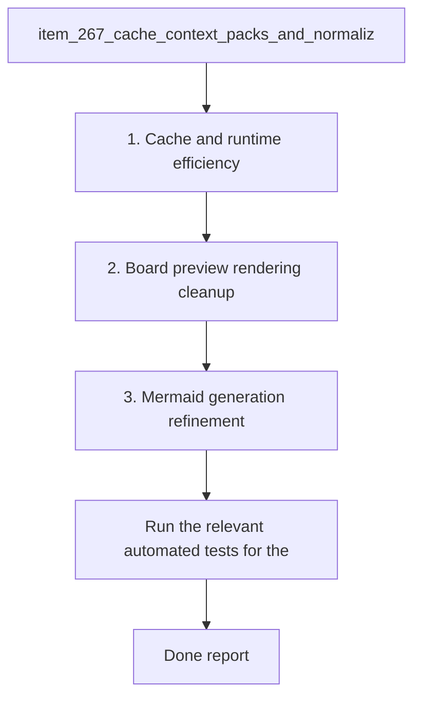

## task_123_orchestration_delivery_for_req_144_to_req_147_board_preview_and_doc_quality_improvements - Orchestration delivery for req 144 to req 147 board preview and doc quality improvements
> From version: 1.23.0
> Schema version: 1.0
> Status: Ready
> Understanding: 90%
> Confidence: 85%
> Progress: 0%
> Complexity: High
> Theme: Board preview, Mermaid generation, and token efficiency
> Reminder: Update status/understanding/confidence/progress and dependencies/references when you edit this doc.

# Context
- Derived from backlog items:
  - `item_267_cache_context_packs_and_normalize_cache_keys`
  - `item_271_reduce_optional_payload_and_command_overhead`
  - `item_268_trim_duplicated_title_and_instruction_from_board_preview`
  - `item_269_improve_mermaid_orientation_and_diagram_variety`
  - `item_270_improve_task_preview_markdown_parsing`
- Related request(s):
  - `req_144_improve_rtk_and_logics_kit_token_performance`
  - `req_145_remove_duplicated_title_and_instruction_from_board_preview_panel`
  - `req_146_improve_generated_mermaid_diagrams_for_logics_docs`
  - `req_147_improve_task_preview_checkbox_parsing_in_board_preview`
- Delivery goal:
  - reduce repeated context assembly and avoid unnecessary payload loading in the hybrid runtime;
  - trim redundant identity chrome from the board preview body;
  - improve Mermaid generation so diagrams are more contextual, vertical, and shape-appropriate;
  - render task previews with clearer checkbox and list parsing.
- Coordination rule:
  - the runtime/token-efficiency items should land before the richer preview and Mermaid polish if shared helpers or preview data flow change;
  - preview and Mermaid changes should keep the existing markdown source untouched and remain consistent with the current board/document rendering surfaces;
  - each wave should end in a commit-ready state with validation captured before moving on.

# Plan
- [ ] 1. Confirm scope, dependencies, and linked acceptance criteria across all five backlog items.
- [ ] 2. Wave 1: implement cache context pack reuse, cache-key normalization, and optional payload overhead reductions.
- [ ] 3. Wave 2: implement the board preview cleanup and task markdown parsing improvements.
- [ ] 4. Wave 3: implement the Mermaid generation improvements for orientation, relevance, and diagram variety.
- [ ] 5. Validate each wave in a commit-ready state and update the linked Logics docs before moving on.
- [ ] CHECKPOINT: leave each completed wave commit-ready and update the linked Logics docs before continuing.
- [ ] CHECKPOINT: if the shared AI runtime is active and healthy, run `python logics/skills/logics.py flow assist commit-all` for the current step, item, or wave commit checkpoint.
- [ ] GATE: do not close a wave or step until the relevant automated tests and quality checks have been run successfully.
- [ ] FINAL: Update related Logics docs

# Delivery checkpoints
- Each completed wave should leave the repository in a coherent, commit-ready state.
- Update the linked Logics docs during the wave that changes the behavior, not only at final closure.
- Prefer a reviewed commit checkpoint at the end of each meaningful wave instead of accumulating several undocumented partial states.
- If the shared AI runtime is active and healthy, use `python logics/skills/logics.py flow assist commit-all` to prepare the commit checkpoint for each meaningful step, item, or wave.
- Do not mark a wave or step complete until the relevant automated tests and quality checks have been run successfully.

# AC Traceability
- AC1 -> Wave 1. Proof: `item_267_cache_context_packs_and_normalize_cache_keys` and `item_271_reduce_optional_payload_and_command_overhead` land the runtime/token-efficiency improvements.
- AC2 -> Wave 2. Proof: `item_268_trim_duplicated_title_and_instruction_from_board_preview` and `item_270_improve_task_preview_markdown_parsing` land the board preview rendering cleanup.
- AC3 -> Wave 3. Proof: `item_269_improve_mermaid_orientation_and_diagram_variety` lands the Mermaid generation refinement.
- AC4 -> all waves. Proof: the task requires each completed wave to end commit-ready and validated before moving on.

# Decision framing
- Product framing: Not needed
- Product signals: (none detected)
- Product follow-up: No product brief follow-up is expected based on current signals.
- Architecture framing: Not needed
- Architecture signals: (none detected)
- Architecture follow-up: No architecture decision follow-up is expected based on current signals.

# Links
- Product brief(s): (none yet)
- Architecture decision(s): (none yet)
- Backlog item(s):
  - `logics/backlog/item_267_cache_context_packs_and_normalize_cache_keys.md`
  - `logics/backlog/item_271_reduce_optional_payload_and_command_overhead.md`
  - `logics/backlog/item_268_trim_duplicated_title_and_instruction_from_board_preview.md`
  - `logics/backlog/item_269_improve_mermaid_orientation_and_diagram_variety.md`
  - `logics/backlog/item_270_improve_task_preview_markdown_parsing.md`
- Request(s):
  - `logics/request/req_144_improve_rtk_and_logics_kit_token_performance.md`
  - `logics/request/req_145_remove_duplicated_title_and_instruction_from_board_preview_panel.md`
  - `logics/request/req_146_improve_generated_mermaid_diagrams_for_logics_docs.md`
  - `logics/request/req_147_improve_task_preview_checkbox_parsing_in_board_preview.md`

# AI Context
- Summary: Orchestration delivery for req 144 to req 147 board preview and doc quality improvements
- Keywords: orchestration, board preview, mermaid, cache, token efficiency, markdown parsing, task rendering
- Use when: Use when executing the coordinated implementation waves for the req 144 to req 147 delivery slice.
- Skip when: Skip when the work belongs to another backlog item or a different execution wave.
# Validation
- Wave 1 validation:
  - run the runtime and workflow tests that cover cache reuse and payload selection;
  - run the relevant logics kit lint or audit checks.
- Wave 2 validation:
  - run the board preview and Markdown rendering tests for the trimmed preview and task parsing behavior.
- Wave 3 validation:
  - run the Mermaid generation and signature-related tests covering contextual shape selection.
- For every wave:
  - confirm the wave leaves the repository in a commit-ready state;
  - capture the validation evidence in this task before advancing.

# Definition of Done (DoD)
- [ ] Scope implemented and acceptance criteria covered across all five backlog items.
- [ ] Validation commands executed and results captured for each wave.
- [ ] No wave or step was closed before the relevant automated tests and quality checks passed.
- [ ] Linked request/backlog/task docs updated during completed waves and at closure.
- [ ] Each completed wave left a commit-ready checkpoint or an explicit exception is documented.
- [ ] Status is `Done` and progress is `100%`.

# Report
