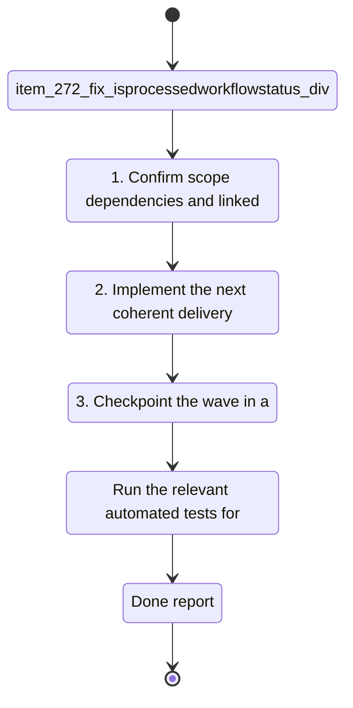

## task_124_fix_isprocessedworkflowstatus_divergence_parseprogress_clamp_and_totalcount_semantics - Fix isProcessedWorkflowStatus divergence parseProgress clamp and totalCount semantics
> From version: 1.23.2
> Schema version: 1.0
> Status: Ready
> Understanding: 95%
> Confidence: 90%
> Progress: 0%
> Complexity: Low
> Theme: UI
> Reminder: Update status/understanding/confidence/progress and linked request/backlog references when you edit this doc.

# Context
- Derived from backlog item `item_272_fix_isprocessedworkflowstatus_divergence_parseprogress_clamp_and_totalcount_semantics`.
- Source file: `logics/backlog/item_272_fix_isprocessedworkflowstatus_divergence_parseprogress_clamp_and_totalcount_semantics.md`.
- Related request(s): `req_148_fix_post_1_23_review_findings_across_indexer_semantics_render_consistency_and_test_coverage`.
- `isProcessedWorkflowStatus` exists in two places with different accepted values: `src/logicsIndexer.ts` accepts `ready | done | complete | completed | archived` while `media/webviewSelectors.js` accepts only `done`. Items with `Status: ready` are treated as processed by the indexer but visible as active in the webview.
- `parseProgress` in `logicsIndexer.ts` removed the `[0, 100]` clamp in the 1.23.x wave. Since `isProcessedWorkflowItem` checks `progress === 100`, a document with `Progress: 150` is no longer detected as complete.
- `totalCount` added to board column groups in `webviewSelectors.js` is set to `visibleItems.length` (global total), not the column item count, distorting any per-column ratio or progress display.

# Plan
- [ ] 1. Confirm scope, dependencies, and linked acceptance criteria.
- [ ] 2. Implement the next coherent delivery wave from the backlog item.
- [ ] 3. Checkpoint the wave in a commit-ready state, validate it, and update the linked Logics docs.
- [ ] CHECKPOINT: leave the current wave commit-ready and update the linked Logics docs before continuing.
- [ ] CHECKPOINT: if the shared AI runtime is active and healthy, run `python logics/skills/logics.py flow assist commit-all` for the current step, item, or wave commit checkpoint.
- [ ] GATE: do not close a wave or step until the relevant automated tests and quality checks have been run successfully.
- [ ] FINAL: Update related Logics docs

# Delivery checkpoints
- Each completed wave should leave the repository in a coherent, commit-ready state.
- Update the linked Logics docs during the wave that changes the behavior, not only at final closure.
- Prefer a reviewed commit checkpoint at the end of each meaningful wave instead of accumulating several undocumented partial states.
- If the shared AI runtime is active and healthy, use `python logics/skills/logics.py flow assist commit-all` to prepare the commit checkpoint for each meaningful step, item, or wave.
- Do not mark a wave or step complete until the relevant automated tests and quality checks have been run successfully.

# AC Traceability
- AC1 -> Scope: `isProcessedWorkflowStatus` in `src/logicsIndexer.ts` and `media/webviewSelectors.js` accept the same set of statuses and this is covered by at least one test.. Proof: capture validation evidence in this doc.
- AC2 -> Scope: `parseProgress` in `logicsIndexer.ts` clamps its return value to `[0, 100]`; `isProcessedWorkflowItem` correctly identifies `Progress: 150` as complete.. Proof: capture validation evidence in this doc.
- AC3 -> Scope: `totalCount` on board column groups in `webviewSelectors.js` reflects the item count of that column, not `visibleItems.length`.. Proof: capture validation evidence in this doc.

# Decision framing
- Product framing: Not needed
- Product signals: (none detected)
- Product follow-up: No product brief follow-up is expected based on current signals.
- Architecture framing: Required
- Architecture signals: data model and persistence, state and sync
- Architecture follow-up: Create or link an architecture decision before irreversible implementation work starts.

# Links
- Product brief(s): (none yet)
- Architecture decision(s): `adr_018_fix_post_1_23_review_findings_with_targeted_delivery_slices`
- Backlog item: `item_272_fix_isprocessedworkflowstatus_divergence_parseprogress_clamp_and_totalcount_semantics`
- Request(s): `req_148_fix_post_1_23_review_findings_across_indexer_semantics_render_consistency_and_test_coverage`

# AI Context
- Summary: Align isProcessedWorkflowStatus TS/JS, restore parseProgress clamp, fix totalCount to column scope
- Keywords: isProcessedWorkflowStatus, parseProgress, clamp, totalCount, logicsIndexer, webviewSelectors
- Use when: Fixing semantic data bugs from the 1.23.x review wave (AC1 AC2 AC4 of req_148).
- Skip when: Work targets UI rendering, state management, or test coverage.
# References
- `logics/skills/logics-ui-steering/SKILL.md`

# Validation
- Run the relevant automated tests for the changed surface before closing the current wave or step.
- Run the relevant lint or quality checks before closing the current wave or step.
- Confirm the completed wave leaves the repository in a commit-ready state.

# Definition of Done (DoD)
- [ ] Scope implemented and acceptance criteria covered.
- [ ] Validation commands executed and results captured.
- [ ] No wave or step was closed before the relevant automated tests and quality checks passed.
- [ ] Linked request/backlog/task docs updated during completed waves and at closure.
- [ ] Each completed wave left a commit-ready checkpoint or an explicit exception is documented.
- [ ] Status is `Done` and progress is `100%`.

# Report
