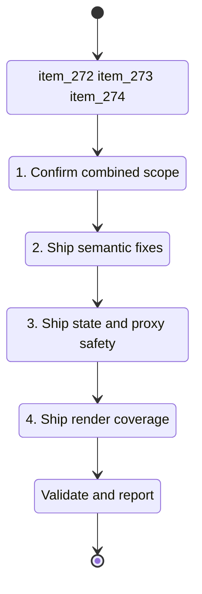

## task_124_fix_post_1_23_review_findings_with_targeted_delivery_slices - Fix post 1.23 review findings with targeted delivery slices
> From version: 1.23.2
> Schema version: 1.0
> Status: Ready
> Understanding: 94%
> Confidence: 88%
> Progress: 100%
> Complexity: Medium
> Theme: UI
> Reminder: Update status/understanding/confidence/progress and linked request/task references when you edit this doc.

# Context
- Derived from backlog items `item_272_fix_isprocessedworkflowstatus_divergence_parseprogress_clamp_and_totalcount_semantics`, `item_273_fix_activetoolsview_dual_state_collectlinkedworkflowitems_proxy_and_openlinkeditem_safety`, and `item_274_add_missing_render_tests_for_corpusinsightshtml_untested_functions_and_badge_edge_cases`.
- Source files: `logics/backlog/item_272_fix_isprocessedworkflowstatus_divergence_parseprogress_clamp_and_totalcount_semantics.md`, `logics/backlog/item_273_fix_activetoolsview_dual_state_collectlinkedworkflowitems_proxy_and_openlinkeditem_safety.md`, `logics/backlog/item_274_add_missing_render_tests_for_corpusinsightshtml_untested_functions_and_badge_edge_cases.md`.
- Related request(s): `req_148_fix_post_1_23_review_findings_across_indexer_semantics_render_consistency_and_test_coverage`.
- The 1.23.x review findings split naturally into three delivery slices, but this task keeps them under one orchestration doc so the delivery plan stays readable and easy to track.
- Slice 1: semantic correctness in `isProcessedWorkflowStatus`, `parseProgress`, and `totalCount`.
- Slice 2: state and proxy safety around `activeToolsView`, `collectLinkedWorkflowItems`, and `openLinkedItem`.
- Slice 3: render coverage for `logicsCorpusInsightsHtml.ts`, flagged helper functions, and the board badge edge case.

# Plan
- [x] 1. Confirm the combined scope, dependencies, and linked acceptance criteria across the three backlog slices.
- [x] 2. Implement the semantic fixes from `item_272` and validate the processed-item behaviour.
- [x] 3. Implement the state and proxy safety fixes from `item_273` and validate the guarded interactions.
- [x] 4. Implement the render coverage from `item_274` and run the relevant automated tests.
- [ ] CHECKPOINT: leave the current wave commit-ready and update the linked Logics docs before continuing.
- [ ] CHECKPOINT: if the shared AI runtime is active and healthy, run `python logics/skills/logics.py flow assist commit-all` for the current step, item, or wave commit checkpoint.
- [ ] GATE: do not close a wave or step until the relevant automated tests and quality checks have been run successfully.
- [ ] FINAL: Update related Logics docs

# Delivery checkpoints
- Each completed wave should leave the repository in a coherent, commit-ready state.
- Update the linked Logics docs during the wave that changes the behavior, not only at final closure.
- Prefer a reviewed commit checkpoint at the end of each meaningful wave instead of accumulating several undocumented partial states.
- If the shared AI runtime is active and healthy, use `python logics/skills/logics.py flow assist commit-all` to prepare the commit checkpoint for each meaningful step, item, or wave.
- Do not mark a wave or step complete until the relevant automated tests and quality checks have been run successfully.

# AC Traceability
- AC1 -> Step 2. Proof: `isProcessedWorkflowStatus` matches between `src/logicsIndexer.ts` and `media/webviewSelectors.js`.
- AC2 -> Step 2. Proof: `parseProgress` clamps to `[0, 100]` and `isProcessedWorkflowItem` treats `Progress: 150` as complete.
- AC3 -> Step 2. Proof: `totalCount` on board column groups reflects the column item count.
- AC4 -> Step 3. Proof: `activeToolsView` has a single authoritative source.
- AC5 -> Step 3. Proof: the `collectLinkedWorkflowItems` proxy does not silently return `[]` when the model function is missing.
- AC6 -> Step 4. Proof: `logicsCorpusInsightsHtml.ts` has render or snapshot coverage.
- AC7 -> Step 3. Proof: `openLinkedItem` encodes or validates the reference before showing a warning.
- AC8 -> Steps 2, 3, and 4. Proof: the five flagged functions each have direct unit coverage.
- AC9 -> Step 4. Proof: `createProgressComplexityBadge` has an unknown-stage test.
- AC10 -> Step 4. Proof: `npm run test` remains green after the changes.

# Decision framing
- Product framing: Not needed
- Product signals: (none detected)
- Product follow-up: No product brief follow-up is expected based on current signals.
- Architecture framing: Required
- Architecture signals: data model and persistence, state and sync, contracts and integration
- Architecture follow-up: Create or link an architecture decision before irreversible implementation work starts.

# Links
- Product brief(s): (none yet)
- Architecture decision(s): `adr_018_fix_post_1_23_review_findings_with_targeted_delivery_slices`
- Backlog items: `item_272_fix_isprocessedworkflowstatus_divergence_parseprogress_clamp_and_totalcount_semantics`, `item_273_fix_activetoolsview_dual_state_collectlinkedworkflowitems_proxy_and_openlinkeditem_safety`, `item_274_add_missing_render_tests_for_corpusinsightshtml_untested_functions_and_badge_edge_cases`
- Request(s): `req_148_fix_post_1_23_review_findings_across_indexer_semantics_render_consistency_and_test_coverage`

# AI Context
- Summary: Single orchestration task for the 1.23.x review findings: semantic correctness, state and proxy safety, and render coverage
- Keywords: isProcessedWorkflowStatus, parseProgress, activeToolsView, totalCount, collectLinkedWorkflowItems, CorpusInsightsHtml, openLinkedItem
- Use when: Planning or delivering the merged follow-up work for the 1.23.x review wave.
- Skip when: The work targets new features or unrelated modules.

# References
- `src/logicsIndexer.ts`
- `media/webviewSelectors.js`
- `media/webviewChrome.js`
- `media/toolsPanelLayout.js`
- `src/logicsViewDocumentController.ts`
- `src/logicsCorpusInsightsHtml.ts`
- `media/renderBoard.js`
- `tests/logicsCorpusInsightsController.test.ts`
- `tests/logicsOnboardingHtml.test.ts`

# Priority
- Impact: High
- Urgency: Medium

# Notes
- This task intentionally merges the three backlog slices into one orchestration doc.
- The older split task docs `task_125` and `task_126` are no longer needed once this merged task is in place.

# Report

# Validation
- npm run tests
- npm run lint
