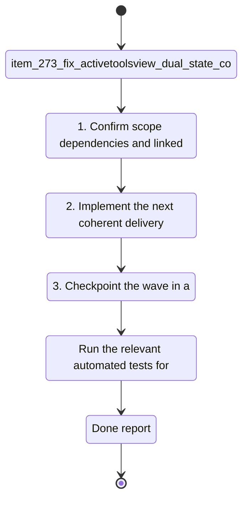

## task_125_fix_activetoolsview_dual_state_collectlinkedworkflowitems_proxy_and_openlinkeditem_safety - Fix activeToolsView dual state collectLinkedWorkflowItems proxy and openLinkedItem safety
> From version: 1.23.2
> Schema version: 1.0
> Status: Ready
> Understanding: 90%
> Confidence: 85%
> Progress: 0%
> Complexity: Low
> Theme: UI
> Reminder: Update status/understanding/confidence/progress and linked request/backlog references when you edit this doc.

# Context
- Derived from backlog item `item_273_fix_activetoolsview_dual_state_collectlinkedworkflowitems_proxy_and_openlinkeditem_safety`.
- Source file: `logics/backlog/item_273_fix_activetoolsview_dual_state_collectlinkedworkflowitems_proxy_and_openlinkeditem_safety.md`.
- Related request(s): `req_148_fix_post_1_23_review_findings_across_indexer_semantics_render_consistency_and_test_coverage`.
- `activeToolsView` is tracked independently in `webviewChrome.js` (local `let activeToolsView`) and in `toolsPanelLayout.js` (its own internal state). When `setToolsPanelOpen(viewName, isOpen)` in `webviewChrome.js` calls `toolsPanelLayout.setActiveToolsView(viewName)`, both copies update, but subsequent re-renders or direct calls to `toolsPanelLayout` do not sync back to `webviewChrome.js`. Two sources of truth for the same view state.
- `collectLinkedWorkflowItems` was removed from its inline JS implementation and replaced by a `modelApi` proxy in `webviewSelectors.js`. If `modelApi` does not expose the function (e.g. in test harnesses or degraded model states), the proxy silently returns `[]` with no warning or fallback.
- `openLinkedItem` in `logicsViewDocumentController.ts` interpolates the raw `reference` argument directly into a `vscode.window.showWarningMessage` call without sanitization. While VS Code's message API is not a browser XSS surface, consistent sanitization is expected across the codebase.

# Plan
- [ ] 1. Confirm scope, dependencies, and linked acceptance criteria.
- [ ] 2. Implement the next coherent delivery wave from the backlog item.
- [ ] 3. Checkpoint the wave in a commit-ready state, validate it, and update the linked Logics docs.
- [ ] CHECKPOINT: leave the current wave commit-ready and update the linked Logics docs before continuing.
- [ ] CHECKPOINT: if the shared AI runtime is active and healthy, run `python logics/skills/logics.py flow assist commit-all` for the current step, item, or wave commit checkpoint.
- [ ] GATE: do not close a wave or step until the relevant automated tests and quality checks have been run successfully.
- [ ] FINAL: Update related Logics docs

# Delivery checkpoints
- Each completed wave should leave the repository in a coherent, commit-ready state.
- Update the linked Logics docs during the wave that changes the behavior, not only at final closure.
- Prefer a reviewed commit checkpoint at the end of each meaningful wave instead of accumulating several undocumented partial states.
- If the shared AI runtime is active and healthy, use `python logics/skills/logics.py flow assist commit-all` to prepare the commit checkpoint for each meaningful step, item, or wave.
- Do not mark a wave or step complete until the relevant automated tests and quality checks have been run successfully.

# AC Traceability
- AC1 -> Scope: `activeToolsView` has a single authoritative source; `webviewChrome.js` and `toolsPanelLayout.js` do not maintain independent copies that can diverge.. Proof: capture validation evidence in this doc.
- AC2 -> Scope: The `collectLinkedWorkflowItems` proxy in `webviewSelectors.js` does not silently return `[]` when `modelApi` does not expose the function — either the proxy logs a warning, throws, or the model contract guarantees the function is always present.. Proof: capture validation evidence in this doc.
- AC3 -> Scope: `openLinkedItem` in `logicsViewDocumentController.ts` encodes or validates the `reference` value before interpolating it into the warning message.. Proof: capture validation evidence in this doc.

# Decision framing
- Product framing: Not needed
- Product signals: (none detected)
- Product follow-up: No product brief follow-up is expected based on current signals.
- Architecture framing: Required
- Architecture signals: data model and persistence, contracts and integration, state and sync
- Architecture follow-up: Create or link an architecture decision before irreversible implementation work starts.

# Links
- Product brief(s): (none yet)
- Architecture decision(s): `adr_018_fix_post_1_23_review_findings_with_targeted_delivery_slices`
- Backlog item: `item_273_fix_activetoolsview_dual_state_collectlinkedworkflowitems_proxy_and_openlinkeditem_safety`
- Request(s): `req_148_fix_post_1_23_review_findings_across_indexer_semantics_render_consistency_and_test_coverage`

# AI Context
- Summary: Unify activeToolsView state, guard collectLinkedWorkflowItems proxy, sanitize openLinkedItem reference
- Keywords: activeToolsView, toolsPanelLayout, webviewChrome, collectLinkedWorkflowItems, modelApi, openLinkedItem
- Use when: Fixing state management and proxy safety bugs from the 1.23.x review wave (AC3 AC5 AC7 of req_148).
- Skip when: Work targets semantic data bugs or test coverage.
# References
- `logics/skills/logics-ui-steering/SKILL.md`

# Validation
- Run the relevant automated tests for the changed surface before closing the current wave or step.
- Run the relevant lint or quality checks before closing the current wave or step.
- Confirm the completed wave leaves the repository in a commit-ready state.

# Definition of Done (DoD)
- [ ] Scope implemented and acceptance criteria covered.
- [ ] Validation commands executed and results captured.
- [ ] No wave or step was closed before the relevant automated tests and quality checks passed.
- [ ] Linked request/backlog/task docs updated during completed waves and at closure.
- [ ] Each completed wave left a commit-ready checkpoint or an explicit exception is documented.
- [ ] Status is `Done` and progress is `100%`.

# Report
