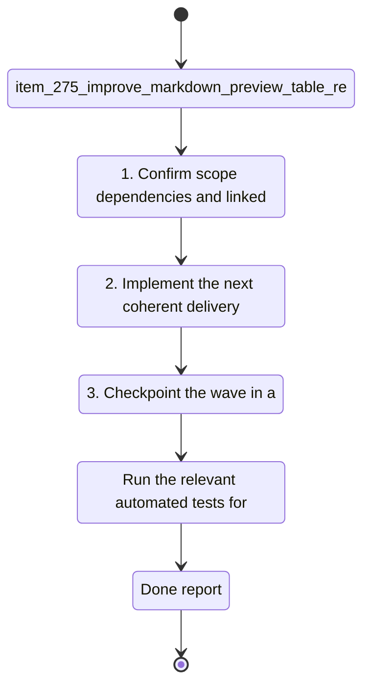

## task_125_improve_markdown_preview_table_rendering_in_claude_authored_docs - Improve Markdown preview table rendering in Claude-authored docs
> From version: 1.23.3
> Schema version: 1.0
> Status: Ready
> Understanding: 94%
> Confidence: 91%
> Progress: 0%
> Complexity: Medium
> Theme: Board preview and markdown rendering
> Reminder: Update status/understanding/confidence/progress and linked request/backlog references when you edit this doc.

# Context
- Derived from backlog item `item_275_improve_markdown_preview_table_rendering_in_claude_authored_docs`.
- Source file: `logics/backlog/item_275_improve_markdown_preview_table_rendering_in_claude_authored_docs.md`.
- Related request(s): `req_149_improve_markdown_preview_table_rendering_in_claude_authored_docs`.
- Render Markdown tables in preview surfaces so they stay visually structured instead of collapsing into hard-to-scan plain text.
- Preserve headers, rows, and cell boundaries well enough that comparison tables remain readable at a glance.
- Keep the underlying `.md` source unchanged and limit the fix to preview rendering behavior.

# Plan
- [ ] 1. Confirm scope, dependencies, and linked acceptance criteria.
- [ ] 2. Implement the next coherent delivery wave from the backlog item.
- [ ] 3. Checkpoint the wave in a commit-ready state, validate it, and update the linked Logics docs.
- [ ] CHECKPOINT: leave the current wave commit-ready and update the linked Logics docs before continuing.
- [ ] CHECKPOINT: if the shared AI runtime is active and healthy, run `python logics/skills/logics.py flow assist commit-all` for the current step, item, or wave commit checkpoint.
- [ ] GATE: do not close a wave or step until the relevant automated tests and quality checks have been run successfully.
- [ ] FINAL: Update related Logics docs

# Delivery checkpoints
- Each completed wave should leave the repository in a coherent, commit-ready state.
- Update the linked Logics docs during the wave that changes the behavior, not only at final closure.
- Prefer a reviewed commit checkpoint at the end of each meaningful wave instead of accumulating several undocumented partial states.
- If the shared AI runtime is active and healthy, use `python logics/skills/logics.py flow assist commit-all` to prepare the commit checkpoint for each meaningful step, item, or wave.
- Do not mark a wave or step complete until the relevant automated tests and quality checks have been run successfully.

# AC Traceability
- AC1 -> Scope: Markdown tables render in preview with a visibly structured layout instead of flattening into plain text.. Proof: capture validation evidence in this doc.
- AC2 -> Scope: Table headers, rows, and cell separation remain readable enough to support quick comparison across columns.. Proof: capture validation evidence in this doc.
- AC3 -> Scope: The preview keeps the original `.md` source unchanged on disk.. Proof: capture validation evidence in this doc.
- AC4 -> Scope: The fix does not degrade preview behavior for non-table Markdown content.. Proof: capture validation evidence in this doc.
- AC5 -> Scope: Representative table cases, including the example above, are covered by tests or fixtures.. Proof: capture validation evidence in this doc.
- AC6 -> Scope: Malformed or partial table-like input fails gracefully without breaking the rest of the preview.. Proof: capture validation evidence in this doc.

# Decision framing
- Product framing: Not needed
- Product signals: (none detected)
- Product follow-up: No product brief follow-up is expected based on current signals.
- Architecture framing: Consider
- Architecture signals: data model and persistence
- Architecture follow-up: Review whether an architecture decision is needed before implementation becomes harder to reverse.

# Links
- Product brief(s): (none yet)
- Architecture decision(s): (none yet)
- Backlog item: `item_275_improve_markdown_preview_table_rendering_in_claude_authored_docs`
- Request(s): `req_149_improve_markdown_preview_table_rendering_in_claude_authored_docs`

# AI Context
- Summary: Make the Markdown preview render standard tables in a readable structured form so Claude-authored docs remain easy to...
- Keywords: markdown, preview, table, rendering, claude-authored docs, structured layout, comparison tables
- Use when: Use when the preview surface cannot present authored Markdown tables clearly enough for review.
- Skip when: Skip when the problem is unrelated to table rendering or the Markdown preview pipeline.
# References
- `media/renderMarkdown.js`
- `src/logicsReadPreviewHtml.ts`
- `src/logicsViewDocumentController.ts`
- `logics/skills/logics-ui-steering/SKILL.md`

# Validation
- `npm run test`
- `npm run lint:ts`
- `npm run lint:logics`

# Validation Notes
- Run the relevant automated tests for the changed surface before closing the current wave or step.
- Run the relevant lint or quality checks before closing the current wave or step.
- Confirm the completed wave leaves the repository in a commit-ready state.

# Definition of Done (DoD)
- [ ] Scope implemented and acceptance criteria covered.
- [ ] Validation commands executed and results captured.
- [ ] No wave or step was closed before the relevant automated tests and quality checks passed.
- [ ] Linked request/backlog/task docs updated during completed waves and at closure.
- [ ] Each completed wave left a commit-ready checkpoint or an explicit exception is documented.
- [ ] Status is `Done` and progress is `100%`.

# Report
