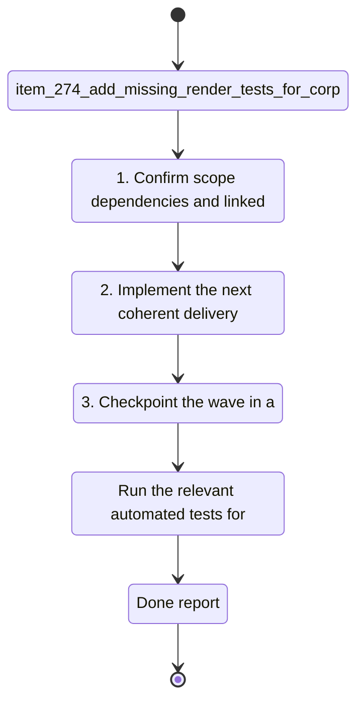

## task_126_add_missing_render_tests_for_corpusinsightshtml_untested_functions_and_badge_edge_cases - Add missing render tests for CorpusInsightsHtml untested functions and badge edge cases
> From version: 1.23.2
> Schema version: 1.0
> Status: Ready
> Understanding: 92%
> Confidence: 88%
> Progress: 0%
> Complexity: Low
> Theme: UI
> Reminder: Update status/understanding/confidence/progress and linked request/backlog references when you edit this doc.

# Context
- Derived from backlog item `item_274_add_missing_render_tests_for_corpusinsightshtml_untested_functions_and_badge_edge_cases`.
- Source file: `logics/backlog/item_274_add_missing_render_tests_for_corpusinsightshtml_untested_functions_and_badge_edge_cases.md`.
- Related request(s): `req_148_fix_post_1_23_review_findings_across_indexer_semantics_render_consistency_and_test_coverage`.
- `logicsCorpusInsightsHtml.ts` is 740 lines of HTML-generating code (SVG pie charts, metric badges, relative dates, tables) with no snapshot or render tests. Only the controller is tested via mocks that bypass `buildLogicsCorpusInsightsHtml` entirely.
- Five functions flagged as untested by the knowledge graph: `openHarnessReadTab`, `assistCommitAll`, `isProcessedWorkflowStatus`, `parseProgress`, `collectLinkedWorkflowItems`. Bugs in these are invisible until a user-facing regression surfaces.
- `createProgressComplexityBadge` in `renderBoard.js` branches on stage names including unknown values, with no test covering unknown stage to verify fallback behavior.

# Plan
- [ ] 1. Confirm scope, dependencies, and linked acceptance criteria.
- [ ] 2. Implement the next coherent delivery wave from the backlog item.
- [ ] 3. Checkpoint the wave in a commit-ready state, validate it, and update the linked Logics docs.
- [ ] CHECKPOINT: leave the current wave commit-ready and update the linked Logics docs before continuing.
- [ ] CHECKPOINT: if the shared AI runtime is active and healthy, run `python logics/skills/logics.py flow assist commit-all` for the current step, item, or wave commit checkpoint.
- [ ] GATE: do not close a wave or step until the relevant automated tests and quality checks have been run successfully.
- [ ] FINAL: Update related Logics docs

# Delivery checkpoints
- Each completed wave should leave the repository in a coherent, commit-ready state.
- Update the linked Logics docs during the wave that changes the behavior, not only at final closure.
- Prefer a reviewed commit checkpoint at the end of each meaningful wave instead of accumulating several undocumented partial states.
- If the shared AI runtime is active and healthy, use `python logics/skills/logics.py flow assist commit-all` to prepare the commit checkpoint for each meaningful step, item, or wave.
- Do not mark a wave or step complete until the relevant automated tests and quality checks have been run successfully.

# AC Traceability
- AC1 -> Scope: `logicsCorpusInsightsHtml.ts` has at least one snapshot or render test covering the main HTML output paths: pie chart present, metric badge present, relative date present, empty-state fallback.. Proof: capture validation evidence in this doc.
- AC2 -> Scope: Each of the 5 flagged functions (`openHarnessReadTab`, `assistCommitAll`, `isProcessedWorkflowStatus`, `parseProgress`, `collectLinkedWorkflowItems`) has at least one direct unit test exercising its core logic.. Proof: capture validation evidence in this doc.
- AC3 -> Scope: `createProgressComplexityBadge` in `renderBoard.js` has at least one test passing an unknown or empty stage value to verify the fallback renders without throwing.. Proof: capture validation evidence in this doc.
- AC4 -> Scope: All existing tests continue to pass after additions (`npm run test` green).. Proof: capture validation evidence in this doc.

# Decision framing
- Product framing: Not needed
- Product signals: (none detected)
- Product follow-up: No product brief follow-up is expected based on current signals.
- Architecture framing: Required
- Architecture signals: data model and persistence, state and sync
- Architecture follow-up: Create or link an architecture decision before irreversible implementation work starts.

# Links
- Product brief(s): (none yet)
- Architecture decision(s): `adr_018_fix_post_1_23_review_findings_with_targeted_delivery_slices`
- Backlog item: `item_274_add_missing_render_tests_for_corpusinsightshtml_untested_functions_and_badge_edge_cases`
- Request(s): `req_148_fix_post_1_23_review_findings_across_indexer_semantics_render_consistency_and_test_coverage`

# AI Context
- Summary: Snapshot tests for CorpusInsightsHtml, unit tests for 5 flagged functions, badge edge-case test
- Keywords: logicsCorpusInsightsHtml, snapshot, openHarnessReadTab, assistCommitAll, isProcessedWorkflowStatus, parseProgress, collectLinkedWorkflowItems, createProgressComplexityBadge
- Use when: Adding missing test coverage for the 1.23.x wave (AC6 AC8 AC9 AC10 of req_148).
- Skip when: Work targets semantic data bugs or state management fixes.
# References
- `logics/skills/logics-ui-steering/SKILL.md`

# Validation
- Run the relevant automated tests for the changed surface before closing the current wave or step.
- Run the relevant lint or quality checks before closing the current wave or step.
- Confirm the completed wave leaves the repository in a commit-ready state.

# Definition of Done (DoD)
- [ ] Scope implemented and acceptance criteria covered.
- [ ] Validation commands executed and results captured.
- [ ] No wave or step was closed before the relevant automated tests and quality checks passed.
- [ ] Linked request/backlog/task docs updated during completed waves and at closure.
- [ ] Each completed wave left a commit-ready checkpoint or an explicit exception is documented.
- [ ] Status is `Done` and progress is `100%`.

# Report
