## task_126_orchestration_delivery_for_req_150_to_req_154_plugin_polish_and_status_selector - Orchestration delivery for req_150 to req_154 plugin polish and status selector
> From version: 1.24.0
> Schema version: 1.0
> Status: Ready
> Understanding: 100% (refreshed)
> Confidence: 100%
> Progress: 69%
> Complexity: Medium
> Theme: UI
> Reminder: Update status/understanding/confidence/progress and linked request/backlog references when you edit this doc.

# Context
Deliver all backlog items derived from req_150 to req_154 in a single orchestrated wave. The items cover four UI/UX polish fixes and one new feature (manual status selector). They are independent of each other and can be implemented sequentially in order of complexity, from simplest (sort order) to most complex (status selector write layer).

```mermaid
%% logics-kind: task
%% logics-signature: task|orchestration-delivery-for-req-150-to-re|item-276-invert-default-sort-order-in-bo|wave-1-item-276-invert-default-sort|npm-run-compile
stateDiagram-v2
    [*] --> Wave1
    Wave1 : Wave 1 - item_276 invert sort order
    Wave1 --> Wave2
    Wave2 : Wave 2 - item_277 misc UI feedback fixes
    Wave2 --> Wave3
    Wave3 : Wave 3 - item_279 fix panel resize blank
    Wave3 --> Wave4
    Wave4 : Wave 4 - item_278 bootstrap AGENTS and LOGICS
    Wave4 --> Wave5
    Wave5 : Wave 5a - item_280 status selector UI
    Wave5 --> Wave6
    Wave6 : Wave 5b - item_281 status write and refresh
    Wave6 --> Wave7
    Wave7 : Wave 6 - item_282 align Obsolete in kit
    Wave7 --> Wave8
    Wave8 : Wave 7 - item_283 gate Claude and Codex checks
    Wave8 --> Wave9
    Wave9 : Wave 8 - item_284 panel init collapsed
    Wave9 --> Wave10
    Wave10 : Wave 9 - item_285 AC traceability and ADR cleanup
    Wave10 --> Wave11
    Wave11 : Wave 10 - item_286 INDEX and RELATIONSHIPS docs
    Wave11 --> Wave12
    Wave12 : Wave 11 - item_287 modularization plan
    Wave12 --> Wave13
    Wave13 : Wave 12 - item_289 velocity counter
    Wave13 --> Wave14
    Wave14 : Wave 13 - item_288 timeline view
    Wave14 --> Done
    Done : Done and docs updated
    Done --> [*]
```

# Plan

## Wave 1 — item_276: Invert default sort order (newest first)
Derived from `logics/request/req_150_invert_default_sort_order_in_board_and_list_so_most_recent_items_appear_first.md`

- [ ] 1.1 Locate the sort comparator used for board and list cell rendering.
- [ ] 1.2 Change the default direction from ascending to descending on `updatedAt` for all item types (requests, backlog, tasks, specs).
- [ ] 1.3 Verify the Activity view is unaffected.
- [ ] 1.4 Run `npm run compile` and `npm run test`.
- [ ] CHECKPOINT: commit wave 1.

## Wave 2 — item_277: Miscellaneous UI feedback fixes
Derived from `logics/request/req_151_address_miscellaneous_post_release_feedback_across_the_plugin.md`

- [ ] 2.1 Spec cells in board/list: remove the Flow information from the cell rendering.
- [ ] 2.2 Cell borders: remove status-based border colouring; keep the colour for the hover effect only.
- [ ] 2.3 Run `npm run compile` and `npm run test`.
- [ ] CHECKPOINT: commit wave 2.

## Wave 3 — item_279: Fix board/list blank on panel resize
Derived from `logics/request/req_153_fix_board_and_list_items_disappearing_when_the_detail_panel_is_resized_or_collapsed.md`

- [ ] 3.1 Reproduce the blank state by resizing/collapsing the detail panel.
- [ ] 3.2 Identify the layout or render lifecycle event that is missing or incorrectly handled on resize.
- [ ] 3.3 Fix the reflow/re-render trigger so items stay visible at any panel size including fully collapsed.
- [ ] 3.4 Run `npm run compile` and `npm run test`.
- [ ] CHECKPOINT: commit wave 3.

## Wave 4 — item_278: Bootstrap creates AGENTS.md and LOGICS.md
Derived from `logics/request/req_152_extend_bootstrap_repair_to_create_and_maintain_agents_md_and_logics_md.md`

- [ ] 4.1 Add a minimal `LOGICS.md` template to `logics/skills/logics-bootstrapper/`.
- [ ] 4.2 Extend the bootstrap script to detect and create/patch `AGENTS.md` (additive, never overwrites).
- [ ] 4.3 Extend the bootstrap script to create `LOGICS.md` from the template when absent.
- [ ] 4.4 Extend the bootstrap script to add `LOGICS.md` to `.gitignore` when not listed.
- [ ] 4.5 Verify `--check` and `--dry-run` flags cover the new actions.
- [ ] 4.6 Run `npm run compile` and `npm run test`.
- [ ] CHECKPOINT: commit wave 4.

## Wave 5 — item_280 + item_281: Manual status selector
Derived from `logics/request/req_154_add_a_manual_status_selector_button_in_the_detail_panel_to_change_item_status_directly.md`

**5a — UI layer (item_280)**
- [ ] 5.1 Add a full-width "Change Status" button below the Obsolete button in the detail panel action bar, matching the Obsolete button's visual style.
- [ ] 5.2 On click, open a dropdown or VS Code quick-pick showing only the valid statuses for the selected item type.
- [ ] 5.3 Highlight the current status in the selector.
- [ ] 5.4 Disable or hide the button when no item is selected.

**5b — Write and refresh layer (item_281)**
- [ ] 5.5 On status selection, write the updated `Status:` line to the markdown file without corrupting surrounding content.
- [ ] 5.6 Trigger a board/list refresh after the write.
- [ ] 5.7 Verify the new status is correctly reflected in the board/list cell and detail panel.
- [ ] 5.8 Run `npm run compile` and `npm run test`.
- [ ] CHECKPOINT: commit wave 5.

## Wave 6 — item_282: Align Obsolete status in the kit
Derived from `logics/request/req_155_align_obsolete_status_between_plugin_and_logics_kit.md`

- [ ] 6.1 Add `Obsolete` to the `allowed_statuses` tuple for `request`, `backlog`, and `task` kinds in `logics/skills/logics-doc-linter/scripts/logics_lint.py`.
- [ ] 6.2 Update `logics/skills/logics-flow-manager/SKILL.md` to include `Obsolete` in the Status indicator list.
- [ ] 6.3 Update `logics/skills/logics-bootstrapper/assets/instructions.md` to include `Obsolete`.
- [ ] 6.4 Update `logics/skills/README.md` to include `Obsolete` in the status values list.
- [ ] 6.5 Run `python3 logics/skills/logics.py lint --require-status` and verify existing `Status: Obsolete` files (if any) now pass.
- [ ] 6.6 Run `npm run compile` and `npm run test`.
- [ ] CHECKPOINT: commit wave 6.

## Wave 7 — item_283: Gate Claude and Codex environment checks
Derived from `logics/request/req_156_gate_claude_and_codex_environment_checks_on_whether_those_assistants_are_installed_and_used.md`

- [ ] 7.1 Confirm `hasClaude` and `hasCodex` are available from `RuntimeLaunchersSnapshot` at the health computation call sites in `src/logicsViewProviderSupport.ts`.
- [ ] 7.2 Wrap `claudeGlobalKit` and `claudeBridgeAvailable` checks inside a `hasClaude` guard — skip them from the degraded count when `hasClaude` is false.
- [ ] 7.3 Wrap `codexOverlay` checks inside a `hasCodex` guard — skip them from the degraded count when `hasCodex` is false.
- [ ] 7.4 Update the environment summary text so it does not mention Claude or Codex configuration issues when the corresponding binary is absent.
- [ ] 7.5 Run `npm run compile` and `npm run test`.
- [ ] CHECKPOINT: commit wave 7.

## Wave 9 — item_285: AC traceability and ADR cleanup
Derived from `logics/request/req_158_address_post_audit_improvements_across_workflow_traceability_docs_and_oversized_source_files.md`

- [x] 9.1 Add per-request AC proof lines to this task doc for req_150 through req_157 so the audit no longer flags traceability gaps.
- [x] 9.2 Add an explicit "no ADR required" note in the Architecture decision section of item_277, item_279, item_280, item_281, item_282.
- [ ] CHECKPOINT: commit wave 9 (docs only, no compile/test needed).

## Wave 10 — item_286: Generate INDEX.md and RELATIONSHIPS.md
Derived from `logics/request/req_158_address_post_audit_improvements_across_workflow_traceability_docs_and_oversized_source_files.md`

- [ ] 10.1 Run `python3 logics/skills/logics-indexer/scripts/generate_index.py --out logics/INDEX.md`.
- [ ] 10.2 Run `python3 logics/skills/logics-relationship-linker/scripts/link_relations.py --out logics/RELATIONSHIPS.md`.
- [ ] 10.3 Verify both files are generated and contain reasonable content.
- [ ] CHECKPOINT: commit wave 10.

## Wave 11 — item_287: Modularization plan for oversized source files
Derived from `logics/request/req_158_address_post_audit_improvements_across_workflow_traceability_docs_and_oversized_source_files.md`

- [ ] 11.1 Document a modularization plan for the 5 oversized files as a new backlog item or ADR in `logics/architecture/`, covering: `logicsViewProviderSupport.ts` (1 025 L), `logicsViewProvider.ts` (1 004 L), `media/main.js` (1 002 L), `media/renderBoard.js` (935 L), `media/logicsModel.js` (910 L).
- [ ] 11.2 Each file should have a proposed split boundary and rationale.
- [ ] CHECKPOINT: commit wave 11.

## Wave 12 — item_289: Velocity counter in Logics Insights
Derived from `logics/request/req_160_add_a_velocity_counter_in_logics_insights_showing_items_closed_per_week_and_month.md`

- [ ] 12.1 Add a velocity section to `logicsCorpusInsightsHtml.ts` computing closed items for the current ISO week and calendar month.
- [ ] 12.2 Render as a compact stat block, consistent with existing Insights sections.
- [ ] 12.3 Show zero explicitly when no items were closed in the period.
- [ ] 12.4 Run `npm run compile` and `npm run test`.
- [ ] CHECKPOINT: commit wave 12.

## Wave 13 — item_288: Timeline view in Logics Insights
Derived from `logics/request/req_159_add_a_timeline_view_in_logics_insights_showing_delivery_activity_over_time.md`

- [ ] 13.1 Add bucketing logic in the extension host: group closed items by week or month using `updatedAt`.
- [ ] 13.2 Add a timeline section to `logicsCorpusInsightsHtml.ts` covering the last 12 weeks or 6 months.
- [ ] 13.3 Render inline as SVG bars or DOM-based chart — no external library.
- [ ] 13.4 Show an empty state when no closed items exist in the window.
- [ ] 13.5 Run `npm run compile` and `npm run test`.
- [ ] CHECKPOINT: commit wave 13.

## Wave 8 — item_284: Initialize detail panel collapsed and all sections closed
Derived from `logics/request/req_157_initialize_detail_panel_collapsed_in_list_mode_and_all_collapsable_sections_closed_by_default.md`

- [ ] 8.1 In `media/main.js`, set `detailsCollapsed: true` as the initial default when `viewMode` is `"list"` — keep `false` for board mode.
- [ ] 8.2 Add `"indicators"` to `defaultCollapsedDetailSections` so all 9 sections start closed.
- [ ] 8.3 Verify that persisted state from a previous session still overrides the new defaults correctly.
- [ ] 8.4 Run `npm run compile` and `npm run test`.
- [ ] CHECKPOINT: commit wave 8.

## Final
- [ ] 9.1 Update all linked backlog items and request docs (Status, Progress).
- [ ] 9.2 Run `python3 logics/skills/logics.py lint --require-status` and `python3 logics/skills/logics.py audit --legacy-cutoff-version 1.1.0 --group-by-doc`.
- [ ] 9.3 Run `python3 logics/skills/logics.py flow finish task logics/tasks/task_126_orchestration_delivery_for_req_150_to_req_154_plugin_polish_and_status_selector.md`.

# Delivery checkpoints
- Each wave must leave the repository in a commit-ready state before starting the next.
- Update linked Logics docs during the wave that changes the behaviour, not only at closure.
- Do not mark a wave complete until `npm run compile` and `npm run test` have passed.
- If the shared AI runtime is active and healthy, use `python3 logics/skills/logics.py flow assist commit-all` for each wave checkpoint.

# AC Traceability
- item_276 AC1-AC5 → Wave 1 (sort direction, all types, Activity unaffected, default, filter compat)
- item_277 AC1-AC3 → Wave 2 (spec cells no Flow, borders no status colour)
- item_278 AC1-AC7 → Wave 4 (bootstrap creates/patches AGENTS.md and LOGICS.md, gitignore, idempotent, dry-run)
- item_279 AC1-AC4 → Wave 3 (items visible at any size, no interaction required, no regression)
- item_280 AC1, AC3, AC5, AC6 → Wave 5a (button UI, current status highlighted, disabled when no item, coexists with Done/Obsolete)
- item_281 AC2, AC4 → Wave 5b (status written to file, board/list refreshes)
- item_282 AC1-AC4 → Wave 6 (Obsolete in kit linter, SKILL.md, instructions.md, README; existing files pass lint)
- item_283 AC1-AC5 → Wave 7 (hasClaude/hasCodex gates, no spurious degraded warnings, no regression when binary present)
- item_284 AC1-AC5 → Wave 8 (panel collapsed in list mode, indicators section closed, persisted state wins)
- item_285 AC1-AC2 → Wave 9 (AC proof lines in task doc, no-ADR notes on 5 backlog items)
- item_286 AC3-AC4 → Wave 10 (INDEX.md and RELATIONSHIPS.md generated)
- item_287 AC5 → Wave 11 (modularization plan documented)
- item_289 AC1-AC5 → Wave 12 (velocity counter: week + month counts, zero shown, all types)
- item_288 AC1-AC5 → Wave 13 (timeline: 12w/6m window, inline chart, empty state)

## Request AC proof lines
- req_150 AC1-AC5 → item_276 Wave 1 (board/list default to newest-first; activity view unaffected)
- req_151 AC1-AC3 → item_277 Wave 2 (spec cells drop Flow text; status-colored borders removed)
- req_152 AC1-AC7 → item_278 Wave 4 (bootstrap creates/patches AGENTS.md and LOGICS.md, adds LOGICS.md to gitignore, dry-run/check coverage)
- req_153 AC1-AC4 → item_279 Wave 3 (items remain visible after resize/collapse; no user interaction required; no regression)
- req_154 AC1, AC3, AC5, AC6 and item_281 AC2, AC4 → item_280/item_281 Wave 5 (status selector UI plus write/refresh path)
- req_155 AC1-AC4 → item_282 Wave 6 (Obsolete supported in kit linter, SKILL.md, bootstrap instructions, and README)
- req_156 AC1-AC5 → item_283 Wave 7 (launcher-aware environment checks suppress spurious Claude/Codex warnings)
- req_157 AC1-AC5 → item_284 Wave 8 (list mode starts collapsed; indicators section closed; persisted state still wins)

# Links
- Backlog items:
  - `logics/backlog/item_276_invert_default_sort_order_in_board_and_list_so_most_recent_items_appear_first.md`
  - `logics/backlog/item_277_address_miscellaneous_post_release_feedback_across_the_plugin.md`
  - `logics/backlog/item_278_extend_bootstrap_repair_to_create_and_maintain_agents_md_and_logics_md.md`
  - `logics/backlog/item_279_fix_board_and_list_items_disappearing_when_the_detail_panel_is_resized_or_collapsed.md`
  - `logics/backlog/item_280_add_status_selector_button_ui_and_per_type_status_set_in_the_detail_panel.md`
  - `logics/backlog/item_281_implement_status_write_to_markdown_file_and_board_refresh_on_status_change.md`
  - `logics/backlog/item_282_align_obsolete_status_between_plugin_and_logics_kit.md`
  - `logics/backlog/item_283_gate_claude_and_codex_environment_checks_on_whether_those_assistants_are_installed_and_used.md`
  - `logics/backlog/item_284_initialize_detail_panel_collapsed_in_list_mode_and_all_collapsable_sections_closed_by_default.md`
  - `logics/backlog/item_285_fix_ac_traceability_gaps_in_task_126_and_suppress_spurious_adr_signals_on_low_complexity_backlog_items.md`
  - `logics/backlog/item_286_generate_index_md_and_relationships_md_for_the_logics_doc_corpus.md`
  - `logics/backlog/item_287_create_modularization_plan_for_the_five_oversized_source_files.md`
  - `logics/backlog/item_288_add_a_timeline_view_in_logics_insights_showing_delivery_activity_over_time.md`
  - `logics/backlog/item_289_add_a_velocity_counter_in_logics_insights_showing_items_closed_per_week_and_month.md`
- Requests:
  - `logics/request/req_150_invert_default_sort_order_in_board_and_list_so_most_recent_items_appear_first.md`
  - `logics/request/req_151_address_miscellaneous_post_release_feedback_across_the_plugin.md`
  - `logics/request/req_152_extend_bootstrap_repair_to_create_and_maintain_agents_md_and_logics_md.md`
  - `logics/request/req_153_fix_board_and_list_items_disappearing_when_the_detail_panel_is_resized_or_collapsed.md`
  - `logics/request/req_154_add_a_manual_status_selector_button_in_the_detail_panel_to_change_item_status_directly.md`
  - `logics/request/req_155_align_obsolete_status_between_plugin_and_logics_kit.md`
  - `logics/request/req_156_gate_claude_and_codex_environment_checks_on_whether_those_assistants_are_installed_and_used.md`
  - `logics/request/req_157_initialize_detail_panel_collapsed_in_list_mode_and_all_collapsable_sections_closed_by_default.md`
  - `logics/request/req_158_address_post_audit_improvements_across_workflow_traceability_docs_and_oversized_source_files.md`
  - `logics/request/req_159_add_a_timeline_view_in_logics_insights_showing_delivery_activity_over_time.md`
  - `logics/request/req_160_add_a_velocity_counter_in_logics_insights_showing_items_closed_per_week_and_month.md`

# Validation
- `npm run compile`
- `npm run test`
- `python3 logics/skills/logics.py lint --require-status`
- `python3 logics/skills/logics.py audit --legacy-cutoff-version 1.1.0 --group-by-doc`

# Definition of Done (DoD)
- [ ] All 14 backlog items addressed across 13 waves.
- [ ] `npm run compile` and `npm run test` pass after each wave.
- [ ] Linked request and backlog docs updated at each wave checkpoint.
- [ ] No wave closed before tests and quality checks passed.
- [ ] Status is `Done` and progress is `100%`.

# Report
