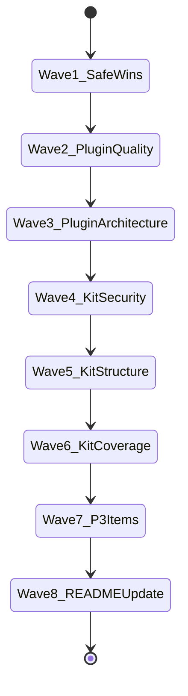

## task_127_orchestrate_april_2026_audit_remediation_across_plugin_and_logics_kit - Orchestrate April 2026 audit remediation across plugin and Logics kit
> From version: 1.25.0
> Schema version: 1.0
> Status: Ready
> Understanding: 95%
> Confidence: 90%
> Progress: 25%
> Complexity: High
> Theme: Quality
> Derived from `logics/backlog/item_290_extract_duplicated_constants_into_a_shared_plugin_module.md`
> Derived from `logics/backlog/item_291_fix_untyped_this_and_raise_plugin_branch_coverage_on_critical_files.md`
> Derived from `logics/backlog/item_292_remove_committed_vsix_binaries_and_enforce_gitignore.md`
> Derived from `logics/backlog/item_293_reduce_src_bootstrap_hub_coupling_by_extracting_a_dedicated_module.md`
> Derived from `logics/backlog/item_294_reorganise_flow_manager_scripts_by_functional_domain.md`
> Derived from `logics/backlog/item_295_raise_kit_branch_coverage_and_reorganise_numbered_test_suites_by_domain.md`
> Derived from `logics/backlog/item_296_harden_hybridproviderdefinition_credential_serialisation_and_audit_cache_files.md`
> Derived from `logics/backlog/item_297_split_oversized_webview_files_per_adr_020.md`
> Derived from `logics/backlog/item_298_add_maximum_kit_version_bound_in_plugin.md`
> Derived from `logics/backlog/item_299_add_programmatic_skill_discovery_to_replace_hardcoded_names.md`

# Context

This task orchestrates the full remediation of the April 2026 structural audit across both the VS Code plugin (`src/`, `media/`) and the Logics kit submodule (`logics/skills/`). The audit surfaced 5 plugin issues and 4 kit issues, grouped into 10 backlog items. Delivery is sequenced so that low-risk, zero-behaviour-change items ship first and unblock the higher-complexity refactors.

Parent requests:
- `logics/request/req_161_address_plugin_audit_findings_from_april_2026_structural_review.md`
- `logics/request/req_162_address_logics_kit_audit_findings_from_april_2026_structural_review.md`

# Plan

## Wave 1 — Safe wins (item_292 + item_290)

- [x] 1.1. `git rm --cached cdx-logics-vscode-1.21.0.vsix cdx-logics-vscode-1.22.0.vsix` and delete local copies; confirm `.gitignore` has `*.vsix`. *(item_292 AC1)*
- [x] 1.2. Create `src/logicsViewProviderConstants.ts`; move the 6 duplicated constants there; update imports in `logicsViewProvider.ts` and `logicsViewProviderSupport.ts`. *(item_290 AC1)*
- [x] 1.3. Run `npm run lint:ts` and `npm run test` — both must pass.
- [x] CHECKPOINT Wave 1 — commit-ready state, update item_290 and item_292 progress to 100 %.

## Wave 2 — Plugin typing + coverage (item_291)

- [ ] 2.1. Fix `this: any` at `src/logicsViewProviderSupport.ts:55` — type the parameter correctly or refactor the call site. *(item_291 AC1)*
- [ ] 2.2. Add branch-covering tests for `src/logicsProviderUtils.ts` until it reaches ≥ 40 % branch coverage.
- [ ] 2.3. Add branch-covering tests for `src/logicsCodexWorkflowBootstrapSupport.ts` until it reaches ≥ 40 % branch coverage.
- [ ] 2.4. Add branch-covering tests for `src/logicsHybridAssistController.ts` until it reaches ≥ 40 % branch coverage. *(item_291 AC2)*
- [ ] 2.5. Run `npm run test:coverage:src` — overall plugin branch coverage must exceed 35 %.
- [ ] CHECKPOINT Wave 2 — commit-ready state, update item_291 progress to 100 %.

## Wave 3 — Plugin architecture (item_293)

- [ ] 3.1. Review `src/logicsCodexWorkflowBootstrapSupport.ts` and identify the most cohesive extractable sub-responsibility (kit-version inspection is the prime candidate).
- [ ] 3.2. Extract the sub-responsibility into a dedicated module (e.g. `src/logicsKitVersionSupport.ts`); update all callers.
- [ ] 3.3. Run `npm run test:smoke`, `npm run test:lifecycle`, and `npm run lint:ts`. *(item_293 AC1)*
- [ ] CHECKPOINT Wave 3 — commit-ready state, update item_293 progress to 100 %.

## Wave 4 — Kit security (item_296)

- [ ] 4.1. Override or add a `to_dict()` method on `HybridProviderDefinition` that omits `credential_value`. *(item_296 AC1)*
- [ ] 4.2. Write a unit test asserting `"credential_value" not in instance.to_dict()`.
- [ ] 4.3. Add a scan in `workflow_audit.py` that reads the two `.jsonl` cache files (if they exist) and exits non-zero if `credential_value` appears. *(item_296 AC2)*
- [ ] 4.4. Run `npm run audit:logics` and `npm run coverage:kit` — both must pass.
- [ ] CHECKPOINT Wave 4 — commit-ready state (kit submodule commit + version bump), update item_296 progress to 100 %.

## Wave 5 — Kit structure (item_294)

- [ ] 5.1. Define the four functional sub-domains: `workflow/`, `hybrid/`, `transport/`, `audit/`.
- [ ] 5.2. Move scripts into sub-domains; update all intra-package imports.
- [ ] 5.3. Verify `python logics/skills/logics.py flow new request --title "smoke"` succeeds end-to-end. *(item_294 AC1)*
- [ ] 5.4. Run `python logics/skills/logics.py audit` — must exit 0; bump kit version.
- [ ] CHECKPOINT Wave 5 — commit-ready state (kit submodule commit + version bump), update item_294 progress to 100 %.

## Wave 6 — Kit coverage (item_295)

- [ ] 6.1. Replace `test_logics_flow_07.py` through `test_logics_flow_11.py` with domain-named suites (`test_hybrid_transport.py`, `test_hybrid_runtime.py`, `test_workflow_core.py`, etc.) with local fixtures. *(item_295 AC1)*
- [ ] 6.2. Add branch-covering tests on `logics_flow_hybrid_transport_core.py` until it reaches ≥ 35 % branch coverage.
- [ ] 6.3. Add branch-covering tests on `logics_flow_support_workflow_core.py` until it reaches ≥ 35 % branch coverage.
- [ ] 6.4. Add branch-covering tests on `logics_flow_hybrid_runtime_core.py` until it reaches ≥ 35 % branch coverage. *(item_295 AC2)*
- [ ] 6.5. Run `npm run coverage:kit` — overall kit branch coverage must exceed 40 %.
- [ ] CHECKPOINT Wave 6 — commit-ready state (kit submodule commit + version bump), update item_295 progress to 100 %.

## Wave 7 — P3 items (item_297 + item_298 + item_299)

- [ ] 7.1. Split `media/main.js` and `media/renderBoard.js` — extract coherent sub-responsibilities until each file is below 600 lines; run `npm run test`. *(item_297 AC1)*
- [ ] 7.2. Add `MAX_LOGICS_KIT_MAJOR` / `MAX_LOGICS_KIT_MINOR` constants (in `src/logicsViewProviderConstants.ts`); extend the version-check logic to warn on over-bound kit; add a unit test for the new branch. *(item_298 AC1)*
- [ ] 7.3. Implement `discoverKitSkills(kitRoot)` in `src/logicsClaudeGlobalKit.ts`; replace the hardcoded skill name array; add a unit test with a fixture directory. *(item_299 AC1)*
- [ ] 7.4. Run `npm run test` and `npm run lint:ts` — both must pass.
- [ ] CHECKPOINT Wave 7 — commit-ready state, update item_297, item_298, item_299 progress to 100 %.

## Wave 8 — README update

- [ ] 8.1. Review `README.md` for any technical or functional content that is outdated relative to the changes made in waves 1–7:
  - Architecture description (module boundaries, bootstrap logic, kit structure).
  - Developer setup instructions (`.env`, Python runtime, kit submodule).
  - CI/test commands (scripts, coverage thresholds, smoke tests).
  - Feature descriptions that reference removed or renamed surfaces.
  - Kit version compatibility range (now bounded on both sides).
- [ ] 8.2. Update `README.md` where needed — do not add sections that were not already present unless a new entry point or workflow was introduced by the remediation.
- [ ] CHECKPOINT Wave 8 — commit-ready state.

## Final

- [ ] Run `npm run ci:fast` end-to-end — all steps must pass.
- [ ] Run `python3 logics/skills/logics.py lint --require-status` and `python3 logics/skills/logics.py audit --legacy-cutoff-version 1.1.0` — both must pass or warnings are documented.
- [ ] Update all 10 linked backlog items to `Status: Done` / `Progress: 100 %`.
- [ ] Update both parent requests to `Status: Done`.
- [ ] Set this task to `Status: Done` / `Progress: 100 %`.

# Delivery checkpoints

- Each wave must leave the repository in a coherent, commit-ready state before the next wave starts.
- Kit changes (waves 4–6) require a separate submodule commit with a version bump in `logics/skills/VERSION` and an entry in `logics/skills/CHANGELOG.md`.
- Do not mark a wave complete until the relevant automated tests and quality checks have passed.
- If the shared AI runtime is active and healthy, use `python logics/skills/logics.py flow assist commit-all` to prepare the commit checkpoint for each wave.

# AC Traceability

- item_290 AC1 -> Wave 1.2: single constants file, lint passes. Proof: `grep -rn "ROOT_OVERRIDE_STATE_KEY\s*=" src/` returns exactly one result.
- item_291 AC1 -> Wave 2.1: no `this: any` in src. Proof: `grep -rn "this: any" src/` returns zero results.
- item_291 AC2 -> Wave 2.2–2.4: per-file branch coverage ≥ 40 %. Proof: `npm run test:coverage:src` report.
- item_292 AC1 -> Wave 1.1: no vsix in git index. Proof: `git ls-files "*.vsix"` returns empty.
- item_293 AC1 -> Wave 3.2: new module exists; smoke + lifecycle pass; edge count reduced. Proof: graph re-run.
- item_294 AC1 -> Wave 5.2: domain sub-directories exist; `logics.py flow` commands succeed. Proof: directory listing + smoke run.
- item_295 AC1 -> Wave 6.1: numbered files 07–11 absent. Proof: `ls` returns nothing for those paths.
- item_295 AC2 -> Wave 6.2–6.4: each core file ≥ 35 % branch. Proof: `coverage.xml`.
- item_296 AC1 -> Wave 4.1–4.2: `to_dict()` omits `credential_value`. Proof: unit test passes.
- item_296 AC2 -> Wave 4.3: `audit:logics` exits 1 on synthetic poisoned cache. Proof: CI output.
- AC3 (req_161) -> Wave 2: plugin branch coverage ≥ 40 % on critical files via item_291. Proof: `npm run test:coverage:src` report showing per-file branch % ≥ 40 %.
- AC4 (req_161) -> Wave 1: vsix binaries removed from git index via item_292. Proof: `git ls-files "*.vsix"` returns empty after Wave 1 commit.
- AC5 (req_161) -> Wave 3: bootstrap hub coupling reduced via item_293. Proof: new module exists; graph edge count ≤ 32 between src-bootstrap and src-kit.

# Decision framing

- Architecture framing: item_293 (Wave 3) and item_296 (Wave 4) have architecture implications — reference `adr_020` for the plugin extraction and document the credential serialisation contract inline.

# Links

- Product brief(s): (none)
- Architecture decision(s): `logics/architecture/adr_020_split_the_oversized_plugin_and_workflow_surfaces_into_focused_modules.md`
- Architecture decision(s): `logics/architecture/adr_001_keep_logics_kit_hardening_incremental_generic_and_agent_productive.md`
- Backlog item: `logics/backlog/item_290_extract_duplicated_constants_into_a_shared_plugin_module.md`
- Backlog item: `logics/backlog/item_291_fix_untyped_this_and_raise_plugin_branch_coverage_on_critical_files.md`
- Backlog item: `logics/backlog/item_292_remove_committed_vsix_binaries_and_enforce_gitignore.md`
- Backlog item: `logics/backlog/item_293_reduce_src_bootstrap_hub_coupling_by_extracting_a_dedicated_module.md`
- Backlog item: `logics/backlog/item_294_reorganise_flow_manager_scripts_by_functional_domain.md`
- Backlog item: `logics/backlog/item_295_raise_kit_branch_coverage_and_reorganise_numbered_test_suites_by_domain.md`
- Backlog item: `logics/backlog/item_296_harden_hybridproviderdefinition_credential_serialisation_and_audit_cache_files.md`
- Backlog item: `logics/backlog/item_297_split_oversized_webview_files_per_adr_020.md`
- Backlog item: `logics/backlog/item_298_add_maximum_kit_version_bound_in_plugin.md`
- Backlog item: `logics/backlog/item_299_add_programmatic_skill_discovery_to_replace_hardcoded_names.md`
- Request(s): `logics/request/req_161_address_plugin_audit_findings_from_april_2026_structural_review.md`
- Request(s): `logics/request/req_162_address_logics_kit_audit_findings_from_april_2026_structural_review.md`

# AI Context

- Summary: Orchestrate 8-wave remediation of April 2026 structural audit findings across the VS Code plugin and the Logics kit submodule (10 backlog items total), ending with a README review pass.
- Keywords: audit, remediation, orchestrate, plugin, kit, coverage, constants, vsix, bootstrap, flow-manager, credential, tests, README
- Use when: Executing any wave of the April 2026 audit remediation.
- Skip when: The work is a new feature unrelated to this audit wave.

# Validation

- `npm run lint:ts` — after each plugin wave
- `npm run test` — after each plugin wave
- `npm run test:coverage:src` — after Wave 2
- `npm run test:smoke` + `npm run test:lifecycle` — after Wave 3
- `npm run audit:logics` — after each kit wave
- `npm run coverage:kit` — after each kit wave
- `python3 logics/skills/logics.py lint --require-status` — before closing
- `python3 logics/skills/logics.py audit --legacy-cutoff-version 1.1.0` — before closing
- `npm run ci:fast` — final gate before closing the task

# Definition of Done (DoD)

- [ ] All 7 backlog items are `Status: Done` / `Progress: 100 %`.
- [ ] Both parent requests are `Status: Done`.
- [ ] `npm run ci:fast` passes end-to-end.
- [ ] Kit submodule has been committed and version bumped for each kit wave.
- [ ] `README.md` has been reviewed and updated where necessary.
- [ ] Logics lint and audit pass (or warnings are documented).
- [ ] Status is `Done` and Progress is `100 %`.

# Report
