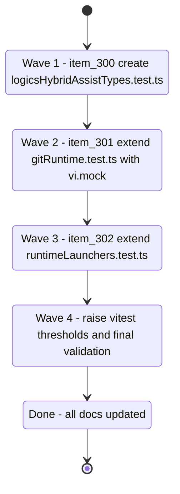

## task_128_orchestrate_test_coverage_improvements_for_item_300_301_and_302 - Orchestrate test coverage improvements for item_300, item_301 and item_302
> From version: 1.25.2
> Schema version: 1.0
> Status: Done
> Understanding: 95%
> Confidence: 95%
> Progress: 100%
> Complexity: Medium
> Theme: Quality
> Reminder: Update status/understanding/confidence/progress and linked request/backlog references when you edit this doc.

# Context

Deliver the three backlog items from req_163 in a single orchestrated sequence. The items target the three largest deterministic coverage gaps in `src/`:

- **item_300**: `logicsHybridAssistTypes.ts` has no test file at all (39% stmts). All exported functions are pure — no mocks needed.
- **item_301**: `gitRuntime.ts` sits at 52.7% stmts. The core `runGitCommand` function and fallback path require `vi.mock('child_process')`.
- **item_302**: `runtimeLaunchers.ts` sits at 40% stmts. Missing scenario branches can be covered via the existing `detectCommand` injection option — no mock infra needed.
- **Wave 4** (final): raise `vitest.config.mts` thresholds to lock in the gains.

The items are independent of each other and can be implemented sequentially in order: item_300 (no mock setup needed) → item_301 (adds mock infra) → item_302 (reuses injection pattern) → threshold update.

# Plan

## Wave 1 — item_300: Create `tests/logicsHybridAssistTypes.test.ts`

Derived from `logics/backlog/item_300_add_missing_tests_for_logicshybridassisttypes.md`

- [x] 1.1 Read `src/logicsHybridAssistTypes.ts` in full — understand the signature of each exported function before writing any test.
- [x] 1.2 Create `tests/logicsHybridAssistTypes.test.ts`. Cover `parseHybridAssistPayload` (null for non-record inputs, valid record passthrough).
- [x] 1.3 Cover `describeHybridAssistOutcome`: `backendUsed` from `backend_used`, from `backend.selected_backend`, null fallback; `backendRequested` same pattern; `degraded` from `degraded` flag, from `result_status === "degraded"`, from non-empty `degraded_reasons`.
- [x] 1.4 Cover `parseHybridCommitPlanSteps`: empty plan, valid steps, invalid step entries filtered out.
- [x] 1.5 Cover `parseHybridTriageResult`, `parseHybridDiffRiskResult`, `parseHybridValidationSummaryResult`, `parseHybridChangelogSummaryResult`, `parseHybridValidationChecklistResult`, `parseHybridDocConsistencyResult`: null when result is missing, null when all fields undefined, populated object when fields present.
- [x] 1.6 Cover `parseHybridPrepareReleaseResult` and `parseHybridPublishReleaseResult`: null when `changelog_status` absent, fully populated when all sub-fields present.
- [x] 1.7 Cover `parseHybridInsightsSources`: null when `sources` is not a string-record, populated when both fields present.
- [x] 1.8 Cover `parseHybridRuntimeProviders`: empty object when `providers` absent or non-record, populated entries with non-record values skipped.
- [x] 1.9 Run `npm run test:coverage:src` — verify `logicsHybridAssistTypes.ts` reaches ≥ 85% statements with no existing test regressions.
- [x] CHECKPOINT: commit `tests/logicsHybridAssistTypes.test.ts`. Update item_300 Progress to 100%.

## Wave 2 — item_301: Extend `tests/gitRuntime.test.ts`

Derived from `logics/backlog/item_301_extend_unit_tests_for_gitruntime.md`

- [x] 2.1 Read the current `tests/gitRuntime.test.ts` to understand existing test setup and mocking style before adding new tests.
- [x] 2.2 Add `vi.mock('child_process', ...)` at the top of the file (or in a new describe block using `vi.doMock`) to intercept `execFile` without real process spawning.
- [x] 2.3 Test `detectGitCommand()`: mock `execFile` to resolve without error → returns `true`; mock to resolve with error → returns `false`.
- [x] 2.4 Test `runGitCommand()` happy path: `execFile` resolves with stdout `"output"` → result has `stdout: "output"` and no `error`.
- [x] 2.5 Test `runGitCommand()` with git completely missing: `execFile` always errors with a "not found" message → result has `error` set and `stderr` contains the missing-git message from `buildMissingGitMessage()`.
- [x] 2.6 Test `runGitCommand()` fallback path: first `execFile` call errors with "command not found" stderr, second call (after `resolvedGitCommandPromise` reset) resolves successfully → result is the successful second-attempt output.
- [x] 2.7 Test `normalizeGitPathSetting` indirectly via `getGitCommandCandidates` with an array `configuredGitPath` — or call it directly if exported (it's currently private; test it via the public surface).
- [x] 2.8 Reset the module's `resolvedGitCommandPromise` cache between tests using `configureGitPathSettingReader(undefined)` in `afterEach` so tests are independent.
- [x] 2.9 Run `npm run test:coverage:src` — verify `gitRuntime.ts` reaches ≥ 75% statements.
- [x] CHECKPOINT: commit extended `tests/gitRuntime.test.ts`. Update item_301 Progress to 100%.

## Wave 3 — item_302: Extend `tests/runtimeLaunchers.test.ts`

Derived from `logics/backlog/item_302_extend_unit_tests_for_runtimelaunchers.md`

- [x] 3.1 Read `src/runtimeLaunchers.ts` and the current `tests/runtimeLaunchers.test.ts` to confirm the injection pattern (`detectCommand` option) before adding cases.
- [x] 3.2 Add a test: `root = null` → `codex.available` is `false`, `claude.available` is `false`, both titles are `"Select a project root first"`.
- [x] 3.3 Add a test: `detectCommand` returns `false` for `"codex"`, `true` for `"claude"` → `codex.available` is `false`, `codex.title` contains `"Codex CLI not found on PATH"`.
- [x] 3.4 Add a test: `detectCommand` returns `true` for `"codex"`, `false` for `"claude"` → `claude.available` is `false`, `claude.title` contains `"Claude CLI not found on PATH"`.
- [x] 3.5 Add a test: valid root, both commands found, `codexOverlay` in `warning` status (create a minimal overlay in the temp root that triggers warning) → `codex.available` is `true`.
- [x] 3.6 Add a test: valid root, claude found, no global kit published, no claude bridge files → `claude.available` is `false`, title contains `"bridge files are missing"` or `"needs re-publication"`.
- [x] 3.7 Run `npm run test:coverage:src` — verify `runtimeLaunchers.ts` reaches ≥ 75% statements.
- [x] CHECKPOINT: commit extended `tests/runtimeLaunchers.test.ts`. Update item_302 Progress to 100% (threshold update follows in Wave 4).

## Wave 4 — Raise `vitest.config.mts` thresholds and final validation

- [x] 4.1 Run `npm run test:coverage:src` to get the final coverage numbers after all three waves.
- [x] 4.2 Update `vitest.config.mts`: set `lines` to at least `68`, `branches` to at least `57`, `statements` to at least `68`, `functions` to at least `73`.
- [x] 4.3 Run `npm run test:coverage:src` again — confirm it exits 0 with no threshold violations.
- [x] 4.4 Run `npm run test` (without coverage) — confirm all tests pass and count is ≥ 383.
- [x] 4.5 Run `npm run compile` — confirm no TypeScript errors.
- [x] 4.6 Update req_163 Status to `Done`, item_300/301/302 Status to `Done` and Progress to `100%`.
- [x] CHECKPOINT: commit threshold update + doc closures. Run `python3 logics/skills/logics.py flow assist commit-all` if the hybrid runtime is healthy.
- [x] FINAL: Run `python3 logics/skills/logics.py lint --require-status` and `python3 logics/skills/logics.py audit --legacy-cutoff-version 1.1.0 --group-by-doc` — resolve any warnings before closing this task.

# Delivery checkpoints

- Each wave ends in a commit-ready state. Do not start wave N+1 before wave N's tests pass.
- Update Progress on each linked backlog item at the end of its wave, not only at final closure.
- If `npm run test:coverage:src` fails at any wave, diagnose the regression before continuing.
- Do not skip `npm run compile` — type errors in test files cause silent coverage gaps.

# AC Traceability

- AC1 → Wave 1 (item_300): `tests/logicsHybridAssistTypes.test.ts` covers all 11+ parse/describe functions. Proof: `npm run test:coverage:src` shows ≥ 85% stmts for `logicsHybridAssistTypes.ts`.
- AC2 → Wave 2 (item_301): `tests/gitRuntime.test.ts` covers `runGitCommand`, `detectGitCommand`, and fallback path. Proof: `npm run test:coverage:src` shows ≥ 75% stmts for `gitRuntime.ts`.
- AC3 → Wave 3 (item_302): `tests/runtimeLaunchers.test.ts` covers all 5 missing scenario branches. Proof: `npm run test:coverage:src` shows ≥ 75% stmts for `runtimeLaunchers.ts`.
- AC4 → Wave 4: `vitest.config.mts` thresholds updated to `lines: 68, branches: 57`; overall src ≥ 68% stmts, ≥ 57% branches. Proof: `npm run test:coverage:src` exits 0 with no threshold violation.
- AC5 → All waves: `npm run test` exits 0 with ≥ 383 passing tests at every checkpoint. Proof: test run output captured at each wave checkpoint.

# Decision framing

- Product framing: Not needed
- Architecture framing: Not needed — pure test additions and threshold config update, no structural changes to src.

# Links

- Product brief(s): (none)
- Architecture decision(s): (none)
- Backlog item: `item_300_add_missing_tests_for_logicshybridassisttypes`
- Backlog item: `item_301_extend_unit_tests_for_gitruntime`
- Backlog item: `item_302_extend_unit_tests_for_runtimelaunchers`
- Request: `req_163_improve_test_coverage_for_hybrid_assist_types_git_runtime_and_runtime_launchers`

# AI Context

- Summary: Four-wave orchestration task implementing test coverage improvements for logicsHybridAssistTypes, gitRuntime, and runtimeLaunchers, ending with a vitest threshold update.
- Keywords: vitest, coverage, unit tests, logicsHybridAssistTypes, gitRuntime, runtimeLaunchers, vi.mock, thresholds, orchestration
- Use when: Executing or reviewing the implementation of any of the four waves in this task.
- Skip when: Working on webview/media coverage, or on unrelated src modules.

# Validation

- `npm run compile` — TypeScript must compile cleanly before starting any wave.
- `npm run test` — all tests pass (≥ 383).
- `npm run test:coverage:src` — per-file and global coverage thresholds are met.
- `python3 logics/skills/logics.py lint --require-status` — no lint errors.
- `python3 logics/skills/logics.py audit --legacy-cutoff-version 1.1.0 --group-by-doc` — no open audit issues after closure.

# Definition of Done (DoD)

- [x] `tests/logicsHybridAssistTypes.test.ts` created and covers all exported parse/describe functions.
- [x] `tests/gitRuntime.test.ts` extended with `runGitCommand`, `detectGitCommand`, and fallback path tests.
- [x] `tests/runtimeLaunchers.test.ts` extended with null-root, missing-command, overlay-warning, and bridge-absent scenarios.
- [x] `vitest.config.mts` thresholds updated to `lines: 68, branches: 57` (or higher).
- [x] `npm run test:coverage:src` exits 0 with no threshold violation.
- [x] `npm run test` exits 0 with ≥ 383 passing tests.
- [x] `npm run compile` exits 0.
- [x] item_300, item_301, item_302, and req_163 all have Status `Done` and Progress `100%`.
- [x] Lint and audit pass cleanly.
- [x] Status is `Done` and Progress is `100%`.

# Report
