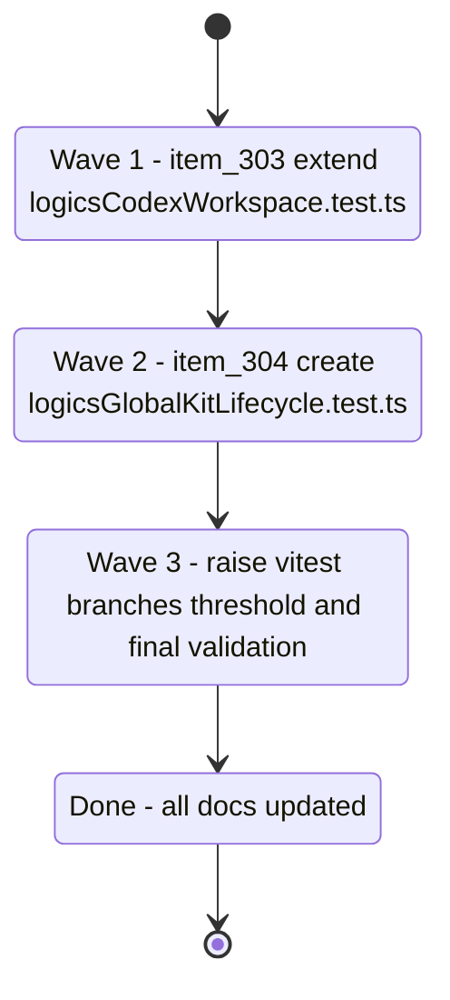

## task_129_orchestrate_branch_coverage_improvements_for_item_303_and_304 - Orchestrate branch coverage improvements for item_303 and item_304
> From version: 1.25.2
> Schema version: 1.0
> Status: Done
> Understanding: 95%
> Confidence: 95%
> Progress: 100%
> Complexity: Medium
> Theme: Quality
> Reminder: Update status/understanding/confidence/progress and linked request/backlog references when you edit this doc.

# Context

Deliver the two backlog items from req_164 in a single orchestrated sequence. Both items target the most severe branch-coverage gaps in the kit publication and overlay inspection layer:

- **item_303**: `logicsCodexWorkspace.ts` sits at 38.23% branches. The surface is already partially tested — this item adds `shouldPublishRepoKit` (5 conditions) and `publishCodexWorkspaceOverlay` edge cases (copy-mode, previous-skill cleanup).
- **item_304**: `logicsGlobalKitLifecycle.ts` sits at 46.55% branches with no dedicated test file. This item creates `tests/logicsGlobalKitLifecycle.test.ts` covering `copyDirectory` (symlink), `readSkillTier` (YAML errors), and `existsOrSymlink` (dangling symlink). It also owns the vitest threshold update.

Order: item_303 first (no new file, lower risk), then item_304 (new test file + threshold gate).

# Plan

## Wave 1 — item_303: Extend `tests/logicsCodexWorkspace.test.ts`

Derived from `logics/backlog/item_303_extend_branch_tests_for_logicscodexworkspace.md`

- [x] 1.1 Read `src/logicsCodexWorkspace.ts` lines 274–299 (`shouldPublishRepoKit`) and 203–272 (`publishCodexWorkspaceOverlay`) in full before writing any test.
- [x] 1.2 Add a `describe("shouldPublishRepoKit")` block. Test `missing-manager` snapshot → returns `false`.
- [x] 1.3 Test `missing-overlay` snapshot → returns `true`; `stale` snapshot → returns `true`.
- [x] 1.4 Test published version older than repo version (use a real root with `VERSION` file set higher) → returns `true`.
- [x] 1.5 Test same version + same revision → returns `false` (no publish needed).
- [x] 1.6 Test same version + different revision + same `sourceRepo` → returns `true`.
- [x] 1.7 Add a `describe("publishCodexWorkspaceOverlay - copy mode")` block. Use `vi.spyOn(fs, 'symlinkSync').mockImplementationOnce(() => { throw new Error('symlink not supported'); })` to force copy mode. Assert `result.publicationMode === "copy"`.
- [x] 1.8 Add a test for previous-skill cleanup: first publish with skills A+B, then re-publish with skill A only. Assert skill B directory no longer exists in globalSkillsRoot after the second publish.
- [x] 1.9 Run `npm run test:coverage:src` — verify `logicsCodexWorkspace.ts` reaches ≥ 60% branches.
- [x] CHECKPOINT: commit extended `tests/logicsCodexWorkspace.test.ts`. Update item_303 Progress to 100%.

## Wave 2 — item_304: Create `tests/logicsGlobalKitLifecycle.test.ts`

Derived from `logics/backlog/item_304_create_branch_tests_for_logicsglobalkitlifecycle.md`

- [x] 2.1 Read `src/logicsGlobalKitLifecycle.ts` lines 350–410 (`existsOrSymlink`, `readSkillMtime`, `copyDirectory`, `readSkillTier`) in full before writing any test.
- [x] 2.2 Create `tests/logicsGlobalKitLifecycle.test.ts`. Import `existsOrSymlink`, `readSkillMtime`, `copyDirectory` (if exported) or test via `publishSkill` which calls them, and `buildRepoKitSource`.
- [x] 2.3 Test `existsOrSymlink` — dangling symlink: `fs.symlinkSync('/nonexistent/target', path.join(tmpdir, 'dangling'))` → `existsOrSymlink` returns `true` (found via `lstatSync`).
- [x] 2.4 Test `existsOrSymlink` — non-existent path with no symlink → returns `false`.
- [x] 2.5 Test `readSkillTier` via `buildRepoKitSource` or `discoverRepoSkills` (if accessible): create an `agents/openai.yaml` with malformed YAML content → tier defaults to `"core"`.
- [x] 2.6 Test `readSkillTier` with valid YAML but `tier: "optional"` → tier is `"optional"`.
- [x] 2.7 Test `readSkillTier` with valid YAML but `tier` field absent → tier defaults to `"core"`.
- [x] 2.8 Test `copyDirectory` with a symlink entry inside the source directory: create a dir with a file and a symlink, call `copyDirectory`, verify the symlink is re-created (not copied as a file) at the destination.
- [x] 2.9 Run `npm run test:coverage:src` — verify `logicsGlobalKitLifecycle.ts` reaches ≥ 65% branches.
- [x] CHECKPOINT: commit `tests/logicsGlobalKitLifecycle.test.ts`. Update item_304 Progress to 100% (threshold update follows in Wave 3).

## Wave 3 — Raise `vitest.config.mts` threshold and final validation

- [x] 3.1 Run `npm run test:coverage:src` to get the final branch coverage numbers after Waves 1 and 2.
- [x] 3.2 Update `vitest.config.mts`: set `branches` to at least `61`. Also raise `statements`, `lines`, `functions` if the new numbers justify it.
- [x] 3.3 Run `npm run test:coverage:src` again — confirm it exits 0 with no threshold violations.
- [x] 3.4 Run `npm run test` (without coverage) — confirm all tests pass and count is ≥ 410.
- [x] 3.5 Run `npm run compile` — confirm no TypeScript errors.
- [x] 3.6 Update req_164 Status to `Done`, item_303/304 Status to `Done` and Progress to `100%`.
- [x] CHECKPOINT: commit threshold update + doc closures. Run `python3 logics/skills/logics.py flow assist commit-all` if the hybrid runtime is healthy.
- [x] FINAL: Run `python3 logics/skills/logics.py lint --require-status` and `python3 logics/skills/logics.py audit --legacy-cutoff-version 1.1.0 --group-by-doc` — resolve any warnings before closing this task.

# Delivery checkpoints

- Do not start Wave 2 before Wave 1's `npm run test:coverage:src` passes at ≥ 60% branches for `logicsCodexWorkspace.ts`.
- `vi.spyOn` calls must be properly restored in `afterEach` — use `vi.restoreAllMocks()` or explicit `.mockRestore()` to avoid cross-test pollution.
- `copyDirectory` is not exported from `logicsGlobalKitLifecycle.ts` — test it via `publishSkill` (which calls it when symlink fails) or verify coverage indirectly via the copy-mode test in Wave 1.
- Do not skip `npm run compile` — type errors in test files cause silent coverage gaps.

# AC Traceability

- AC1 → Wave 1 (item_303): `logicsCodexWorkspace.ts` branch coverage ≥ 60%. Proof: `npm run test:coverage:src` output.
- AC2 → Wave 2 (item_304): `logicsGlobalKitLifecycle.ts` branch coverage ≥ 65% with new test file. Proof: `npm run test:coverage:src` output.
- AC3 → Wave 3: overall src branches ≥ 61%, `vitest.config.mts` updated. Proof: `npm run test:coverage:src` exits 0.
- AC4 → All waves: `npm run test` exits 0 with ≥ 410 tests at every checkpoint. Proof: test run output.

# Decision framing

- Product framing: Not needed
- Architecture framing: Not needed — pure test additions and threshold config update, no structural changes to src.

# Links

- Product brief(s): (none)
- Architecture decision(s): (none)
- Backlog item: `item_303_extend_branch_tests_for_logicscodexworkspace`
- Backlog item: `item_304_create_branch_tests_for_logicsglobalkitlifecycle`
- Request: `req_164_improve_branch_coverage_for_logicscodexworkspace_and_logicsglobalkitlifecycle`

# AI Context

- Summary: Three-wave orchestration task extending logicsCodexWorkspace.test.ts, creating logicsGlobalKitLifecycle.test.ts, and raising the vitest branch threshold to close the 38% and 46% branch coverage gaps.
- Keywords: branch coverage, logicsCodexWorkspace, logicsGlobalKitLifecycle, shouldPublishRepoKit, copyDirectory, readSkillTier, existsOrSymlink, vi.spyOn, vitest threshold
- Use when: Executing or reviewing any of the three waves in this orchestration task.
- Skip when: Working on webview/media coverage or on logicsViewDocumentController/logicsViewProvider.

# Validation

- `npm run compile` — TypeScript must compile cleanly before starting any wave.
- `npm run test` — all tests pass (≥ 410).
- `npm run test:coverage:src` — per-file and global branch thresholds are met.
- `python3 logics/skills/logics.py lint --require-status` — no lint errors.
- `python3 logics/skills/logics.py audit --legacy-cutoff-version 1.1.0 --group-by-doc` — no open audit issues after closure.

# Definition of Done (DoD)

- [x] `tests/logicsCodexWorkspace.test.ts` extended with `shouldPublishRepoKit` (5 branches) and `publishCodexWorkspaceOverlay` (copy-mode and cleanup) tests.
- [x] `tests/logicsGlobalKitLifecycle.test.ts` created and covers `copyDirectory` symlink, `readSkillTier` YAML errors, and `existsOrSymlink` dangling symlink.
- [x] `vitest.config.mts` `branches` threshold updated to at least 61.
- [x] `npm run test:coverage:src` exits 0 with `logicsCodexWorkspace.ts` ≥ 60% branches, `logicsGlobalKitLifecycle.ts` ≥ 65% branches, overall ≥ 61%.
- [x] `npm run test` exits 0 with ≥ 410 passing tests.
- [x] `npm run compile` exits 0.
- [x] item_303, item_304, and req_164 all have Status `Done` and Progress `100%`.
- [x] Lint and audit pass cleanly.
- [x] Status is `Done` and Progress is `100%`.

# Report
