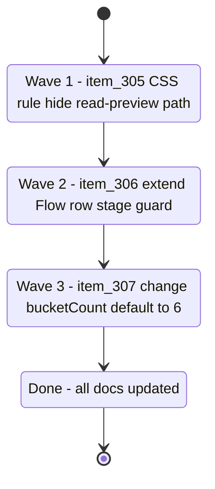

## task_130_orchestrate_ux_feedback_fixes_for_item_305_306_and_307 - Orchestrate UX feedback fixes for item_305, item_306 and item_307
> From version: 1.25.2
> Schema version: 1.0
> Status: Done
> Understanding: 95%
> Confidence: 95%
> Progress: 100%
> Complexity: Low
> Theme: UI
> Reminder: Update status/understanding/confidence/progress and linked request/backlog references when you edit this doc.

# Context

Three small, independent UX fixes from 1.25.2 feedback. All three are surgical — one CSS rule, one guard extension, one constant change. They can be delivered in any order; the sequence below goes from lowest risk to highest surface area.

- **item_305**: one CSS rule in `media/css/details.css` to hide `.read-preview__path` when the panel is collapsed.
- **item_306**: one-line guard extension in `media/renderBoardApp.js:650` to exclude `"product"` and `"architecture"` from the Flow row.
- **item_307**: change `bucketCount = 12` → `6` in `src/logicsCorpusInsightsHtml.ts:310` and update three description strings.

# Plan

## Wave 1 — item_305: Hide `File: ...` in collapsed detail panel

Derived from `logics/backlog/item_305_hide_file_label_in_collapsed_detail_panel.md`

- [x] 1.1 Read `media/css/details.css` around line 97 (`.details--collapsed` rules) to find the right insertion point.
- [x] 1.2 Add the CSS rule: `.details--collapsed .read-preview__path { display: none; }` in the `.details--collapsed` block in `media/css/details.css`.
- [x] 1.3 Run `npm run compile` — confirm no TypeScript errors.
- [x] 1.4 Run `npm run test` — confirm all tests pass.
- [x] CHECKPOINT: commit CSS change. Update item_305 Progress to 100%.

## Wave 2 — item_306: Suppress Flow row in product brief and ADR cards

Derived from `logics/backlog/item_306_suppress_flow_row_in_product_brief_and_adr_card_previews.md`

- [x] 2.1 Read `media/renderBoardApp.js` around line 650 to confirm the current guard expression before editing.
- [x] 2.2 Change line 650 from:
  `const linkage = String(item?.stage || "").trim() === "spec" ? "" : createPrimaryFlowSummary(item);`
  to:
  `const linkage = ["spec", "product", "architecture"].includes(String(item?.stage || "").trim()) ? "" : createPrimaryFlowSummary(item);`
- [x] 2.3 Run `npm run compile` — confirm no TypeScript errors.
- [x] 2.4 Run `npm run test` — confirm all tests pass.
- [x] CHECKPOINT: commit renderBoardApp.js change. Update item_306 Progress to 100%.

## Wave 3 — item_307: Reduce timeline default window to 6 weeks

Derived from `logics/backlog/item_307_reduce_insights_timeline_default_window_from_12_to_6_weeks.md`

- [x] 3.1 Read `src/logicsCorpusInsightsHtml.ts` lines 308–345 and 768–775 to confirm the exact string locations before editing.
- [x] 3.2 Change the function signature at line 310 from `bucketCount = 12` to `bucketCount = 6`.
- [x] 3.3 Update line 344: `"No closed items in the last 12 weeks."` → `"No closed items in the last 6 weeks."`
- [x] 3.4 Update lines 771–772: `"last 12 weeks"` → `"last 6 weeks"` in both the `
` description and the `renderTimelineChart` call.
- [x] 3.5 Run `npm run compile` — confirm no TypeScript errors.
- [x] 3.6 Run `npm run test` — confirm all tests pass (tests using explicit `bucketCount` are unaffected).
- [x] 3.7 Update req_165 Status to `Done`, item_305/306/307 Status to `Done` and Progress to `100%`.
- [x] CHECKPOINT: commit insights change + doc closures. Run `python3 logics/skills/logics.py flow assist commit-all` if the hybrid runtime is healthy.
- [x] FINAL: Run `python3 logics/skills/logics.py lint --require-status` and `python3 logics/skills/logics.py audit --legacy-cutoff-version 1.1.0 --group-by-doc` — resolve any warnings before closing this task.

# Delivery checkpoints

- Each wave is a single, self-contained change. Commit after each wave — do not batch all three into one commit.
- All three fixes are independent. If one wave fails review, the others can still be committed.
- Do not skip `npm run compile` — changes to `.ts` files can introduce type errors.

# AC Traceability

- AC1 → Wave 1 (item_305): File label hidden in collapsed panel. Proof: manual check in plugin — collapsed panel shows no File label; expanded panel shows it.
- AC2 → Wave 2 (item_306): Flow row absent from prod_ and adr_ card previews. Proof: board shows no Flow row for product brief and ADR cards; still present for request/backlog/task.
- AC3 → Wave 3 (item_307): Logics Insights timeline shows 6 bars with "6 weeks" copy. Proof: Insights panel renders 6-bar timeline.
- AC4 → All waves: `npm run test` exits 0 with ≥ 410 tests at every checkpoint. Proof: test run output.

# Decision framing

- Product framing: Not needed
- Architecture framing: Not needed — one CSS rule, one guard extension, one constant change.

# Links

- Product brief(s): (none)
- Architecture decision(s): (none)
- Backlog item: `item_305_hide_file_label_in_collapsed_detail_panel`
- Backlog item: `item_306_suppress_flow_row_in_product_brief_and_adr_card_previews`
- Backlog item: `item_307_reduce_insights_timeline_default_window_from_12_to_6_weeks`
- Request: `req_165_plugin_ux_feedback_panel_detail_cell_labels_and_insights_timeline_period`

# AI Context

- Summary: Three-wave delivery of independent UX fixes: CSS hide for File label in collapsed panel, Flow row guard for product/architecture stages, and timeline default window reduced from 12 to 6 weeks.
- Keywords: collapsed detail panel, read-preview__path, Flow row, product brief, ADR, insights timeline, bucketCount, renderBoardApp, logicsCorpusInsightsHtml, details.css
- Use when: Executing or reviewing any of the three waves.
- Skip when: Working on coverage, modularisation, or unrelated plugin surfaces.

# Validation

- `npm run compile` — TypeScript must compile cleanly after each wave.
- `npm run test` — all tests pass (≥ 410) after each wave.
- `python3 logics/skills/logics.py lint --require-status` — no lint errors.
- `python3 logics/skills/logics.py audit --legacy-cutoff-version 1.1.0 --group-by-doc` — no open audit issues after closure.

# Definition of Done (DoD)

- [x] `media/css/details.css` has `.details--collapsed .read-preview__path { display: none; }`.
- [x] `media/renderBoardApp.js:650` guard excludes `"product"` and `"architecture"` stages.
- [x] `src/logicsCorpusInsightsHtml.ts` uses `bucketCount = 6` default and all three "12 weeks" strings updated to "6 weeks".
- [x] `npm run test` exits 0 with ≥ 410 passing tests.
- [x] `npm run compile` exits 0.
- [x] item_305, item_306, item_307, and req_165 all have Status `Done` and Progress `100%`.
- [x] Lint and audit pass cleanly.
- [x] Status is `Done` and Progress is `100%`.

# Report
