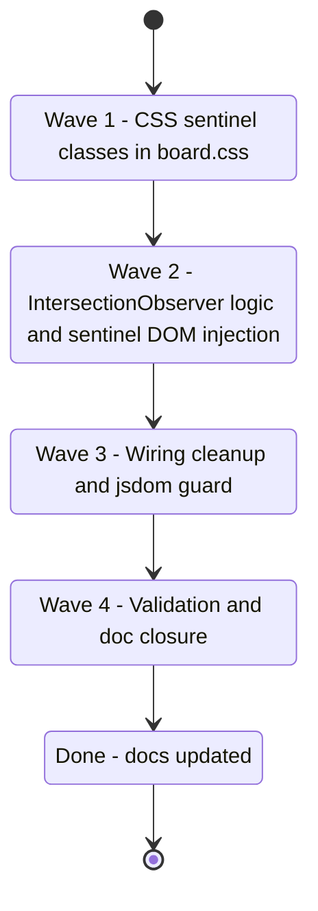

## task_131_implement_sticky_ambient_section_headers_in_list_view - Implement sticky ambient section headers in list view
> From version: 1.25.2
> Schema version: 1.0
> Status: Done
> Understanding: 95%
> Confidence: 90%
> Progress: 100%
> Complexity: Medium
> Theme: UI
> Reminder: Update status/understanding/confidence/progress and linked request/backlog references when you edit this doc.

# Context

Deliver item_308: add two ambient sticky sentinels to the list view showing the previous and next group header as the user scrolls. The scroll container is `.board--list` (`overflow-y: auto`), sections are `.list-view__section[data-group]`, headers are `.list-view__header` buttons with `.list-view__header-label` and `.list-view__header-count` children.

The implementation has three parts:
1. **CSS**: `position: relative` wrapper + two `position: absolute` sentinel classes in `media/css/board.css`.
2. **JS**: observer logic in `media/renderBoardApp.js` — `IntersectionObserver` on all `.list-view__header` elements with the wrapper as root; chevron direction indicator reusing `chevronIcon()`; D3 (collapsed groups included), D4 (bottom sentinel triggers immediately).
3. **Wiring**: inject wrapper + sentinels after `renderListView` builds the DOM; `disconnectSentinels()` before each re-render.

# Plan

## Wave 1 — CSS: wrapper and sentinel classes in `media/css/board.css`

- [x] 1.1 Read `media/css/board.css` lines 16–21 (`.board--list`) and lines 437–505 (`.list-view__header`) to understand the existing visual context before editing.
- [x] 1.2 Add `.list-view__wrapper`: `position: relative; flex: 1; overflow: hidden;` — this wraps `.board--list` and serves as the `position: relative` anchor for the absolute sentinels.
- [x] 1.3 Add `.list-view__sentinel` base class: `position: absolute; left: 0; right: 0; z-index: 10; display: flex; align-items: center; gap: 6px; padding: 0 12px 6px; font-size: 12px; text-transform: uppercase; letter-spacing: 0.06em; color: var(--vscode-descriptionForeground, #9da5b4); background: var(--vscode-sideBar-background, #252526); pointer-events: none;`
- [x] 1.4 Add `.list-view__sentinel--top`: `top: 0; border-bottom: 1px solid var(--vscode-panel-border, #333333);`
- [x] 1.5 Add `.list-view__sentinel--bottom`: `bottom: 0; border-top: 1px solid var(--vscode-panel-border, #333333);`
- [x] 1.6 Add `.list-view__sentinel[hidden] { display: none !important; }`
- [x] CHECKPOINT: CSS-only, `npm run compile` passes, no visual regression (sentinels not yet injected).

## Wave 2 — JS: wrapper, sentinel injection and IntersectionObserver

- [x] 2.1 Read `media/renderBoardApp.js` lines 830–900 (`renderListView`) and the call site that mounts the board element to understand the exact injection point.
- [x] 2.2 Create `createSentinelElement(variant)` where `variant` is `"top"` or `"bottom"`. Returns a `
` containing:
  - `` — `chevronIcon(variant === "bottom")` (up for top, down for bottom, reusing existing helper)
  - ``
  - ``
  - Set `hidden` by default.
- [x] 2.3 After `renderListView` builds the list, wrap `.board--list` in a `
`. Append `sentinel-top` and `sentinel-bottom` as children of the wrapper (siblings of `.board--list`), not inside the scroll container.
- [x] 2.4 Build `attachSentinelObserver(wrapperEl, boardListEl, sentinelTop, sentinelBottom)`:
  - `Map<Element, "above" | "visible" | "below">` tracking each header's state.
  - `IntersectionObserver` with `root: boardListEl`, `threshold: [0, 1]`, observe all `.list-view__header` elements (including collapsed group headers — D3).
  - On each entry: if `isIntersecting` → `"visible"`; else if `boundingClientRect.bottom < rootBounds.top` → `"above"`; else → `"below"`.
  - After processing: last `"above"` header → top sentinel; first `"below"` header → bottom sentinel (D4: triggers immediately regardless of current header state).
  - Update label + count `textContent` atomically; toggle `hidden`.
- [x] 2.5 Store observer reference in a module-level variable for cleanup.
- [x] CHECKPOINT: `npm run test` passes. Manual verify: scroll through 5+ groups — both sentinels update correctly.

## Wave 3 — Wiring: cleanup guard and jsdom safety

- [x] 3.1 Add a `disconnectSentinels()` function that: calls `observer.disconnect()` if the observer exists; removes sentinel DOM elements from `.board--list` if present; resets module-level references to `null`.
- [x] 3.2 Call `disconnectSentinels()` at the **top** of `renderListView` (before building the new DOM) so stale observers are always cleaned up before a new render.
- [x] 3.3 Wrap `attachSentinelObserver` with a guard: `if (typeof IntersectionObserver === "undefined") return;` — ensures the code is a no-op in jsdom tests without throwing.
- [x] 3.4 Confirm the board column mode path (the `else` branch that calls `renderBoardColumns`) does NOT call `attachSentinelObserver` — sentinels must be absent when `.board--list` is not active.
- [x] CHECKPOINT: `npm run test` passes. Rapid re-render (trigger state change twice in quick succession) does not produce duplicate observers.

## Wave 4 — Validation and closure

- [x] 4.1 Run `npm run compile` — confirm no TypeScript errors.
- [x] 4.2 Run `npm run test` — confirm all tests pass (≥ 410).
- [x] 4.3 Manual smoke test in the plugin: scroll through a list with 5+ groups. Verify:
  - Top of list: top sentinel hidden, bottom sentinel shows first section below viewport.
  - Middle of a long section: top sentinel shows previous group, bottom sentinel shows next group.
  - Bottom of list: bottom sentinel hidden, top sentinel shows last group scrolled past.
  - In board column mode: no sentinel elements present in DOM.
- [x] 4.4 Update req_166 Status to `Done`, item_308 Status to `Done` and Progress to `100%`.
- [x] CHECKPOINT: commit final changes + doc closures. Run `python3 logics/skills/logics.py flow assist commit-all` if the hybrid runtime is healthy.
- [x] FINAL: Run `python3 logics/skills/logics.py lint --require-status` and `python3 logics/skills/logics.py audit --legacy-cutoff-version 1.1.0 --group-by-doc` — resolve any warnings before closing.

# Delivery checkpoints

- Wave 1 is CSS-only — commit independently so it can be reviewed and rolled back without touching JS.
- Sentinels are siblings of `.board--list` inside `.list-view__wrapper`, not children of the scroll container — this is the overlay approach (D1). Do not inject them inside `.board--list`.
- The `IntersectionObserver` callback fires asynchronously — do not rely on it in synchronous tests. The pure `Map` update logic can be unit-tested by calling the callback handler directly with mocked entries.
- `pointer-events: none` on sentinels is mandatory (D1 overlay) — they must never block scroll or click events on the underlying cards.
- Collapsed group headers are observed normally (D3) — do not filter out sections with `hidden` body.
- Bottom sentinel logic: use `boundingClientRect.top > rootBounds.bottom` as the sole condition (D4) — no dependency on whether the current header has already exited the top.

# AC Traceability

- AC1 → Wave 2: top sentinel shows prev group label and count. Proof: manual scroll test.
- AC2 → Wave 2: bottom sentinel shows next group label and count. Proof: manual scroll test.
- AC3 → Wave 1 + Wave 2: `pointer-events: none` in CSS; no event listeners on sentinel elements. Proof: keyboard nav and collapse/expand work after feature is active.
- AC4 → Wave 3: `disconnectSentinels` and no injection in board column path. Proof: board column mode DOM has no `.list-view__sentinel` elements.
- AC5 → Wave 3: `disconnectSentinels()` called at top of `renderListView`. Proof: single observer after rapid re-renders.
- AC6 → Wave 3: `typeof IntersectionObserver !== "undefined"` guard. Proof: `npm run test` exits 0 with ≥ 410 tests.

# Decision framing

- Product framing: Not needed
- Architecture framing: Not needed — self-contained DOM injection with module-level cleanup; no impact on message passing, state, or extension host.

# Links

- Product brief(s): (none)
- Architecture decision(s): (none)
- Backlog item: `item_308_sticky_ambient_section_headers_in_list_view_showing_prev_and_next_group_context`
- Request: `req_166_sticky_ambient_section_headers_in_list_view_showing_prev_and_next_group_context`

# AI Context

- Summary: Four-wave implementation of ambient sticky sentinels in the list view: CSS classes, IntersectionObserver injection, cleanup/guard wiring, and validation.
- Keywords: sticky header, sentinel, IntersectionObserver, board--list, list-view__sentinel, ambient navigation, list view, renderBoardApp
- Use when: Executing or reviewing any of the four waves.
- Skip when: Working on board column mode, coverage, or unrelated plugin surfaces.

# Validation

- `npm run compile` — TypeScript must compile cleanly after each wave.
- `npm run test` — all tests pass (≥ 410) after each wave.
- Manual smoke test in plugin — sentinels show correct prev/next labels at all scroll positions.
- `python3 logics/skills/logics.py lint --require-status` — no lint errors.
- `python3 logics/skills/logics.py audit --legacy-cutoff-version 1.1.0 --group-by-doc` — no open audit issues after closure.

# Definition of Done (DoD)

- [x] `.list-view__sentinel`, `.list-view__sentinel--top`, `.list-view__sentinel--bottom` CSS classes added to `media/css/board.css`.
- [x] Two sentinel elements injected into `.board--list` after each `renderListView` call.
- [x] `IntersectionObserver` tracks all `.list-view__header` elements and updates sentinels on scroll.
- [x] `disconnectSentinels()` called at the top of `renderListView` before each new render.
- [x] `typeof IntersectionObserver !== "undefined"` guard prevents jsdom test failures.
- [x] Sentinels absent in board column mode.
- [x] `npm run test` exits 0 with ≥ 410 passing tests.
- [x] `npm run compile` exits 0.
- [x] item_308 and req_166 have Status `Done` and Progress `100%`.
- [x] Lint and audit pass cleanly.
- [x] Status is `Done` and Progress is `100%`.

# Report
