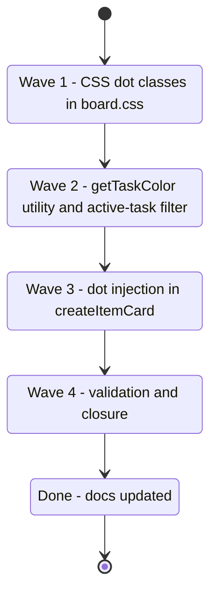

## task_132_implement_task_color_badge_on_cards - Implement task color badge on cards
> From version: 1.25.2
> Schema version: 1.0
> Status: Done
> Understanding: 96%
> Confidence: 92%
> Progress: 100%
> Complexity: Medium
> Theme: UI
> Reminder: Update status/understanding/confidence/progress and linked request/backlog references when you edit this doc.

# Context

Deliver item_309: add a small colored dot badge to the top-right corner of each card that is either a task itself or covered by an active task. Color is derived deterministically from `taskNumber % 10` against a fixed 10-color palette. Data comes entirely from `item.usedBy` (already populated by the indexer) — no indexer or state changes needed.

Three deliverables:
1. **CSS** — `.card__task-dot` and `.card__task-dot-overflow` classes in `media/css/board.css`.
2. **JS utility** — `getTaskColor(id)` function and active-task filter in `media/renderBoardApp.js`.
3. **Card injection** — dot(s) appended inside `createItemCard` for task cards and covered cards.



# Plan

## Wave 1 — CSS: dot classes in `media/css/board.css`

- [ ] 1.1 Read `media/css/board.css` around the `.card` class to confirm `position: relative` is already set and find the insertion point.
- [ ] 1.2 Add `.card__task-dot-container`: `position: absolute; top: 6px; right: 6px; display: flex; align-items: center; gap: 3px; pointer-events: none;`
- [ ] 1.3 Add `.card__task-dot`: `width: 8px; height: 8px; border-radius: 50%; opacity: 0.9; border: 1px solid rgba(255,255,255,0.2); flex: none;`
- [ ] 1.4 Add `.card__task-dot-overflow`: `font-size: 9px; color: var(--vscode-descriptionForeground, #9da5b4); line-height: 1; align-self: center;`
- [ ] 1.5 Run `npm run compile` — confirm clean.
- [ ] CHECKPOINT: CSS-only commit, no visual change yet (container not injected).

## Wave 2 — JS: `getTaskColor` utility and active-task filter

- [ ] 2.1 Read `media/renderBoardApp.js` lines 630–680 (`createCardPreview`, `createItemCard`) to understand the card creation flow before editing.
- [ ] 2.2 Add the 10-color palette constant near the top of `renderBoardApp.js`:
  ```js
  const TASK_COLORS = ["#2dd4bf","#a78bfa","#fbbf24","#f87171","#38bdf8","#a3e635","#fb923c","#f472b6","#818cf8","#22d3ee"];
  ```
- [ ] 2.3 Add `getTaskColor(id)`:
  ```js
  function getTaskColor(id) {
    const n = parseInt((id || "").match(/(\d+)$/)?.[1] ?? "0", 10);
    return TASK_COLORS[n % TASK_COLORS.length];
  }
  ```
- [ ] 2.4 Add `getActiveTaskUsages(item)` — returns `item.usedBy` entries where `stage === "task"` AND `Status` indicator not in `["done","archived","obsolete"]` (case-insensitive). Returns an array of `{ id, title }`.
- [ ] 2.5 Run `npm run test` — confirm clean.
- [ ] CHECKPOINT: utility functions committed, not yet wired to card rendering.

## Wave 3 — dot injection in `createItemCard`

- [ ] 3.1 In `createItemCard`, determine the active task list:
  - If `item.stage === "task"`: active tasks = `[item]` (the card IS the task) — filter by its own Status indicator not Done/Archived/Obsolete.
  - Otherwise: active tasks = `getActiveTaskUsages(item)`.
- [ ] 3.2 If the active task list is empty → skip dot rendering entirely.
- [ ] 3.3 Create `container` with class `card__task-dot-container`.
- [ ] 3.4 For the first `Math.min(2, activeTasks.length)` tasks: create a `<span class="card__task-dot">` with `style="background: ${getTaskColor(task.id)}"`. Append to container.
- [ ] 3.5 If `activeTasks.length > 2`: append a `<span class="card__task-dot-overflow">+${activeTasks.length - 1}</span>`.
- [ ] 3.6 Append `container` to the card element (after the card content, before any existing absolute elements).
- [ ] 3.7 Run `npm run test` — confirm clean. Manual check: board shows colored dots on task and covered items.
- [ ] CHECKPOINT: commit dot injection. Update item_309 Progress to 100%.

## Wave 4 — Validation and closure

- [ ] 4.1 Run `npm run compile` — confirm no TypeScript errors.
- [ ] 4.2 Run `npm run test` — confirm all tests pass (≥ 410).
- [ ] 4.3 Manual smoke test in the plugin:
  - One active task with 2 linked backlog items → 3 cards show same color dot.
  - Two active tasks covering the same item → item card shows 2 dots side-by-side.
  - Mark a task Done → its dots disappear on next render.
  - In board column mode (non-list): dots still appear on individual cards (column view renders cards too).
  - Detail panel and activity view: no dots visible.
- [ ] 4.4 Update req_167 Status to `Done`, item_309 Status to `Done` and Progress to `100%`.
- [ ] CHECKPOINT: commit closures. Run `python3 logics/skills/logics.py flow assist commit-all` if the hybrid runtime is healthy.
- [ ] FINAL: Run `python3 logics/skills/logics.py lint --require-status` and `python3 logics/skills/logics.py audit --legacy-cutoff-version 1.1.0 --group-by-doc`.

# Delivery checkpoints

- Wave 1 is CSS-only — safe to commit independently.
- Wave 2 adds pure functions with no DOM side-effects — safe to commit before Wave 3.
- In Wave 3, the task-card self-dot check (`item.stage === "task"`) must use the item's OWN Status indicator, not `usedBy`.
- The `+N` overflow shows `activeTasks.length - 1` (not length − 2), since only 1 dot is visible when overflow kicks in at 3+.
- Do not add dots to compact card mode (`.card--compact`) if the compact style has a conflicting top-right element — check `board.css` first.

# AC Traceability

- AC1 → Wave 2: `getTaskColor` returns consistent color per task ID. Proof: same task always maps to same palette entry.
- AC2 → Wave 3: task card self-dot. Proof: task cards show their own color dot top-right.
- AC3 → Wave 3: covered cards via `getActiveTaskUsages`. Proof: linked backlog/request cards show matching dot.
- AC4 → Wave 3: multi-dot logic. Proof: 2 tasks → 2 dots; 3+ → dot + `+N`.
- AC5 → Wave 2 + 3: active filter. Proof: Done task → dot removed on next render.
- AC6 → Wave 3: injection only in `createItemCard`. Proof: detail panel and activity have no `.card__task-dot` elements.
- AC7 → All waves: `npm run test` exits 0 with ≥ 410 tests at each checkpoint.

# Decision framing

- Product framing: Not needed
- Architecture framing: Not needed — reads existing `usedBy` data, no indexer or message-type changes.

# Links

- Product brief(s): (none)
- Architecture decision(s): (none)
- Backlog item: `item_309_task_color_badge_on_cards_to_visualize_active_task_coverage_at_a_glance`
- Request: `req_167_task_color_badge_on_cards_to_visualize_active_task_coverage_at_a_glance`

# AI Context

- Summary: Four-wave implementation of the task color dot badge: CSS classes, getTaskColor utility + active filter, dot injection in createItemCard, and validation.
- Keywords: task badge, color dot, getTaskColor, TASK_COLORS, card__task-dot, usedBy, active task filter, createItemCard
- Use when: Executing or reviewing any of the four waves.
- Skip when: Working on coverage, sticky headers, or unrelated plugin surfaces.

# Validation

- `npm run compile` — TypeScript must compile cleanly after each wave.
- `npm run test` — all tests pass (≥ 410) after each wave.
- Manual smoke test — dots appear on correct cards, disappear when task closes.
- `python3 logics/skills/logics.py lint --require-status` — no lint errors.
- `python3 logics/skills/logics.py audit --legacy-cutoff-version 1.1.0 --group-by-doc` — no open audit issues after closure.

# Definition of Done (DoD)

- [x] `.card__task-dot-container`, `.card__task-dot`, `.card__task-dot-overflow` CSS classes in `media/css/board.css`.
- [x] `TASK_COLORS` palette and `getTaskColor(id)` function in `media/renderBoardApp.js`.
- [x] `getActiveTaskUsages(item)` filter for active tasks.
- [x] Dot injection in `createItemCard` for both task self-dots and covered-item dots.
- [x] Multi-dot: ≤2 side-by-side, ≥3 first dot + `+N`.
- [x] Active filter: Done/Archived/Obsolete tasks produce no dots.
- [x] `npm run test` exits 0 with ≥ 410 passing tests.
- [x] `npm run compile` exits 0.
- [x] item_309 and req_167 have Status `Done` and Progress `100%`.
- [x] Lint and audit pass cleanly.
- [x] Status is `Done` and Progress is `100%`.

# Report

- Implemented deterministic task color dots in `media/renderBoardApp.js` with active-task filtering and overflow handling.
- Added styling in `media/css/board.css` for the top-right badge container, dot, and overflow label.
- Added DOM coverage in `tests/webview.board-renderer.test.ts` for active, completed, and multi-task cases.
- Validation passed: `npm run test` (427 tests) and `npm run compile`.
