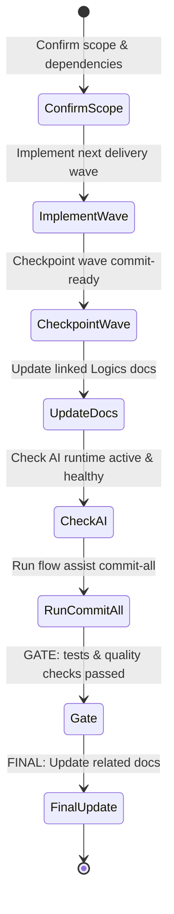

## task_133_am_liorer_la_cr_ation_de_requests_de_test_et_la_pr_validation_du_flow_manager - Improve test request creation and flow manager pre-validation
> From version: 1.25.4
> Schema version: 1.0
> Status: Done
> Understanding: 93%
> Confidence: 93%
> Progress: 100%
> Complexity: Medium
> Theme: Workflow
> Reminder: Update status/understanding/confidence/progress and linked request/backlog references when you edit this doc.

# Context
- Derived from backlog item `item_312_am_liorer_la_cr_ation_de_requests_de_test_et_la_pr_validation_du_flow_manager`.
- Source file: `logics/backlog/item_312_am_liorer_la_cr_ation_de_requests_de_test_et_la_pr_validation_du_flow_manager.md`.
- Related request(s): `req_169_am_liorer_la_cr_ation_de_requests_de_test_et_la_pr_validation_du_flow_manager`.
- Make the flow manager better at generating synthetic requests for testing and smoke checks.
- Reduce the amount of manual cleanup needed after `flow new`, `flow split`, and `flow promote`.
- Catch the most common audit problems earlier, before the request has to be hand-fixed after generation.

# Plan
- [ ] 1. Confirm scope, dependencies, and linked acceptance criteria.
- [ ] 2. Implement the next coherent delivery wave from the backlog item.
- [ ] 3. Checkpoint the wave in a commit-ready state, validate it, and update the linked Logics docs.
- [ ] CHECKPOINT: leave the current wave commit-ready and update the linked Logics docs before continuing.
- [ ] CHECKPOINT: if the shared AI runtime is active and healthy, run `python logics/skills/logics.py flow assist commit-all` for the current step, item, or wave commit checkpoint.
- [ ] GATE: do not close a wave or step until the relevant automated tests and quality checks have been run successfully.
- [ ] FINAL: Update related Logics docs

# Delivery checkpoints
- Each completed wave should leave the repository in a coherent, commit-ready state.
- Update the linked Logics docs during the wave that changes the behavior, not only at final closure.
- Prefer a reviewed commit checkpoint at the end of each meaningful wave instead of accumulating several undocumented partial states.
- If the shared AI runtime is active and healthy, use `python logics/skills/logics.py flow assist commit-all` to prepare the commit checkpoint for each meaningful step, item, or wave.
- Do not mark a wave or step complete until the relevant automated tests and quality checks have been run successfully.

# AC Traceability
- AC1 -> Scope: Test or smoke-test requests can be generated with a more opinionated template that fits synthetic scenarios better than the default generic request shape.. Proof: capture validation evidence in this doc.
- AC2 -> Scope: The flow manager can surface or create AC traceability in a form that matches the request, backlog item, and task chain used by the audit.. Proof: capture validation evidence in this doc.
- AC3 -> Scope: The flow manager can detect stale Mermaid signatures or other doc-shape issues earlier, ideally during generation or promotion instead of only at lint or audit time.. Proof: capture validation evidence in this doc.
- AC4 -> Scope: A synthetic test mode or equivalent flag exists so operators can ask for a smaller, fixture-friendly request shape without hand-editing the result heavily.. Proof: capture validation evidence in this doc.
- AC5 -> Scope: The audit and validation feedback is more actionable for creators, making it clear what to fix and where to fix it before the docs are used downstream.. Proof: capture validation evidence in this doc.
- AC6 -> Scope: The operator-facing documentation updates are discoverable from the task chain. Proof: `README.md`, `logics/skills/README.md`, and `logics/skills/logics-flow-manager/SKILL.md` now document `--fixture`/`--smoke-test` and the earlier validation path.

# Decision framing
- Product framing: Not needed
- Product signals: (none detected)
- Product follow-up: No product brief follow-up is expected based on current signals.
- Architecture framing: Consider
- Architecture signals: data model and persistence
- Architecture follow-up: Review whether an architecture decision is needed before implementation becomes harder to reverse.

# Links
- Product brief(s): (none yet)
- Architecture decision(s): (none yet)
- Backlog item: `item_312_am_liorer_la_cr_ation_de_requests_de_test_et_la_pr_validation_du_flow_manager`
- Request(s): `req_169_am_liorer_la_cr_ation_de_requests_de_test_et_la_pr_validation_du_flow_manager`

# AI Context
- Summary: Improve synthetic request generation, traceability, and prevalidation in the Logics flow manager.
- Keywords: flow manager, request generation, smoke test, fixture, traceability, mermaid, audit
- Use when: Use when you need better generated requests and earlier validation for synthetic or test-oriented workflow docs.
- Skip when: Skip when the work is a normal product delivery slice or unrelated workflow maintenance.
# Validation
- Run the relevant automated tests for the changed surface before closing the current wave or step.
- Run the relevant lint or quality checks before closing the current wave or step.
- Confirm the completed wave leaves the repository in a commit-ready state.
- Finish workflow executed on 2026-04-11.
- Linked backlog/request close verification passed.

# Definition of Done (DoD)
- [x] Scope implemented and acceptance criteria covered.
- [x] Validation commands executed and results captured.
- [x] No wave or step was closed before the relevant automated tests and quality checks passed.
- [x] Linked request/backlog/task docs updated during completed waves and at closure.
- [x] Each completed wave left a commit-ready checkpoint or an explicit exception is documented.
- [x] Status is `Done` and progress is `100%`.

# Report
- Finished on 2026-04-11.
- Linked backlog item(s): `item_312_am_liorer_la_cr_ation_de_requests_de_test_et_la_pr_validation_du_flow_manager`
- Related request(s): `req_169_am_liorer_la_cr_ation_de_requests_de_test_et_la_pr_validation_du_flow_manager`
