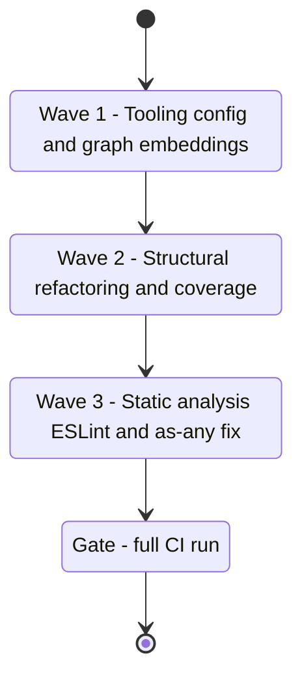

## task_134_wave_1_maintenance_hardening_graph_embeddings_coverage_and_static_analysis - wave 1 maintenance hardening graph embeddings coverage and static analysis
> From version: 1.25.4
> Schema version: 1.0
> Status: Ready
> Understanding: 95%
> Confidence: 92%
> Progress: 0%
> Complexity: Medium
> Theme: Maintenance
> Reminder: Update status/understanding/confidence/progress and linked request/backlog references when you edit this doc.

# Context

Orchestration task covering all maintenance and hardening items surfaced by the April 2026 project audit (req_170, req_171, req_172). Delivers in three sequential waves — tooling config first (safest, no production code), then structural refactoring, then static analysis hardening. Each wave must leave a green build and a commit checkpoint before the next starts.

Covers backlog items: `item_313`, `item_314`, `item_315`, `item_316`, `item_317`.

# Plan

## Wave 1 — Tooling config and graph embeddings (item_313)
*Scope: req_170 AC1 + AC2. No production code changed.*

- [ ] 1.1 Verify `.claude/settings.json` is in its corrected state (hooks array format, no `--quiet` flag). Document as done — already fixed in session.
- [ ] 1.2 Run `code-review-graph status --json` and confirm the graph is healthy.
- [ ] 1.3 Run `code-review-graph embed` to initialize semantic embeddings. If a model or API key is required and unavailable, document the blocker in this task and proceed.
- [ ] 1.4 Re-run `code-review-graph status --json` and confirm at least one embedded node is reported (or document the skip reason).
- [ ] 1.5 Commit checkpoint — `npm run compile && npm run test` must pass.

**CHECKPOINT Wave 1**: commit, update item_313 Progress to 100%.

## Wave 2 — Structural refactoring and coverage (item_314, item_315, item_316)
*Scope: req_170 AC3–AC5, req_171 AC1–AC5.*

- [ ] 2.1 **Import resolution audit (item_314 / req_170 AC3)** — run `code-review-graph build` and compare `IMPORTS_FROM` edge count before/after. For each file with missing imports, either add the missing `import` statement or document why the edge is absent (dynamic import, barrel, etc.).
- [ ] 2.2 **Community fragmentation (item_314 / req_170 AC4)** — list all duplicate-named communities. For each: determine if a missing import would consolidate it; if not, record the reason in this task report.
- [ ] 2.3 **Shared test helpers (item_314 / req_170 AC5)** — inspect `tests-harness`, `tests-after`, `tests-when`. Extract at least one shared helper (e.g. a common mock factory or setup util) into `tests/helpers/`. Verify cohesion improves after graph rebuild.
- [ ] 2.4 **Remove dead shim (item_315 / req_171 AC3)** — confirm `src/logicsCodexWorkflowController.ts` has no live importers (`grep -r "logicsCodexWorkflowController" src/ tests/`), then delete it. Run `npm run compile`.
- [ ] 2.5 **Split oversized files (item_315 / req_171 AC1)** — split `src/logicsViewProvider.ts` (1044 lines) and `src/logicsViewProviderSupport.ts` (1098 lines) below 1000 lines each using seam-driven extraction. Update all callers. Run `npm run compile && npm run test`.
- [ ] 2.6 **Webview coverage decision (item_315 / req_171 AC4)** — write a short ADR in `logics/architecture/` explaining why `media/` is at 0% and how regressions are caught (smoke tests + manual harness). Link it from req_171.
- [ ] 2.7 **extension.ts branch coverage (item_316 / req_171 AC2+AC5)** — add tests for activation-path branches and error branches in `extension.ts`. Run `npm run test:coverage:src` and confirm branch coverage rises above 50% for that file, and overall statement coverage stays ≥ 39.51%.
- [ ] 2.8 Commit checkpoint — `npm run compile && npm run test:coverage:src` must pass.

**CHECKPOINT Wave 2**: commit, update item_314/315/316 Progress to 100%.

## Wave 3 — Static analysis hardening (item_317)
*Scope: req_172 AC1–AC5.*

- [ ] 3.1 **ESLint setup** — install `eslint`, `@typescript-eslint/eslint-plugin`, `@typescript-eslint/parser` as devDependencies. Create `eslint.config.js` (flat config) with `@typescript-eslint/no-floating-promises` as `error` and `@typescript-eslint/no-explicit-any` as `warn` to start.
- [ ] 3.2 **Integrate into lint script** — update `package.json`: `"lint": "npm run lint:ts && npm run lint:es"` with `"lint:es": "eslint src/**/*.ts"`. Run `npm run lint`.
- [ ] 3.3 **Fix existing any violations (req_172 AC3+AC4)** — resolve `(this as any).injectAgentPromptIntoCodexChat` in `src/logicsViewProvider.ts:561` with a typed alternative. Add inline `eslint-disable` with justification for the remaining 3 usages if they cannot be removed.
- [ ] 3.4 **Raise branch threshold (req_172 AC1)** — update `vitest.config.ts`: set `branches` threshold to `63`. Run `npm run test:coverage:src` and confirm it passes.
- [ ] 3.5 **Promote no-explicit-any to error** — once all violations are resolved, change rule severity to `error`. Run `npm run lint` again.
- [ ] 3.6 Commit checkpoint — `npm run compile && npm run lint && npm run test:coverage:src` must all pass.

**CHECKPOINT Wave 3**: commit, update item_317 Progress to 100%.

# AC Traceability

- item_313 AC → req_170 AC1: settings hooks canonical format, no parse errors.
- item_313 AC → req_170 AC2: graph embeddings initialized, at least one node embedded.
- item_314 AC → req_170 AC3: IMPORTS_FROM count increased or gap documented.
- item_314 AC → req_170 AC4: duplicate communities investigated and resolved or documented.
- item_314 AC → req_170 AC5: shared test helper extracted, harness/after/when cohesion improved.
- item_315 AC → req_171 AC1: both oversized src/ files below 1000 lines.
- item_315 AC → req_171 AC3: dead shim removed.
- item_315 AC → req_171 AC4: webview coverage decision documented in ADR.
- item_316 AC → req_171 AC2: extension.ts branch coverage > 50%.
- item_316 AC → req_171 AC5: overall statement coverage ≥ 39.51%.
- item_317 AC → req_172 AC1: branch threshold raised to 63%, CI green.
- item_317 AC → req_172 AC2: ESLint with no-floating-promises + no-explicit-any in lint script and CI.
- item_317 AC → req_172 AC3: unsafe as-any cast replaced.
- item_317 AC → req_172 AC4: all any usages resolved or justified.
- item_317 AC → req_172 AC5: npm run lint and test:coverage:src pass.

# Links
- Derived from `logics/backlog/item_313_fix_settings_hooks_format_and_initialize_graph_embeddings.md`
- Derived from `logics/backlog/item_314_audit_graph_import_resolution_community_fragmentation_and_extract_shared_test_helpers.md`
- Derived from `logics/backlog/item_315_remove_dead_shim_split_oversized_ts_files_and_document_webview_coverage_decision.md`
- Derived from `logics/backlog/item_316_improve_extension_ts_branch_coverage_and_maintain_overall_coverage_floor.md`
- Derived from `logics/backlog/item_317_add_eslint_raise_branch_threshold_and_fix_unsafe_as_any_cast.md`
- Request(s): `logics/request/req_170_address_codebase_audit_findings_from_april_2026_settings_hooks_graph_embeddings_and_test_fragmentation.md`
- Request(s): `logics/request/req_171_address_post_audit_coverage_regressions_dead_shim_and_file_size_drift.md`
- Request(s): `logics/request/req_172_harden_static_analysis_and_branch_coverage_safety_net.md`

# Validation
- Wave 1 gate: `code-review-graph status --json` + `npm run compile && npm run test`
- Wave 2 gate: `npm run compile && npm run test:coverage:src`
- Wave 3 gate: `npm run compile && npm run lint && npm run test:coverage:src`

# Decision framing
- Product framing: Not needed
- Architecture framing: Required for Wave 2.6 (webview coverage ADR)

# Definition of Done (DoD)
- [ ] All 3 waves implemented and their checkpoints committed.
- [ ] item_313–317 all at Progress 100%.
- [ ] req_170, req_171, req_172 Backlog sections updated with links.
- [ ] `npm run compile && npm run lint && npm run test:coverage:src` pass.
- [ ] Status is `Done` and Progress is `100%`.

# Report
