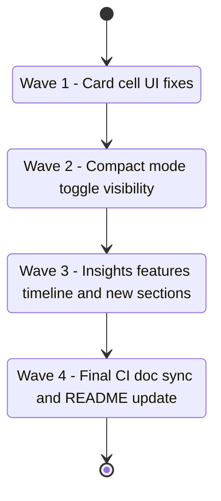

## task_135_wave_2_ui_features_card_cells_compact_mode_insights_sections_and_final_ci_validation - wave 2 ui features card cells compact mode insights sections and final ci validation
> From version: 1.25.4
> Schema version: 1.0
> Status: In progress
> Understanding: 95%
> Confidence: 92%
> Progress: 75%
> Complexity: Medium
> Theme: UI
> Reminder: Update status/understanding/confidence/progress and linked request/backlog references when you edit this doc.

# Context

Orchestration task covering all UI feature items surfaced by the April 2026 audit session (req_173, req_174, req_175, req_176), followed by a final CI, doc sync, and README validation wave. Intended to run after task_134 is complete so the dev environment is already hardened (ESLint active, coverage threshold raised).

Delivers in four sequential waves — quick UI fixes first (low risk), then compact-mode fix, then Insights features, then final validation. Each wave commits and passes the test suite before the next starts.

Covers backlog items: `item_318`, `item_319`, `item_320`, `item_321`, `item_322`.

# Plan

## Wave 1 — Card cell UI fixes (item_318)
*Scope: req_173 AC1–AC5. Changes only `media/renderBoardApp.js`.*

- [x] 1.1 **Remove filename subtitle — non-compact cards** (`renderBoardApp.js` lines 937–940): delete the `card__meta` block that renders `${getStageLabel(item.stage)} • ${item.id}`. Keep the `card__meta--linkage` block (lines 944–951) untouched.
- [x] 1.2 **Remove filename subtitle — compact cards** (`renderBoardApp.js` lines 953–957): delete the second `card__meta` block inside the `if (compact)` branch.
- [x] 1.3 **Add Theme to hover preview** (`renderBoardApp.js` `createCardPreview`, lines 799–816): insert `if (theme) preview.appendChild(createPreviewRow("Theme", theme))` before the Status row. Read `theme` from `item?.indicators?.Theme`.
- [x] 1.4 Run `npm run test` — confirm all webview tests pass.
- [x] 1.5 Commit checkpoint.

**CHECKPOINT Wave 1**: commit, update item_318 Progress to 100%.

## Wave 2 — Compact mode toggle visibility (item_319)
*Scope: req_174 AC1–AC5. Changes only `media/webviewChrome.js`.*

- [x] 2.1 In `updateViewModeToggle` (`webviewChrome.js` lines 110–117), add `viewModeToggleButton.hidden = true` inside the `isCompactListForced()` branch (after `disabled = true`, before `return`).
- [x] 2.2 In the normal branch (line 132), add `viewModeToggleButton.hidden = false` before `disabled = false`.
- [x] 2.3 Run `npm run test` — confirm all tests pass.
- [x] 2.4 Commit checkpoint.

**CHECKPOINT Wave 2**: commit, update item_319 Progress to 100%.

## Wave 3 — Insights features (item_320, item_321, item_322)
*Scope: req_175 AC1–AC6, req_176 AC1–AC8. Changes only `src/logicsCorpusInsightsHtml.ts`.*

- [x] 3.1 **Timeline period selector (item_320 / req_175)**:
  - Extend `summarizeTimeline` to accept `period: "day" | "week"` and `bucketCount`. For `"day"`: `bucketDurationMs = 24 * 60 * 60 * 1000`, align to UTC day start, default 30 buckets.
  - Pre-compute `dayPoints` (30 days) and `weekPoints` (6 weeks) at render time.
  - Embed both as inline JS constants in the `<script>` block.
  - Add a `Day` / `Week` toggle above the chart; `Week` active by default. Client-side JS swaps the rendered SVG or re-renders bars from the inline data.
  - Update empty-state messages to reflect the active period.
- [x] 3.2 **WIP, Blocked, and Stale sections (item_321 / req_176 AC1+AC2)**:
  - Add WIP stat card (`Status = "In progress"` count, tone `warn` if > 5) and Blocked stat card (`Status = "Blocked"` count, tone `bad` if > 0) into the Velocity section grid.
  - When Blocked count > 0, render a detail list below the card (capped at 10 items).
  - Add a Stale open items section: items not in terminal status and `updatedAt` older than 30 days, showing title, stage, and days since update.
- [x] 3.3 **Status, Theme, Confidence/Understanding, and Requests-without-backlog sections (item_322 / req_176 AC3–AC7)**:
  - Status distribution: all workflow items grouped by `Status`, active-first then terminal, using `renderList`.
  - Theme distribution: grouped by `indicators.Theme`, `"(none)"` catch-all, sorted by count descending with percentage.
  - Confidence and Understanding distribution: buckets `< 70%` / `70–90%` / `> 90%` / `missing` for each indicator.
  - Requests without backlog: open requests with no linked backlog child (`usedBy` contains no `stage = "backlog"` item).
  - All sections use existing helpers (`renderList`, `renderStatCard`, `renderPieChart`).
- [x] 3.4 Run `npm run compile` — no type errors.
- [x] 3.5 Run `npm run test` — confirm all tests pass.
- [x] 3.6 Commit checkpoint.

**CHECKPOINT Wave 3**: commit, update item_320/321/322 Progress to 100%.

## Wave 4 — Final CI validation, doc sync, and README (orchestration close-out)
*No production code changes — validation and documentation only.*

- [ ] 4.1 **Full CI simulation**: run `npm run ci:fast` (compile + lint + coverage + smoke + logics lint + VSIX package). All steps must pass. Capture output summary in Report section below.
- [ ] 4.2 **Logics doc lint**: run `python3 logics/skills/logics.py lint --require-status`. Fix any warnings before continuing.
- [ ] 4.3 **Workflow audit**: run `python3 logics/skills/logics.py audit --legacy-cutoff-version 1.1.0 --group-by-doc`. Resolve any blocking findings.
- [ ] 4.4 **Close-eligible sync**: run `python3 logics/skills/logics.py flow sync close-eligible-requests`. Commit any auto-closed docs.
- [ ] 4.5 **README features update**: open `README.md` and check whether any of the features delivered in task_134 + task_135 should be reflected (new ESLint setup, Insights enhancements, card cell changes). Add or update relevant feature entries if the README has a features section.
- [ ] 4.6 **Update all linked backlog and request docs**: mark item_318–322 as Done, update Progress to 100%, and add Backlog links in req_173–176.
- [ ] 4.7 **Final commit checkpoint** — `npm run ci:fast` must pass clean.

**CHECKPOINT Wave 4**: final commit, close task_135 via `python3 logics/skills/logics.py flow finish task logics/tasks/task_135_wave_2_ui_features_card_cells_compact_mode_insights_sections_and_final_ci_validation.md`.

# AC Traceability

- item_318 AC → req_173 AC1: card__meta filename subtitle removed from all card types.
- item_318 AC → req_173 AC2: card__meta--linkage unaffected.
- item_318 AC → req_173 AC3: Theme row appears first in hover preview when present.
- item_318 AC → req_173 AC4: Status and Updated unchanged in position.
- item_318 AC → req_173 AC5: npm run test passes.
- item_319 AC → req_174 AC1: button hidden when isCompactListForced.
- item_319 AC → req_174 AC2: button restored above 500px.
- item_319 AC → req_174 AC3: transition is responsive without reload.
- item_319 AC → req_174 AC4: no other button affected.
- item_319 AC → req_174 AC5: npm run test passes.
- item_320 AC → req_175 AC1–AC6: Day/Week toggle, instant switch, active state, empty-state messages, summarizeTimeline backward compatible.
- item_321 AC → req_176 AC1: WIP and Blocked stat cards in Velocity.
- item_321 AC → req_176 AC2: Stale open items section.
- item_322 AC → req_176 AC3: Status distribution section.
- item_322 AC → req_176 AC4: Requests without backlog section.
- item_322 AC → req_176 AC5: Theme distribution section.
- item_322 AC → req_176 AC6: Confidence and Understanding distribution section.
- item_322 AC → req_176 AC7: existing helpers reused, no new CSS unless necessary.
- item_322 AC → req_176 AC8: npm run test and npm run compile pass.

# Links
- Derived from `logics/backlog/item_318_remove_filename_subtitle_from_cells_and_add_theme_to_card_hover_row.md`
- Derived from `logics/backlog/item_319_hide_view_mode_toggle_button_when_compact_list_is_forced_below_500px.md`
- Derived from `logics/backlog/item_320_add_day_and_week_period_selector_to_delivery_timeline_in_logics_insights.md`
- Derived from `logics/backlog/item_321_add_wip_blocked_and_stale_sections_to_logics_insights.md`
- Derived from `logics/backlog/item_322_add_status_theme_confidence_and_requests_without_backlog_sections_to_logics_insights.md`
- Request(s): `logics/request/req_173_remove_filename_subtitle_from_cells_and_add_theme_field_in_cell_metadata_row.md`
- Request(s): `logics/request/req_174_hide_view_mode_toggle_button_when_compact_list_is_forced_below_500px.md`
- Request(s): `logics/request/req_175_add_day_and_week_period_selector_to_delivery_timeline_in_logics_insights.md`
- Request(s): `logics/request/req_176_enrich_logics_insights_with_wip_blocked_stale_status_theme_and_backlog_coverage_sections.md`

# Validation
- Wave 1–3 gate: `npm run compile && npm run test`
- Wave 4 full gate: `npm run ci:fast`
- Doc gate: `python3 logics/skills/logics.py lint --require-status`
- Audit gate: `python3 logics/skills/logics.py audit --legacy-cutoff-version 1.1.0 --group-by-doc`

# Definition of Done (DoD)
- [ ] All 4 waves implemented and their checkpoints committed.
- [ ] item_318–322 all at Progress 100% and Status Done.
- [ ] req_173–176 Backlog sections updated with links to item_318–322.
- [ ] `npm run ci:fast` passes clean.
- [ ] Logics lint and workflow audit pass with no blocking findings.
- [ ] README updated if new features warrant it.
- [ ] Status is `Done` and Progress is `100%`.

# Report
- Wave 1, 2, and 3 changes are implemented and committed.
- Validation passed: `npm test`, `npm run compile`, targeted flow-manager unit tests, and targeted webview tests.
- Remaining work is Wave 4 final CI, doc sync, README review, and closing the linked Logics docs.
