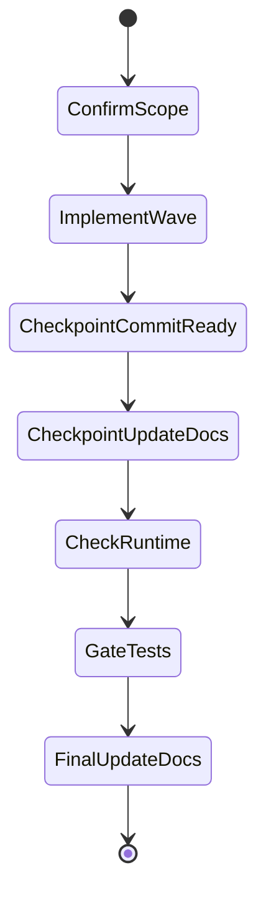

## task_136_allow_logics_indicators_to_stay_stable_for_non_semantic_document_edits - Allow Logics indicators to stay stable for non-semantic document edits
> From version: 1.26.1
> Schema version: 1.0
> Status: Done
> Understanding: 90%
> Confidence: 85%
> Progress: 100%
> Complexity: Medium
> Theme: General
> Reminder: Update status/understanding/confidence/progress and linked request/backlog references when you edit this doc.
> Maintenance edit: normalized checklist state after delivery closure.

# Context
- Derived from backlog item `item_325_allow_logics_indicators_to_stay_stable_for_non_semantic_document_edits`.
- Source file: `logics/backlog/item_325_allow_logics_indicators_to_stay_stable_for_non_semantic_document_edits.md`.
- Related request(s): `req_182_allow_logics_indicators_to_stay_unchanged_for_non_semantic_document_edits`.
- Deliver the bounded slice for Allow Logics indicators to stay stable for non-semantic document edits without widening scope.

# Plan
- [x] 1. Confirm scope, dependencies, and linked acceptance criteria.
- [x] 2. Implement the next coherent delivery wave from the backlog item.
- [x] 3. Checkpoint the wave in a commit-ready state, validate it, and update the linked Logics docs.
- [x] CHECKPOINT: leave the current wave commit-ready and update the linked Logics docs before continuing.
- [x] CHECKPOINT: if the shared AI runtime is active and healthy, run `python logics/skills/logics.py flow assist commit-all` for the current step, item, or wave commit checkpoint.
- [x] GATE: do not close a wave or step until the relevant automated tests and quality checks have been run successfully.
- [x] FINAL: Update related Logics docs

# Delivery checkpoints
- Each completed wave should leave the repository in a coherent, commit-ready state.
- Update the linked Logics docs during the wave that changes the behavior, not only at final closure.
- Prefer a reviewed commit checkpoint at the end of each meaningful wave instead of accumulating several undocumented partial states.
- If the shared AI runtime is active and healthy, use `python logics/skills/logics.py flow assist commit-all` to prepare the commit checkpoint for each meaningful step, item, or wave.
- Do not mark a wave or step complete until the relevant automated tests and quality checks have been run successfully.

# AC Traceability
- AC1 -> Scope: Confirm Allow Logics indicators to stay stable for non-semantic document edits delivers one coherent backlog slice.. Proof: capture validation evidence in this doc.

# Decision framing
- Product framing: Not needed
- Product signals: (none detected)
- Product follow-up: No product brief follow-up is expected based on current signals.
- Architecture framing: Consider
- Architecture signals: data model and persistence
- Architecture follow-up: Review whether an architecture decision is needed before implementation becomes harder to reverse.

# Links
- Product brief(s): (none yet)
- Architecture decision(s): (none yet)
- Derived from `item_325_allow_logics_indicators_to_stay_stable_for_non_semantic_document_edits`
- Request(s): `req_182_allow_logics_indicators_to_stay_unchanged_for_non_semantic_document_edits`

# AI Context
- Summary: Allow Logics indicators to stay stable for non-semantic document edits
- Keywords: allow, logics, indicators, stay, stable, for, non-semantic, document
- Use when: Use when implementing or reviewing the delivery slice for Allow Logics indicators to stay stable for non-semantic document edits.
- Skip when: Skip when the change is unrelated to this delivery slice or its linked request.
# Validation
- Run the relevant automated tests for the changed surface before closing the current wave or step.
- Run the relevant lint or quality checks before closing the current wave or step.
- Confirm the completed wave leaves the repository in a commit-ready state.

# Report
- Added an explicit maintenance-edit marker that lets non-semantic workflow doc edits keep indicators stable.
- Kept indicator enforcement in place for real workflow edits and backed the rule with end-to-end lint coverage.
- Validation: `npm test -- tests/logicsDocLinter.test.ts`, `npm run lint:ts`.

# Definition of Done (DoD)
- [x] Scope implemented and acceptance criteria covered.
- [x] Validation commands executed and results captured.
- [x] No wave or step was closed before the relevant automated tests and quality checks passed.
- [x] Linked request/backlog/task docs updated during completed waves and at closure.
- [x] Each completed wave left a commit-ready checkpoint or an explicit exception is documented.
- [x] Status is `Done` and progress is `100%`.

# Report
