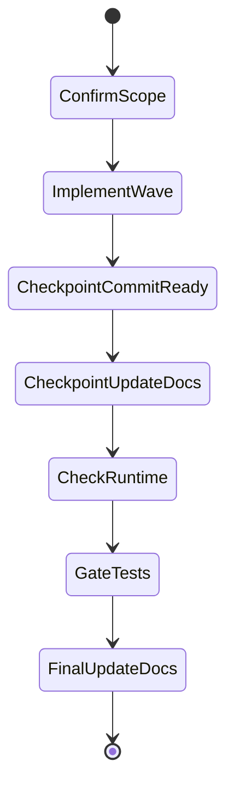

## task_137_fix_inverted_active_state_styling_for_delivery_timeline_period_buttons - Fix inverted active state styling for delivery timeline period buttons
> From version: 1.26.1
> Schema version: 1.0
> Status: Done
> Understanding: 95%
> Confidence: 90%
> Progress: 100%
> Complexity: Low
> Theme: UI
> Reminder: Update status/understanding/confidence/progress and linked request/backlog references when you edit this doc.
> Maintenance edit: normalized checklist state after delivery closure.

# Context
- Derived from backlog item `item_326_fix_inverted_active_state_styling_for_delivery_timeline_period_buttons`.
- Source file: `logics/backlog/item_326_fix_inverted_active_state_styling_for_delivery_timeline_period_buttons.md`.
- Related request(s): `req_180_fix_inverted_active_state_styling_for_delivery_timeline_period_buttons`.
- The Day / Week filter buttons above the Delivery timeline in Logics Insights are functionally correct, but the active state reads visually inverted or weaker than the inactive state.
- The selected button should feel clearly pressed, highlighted, or current, while the unselected button should recede.
- The issue is visual only; the filter behavior and timeline data switching should stay unchanged.

# Plan
- [x] 1. Confirm scope, dependencies, and linked acceptance criteria.
- [x] 2. Implement the next coherent delivery wave from the backlog item.
- [x] 3. Checkpoint the wave in a commit-ready state, validate it, and update the linked Logics docs.
- [x] CHECKPOINT: leave the current wave commit-ready and update the linked Logics docs before continuing.
- [x] CHECKPOINT: if the shared AI runtime is active and healthy, run `python logics/skills/logics.py flow assist commit-all` for the current step, item, or wave commit checkpoint.
- [x] GATE: do not close a wave or step until the relevant automated tests and quality checks have been run successfully.
- [x] FINAL: Update related Logics docs

# Delivery checkpoints
- Each completed wave should leave the repository in a coherent, commit-ready state.
- Update the linked Logics docs during the wave that changes the behavior, not only at final closure.
- Prefer a reviewed commit checkpoint at the end of each meaningful wave instead of accumulating several undocumented partial states.
- If the shared AI runtime is active and healthy, use `python logics/skills/logics.py flow assist commit-all` to prepare the commit checkpoint for each meaningful step, item, or wave.
- Do not mark a wave or step complete until the relevant automated tests and quality checks have been run successfully.

# AC Traceability
- AC1 -> Scope: The selected Day or Week button is visually stronger than the unselected button and reads as the active filter.. Proof: capture validation evidence in this doc.
- AC2 -> Scope: The inactive button remains visually subdued enough that the selection is unambiguous at a glance.. Proof: capture validation evidence in this doc.
- AC3 -> Scope: The fix does not change period-switch behavior, labels, or the underlying timeline data.. Proof: capture validation evidence in this doc.
- AC4 -> Scope: The visual state remains correct on initial render and after toggling between Day and Week.. Proof: capture validation evidence in this doc.
- AC5 -> Scope: In Day mode, the timeline uses a more compact month-day legend format than full labels like `Mar 13` or `Apr 12`, so the chart stays readable at typical panel widths.. Proof: capture validation evidence in this doc.
- AC6 -> Scope: The compact legend format remains unambiguous enough that users can still tell which dates the bars represent.. Proof: capture validation evidence in this doc.
- AC7 -> Scope: Tests or snapshots cover the active/inactive presentation and the compact day-mode legend so the styling does not regress silently.. Proof: capture validation evidence in this doc.

# Decision framing
- Product framing: Consider
- Product signals: navigation and discoverability
- Product follow-up: Review whether a product brief is needed before scope becomes harder to change.
- Architecture framing: Consider
- Architecture signals: data model and persistence
- Architecture follow-up: Review whether an architecture decision is needed before implementation becomes harder to reverse.

# Links
- Product brief(s): (none yet)
- Architecture decision(s): (none yet)
- Derived from `item_326_fix_inverted_active_state_styling_for_delivery_timeline_period_buttons`
- Request(s): `req_180_fix_inverted_active_state_styling_for_delivery_timeline_period_buttons`

# AI Context
- Summary: Fix the visual active/inactive state styling for the Delivery timeline period buttons in Logics Insights and compact the...
- Keywords: timeline, delivery, period selector, Day, Week, active state, selected button, inactive button, styling, UI, legend, compact labels
- Use when: Use when reviewing or implementing the Delivery timeline period buttons and the Day-mode legend reads too verbose or the selected state reads backwards.
- Skip when: Skip when the problem is about the timeline data itself, the selector behavior, or unrelated button styles.
# References
- `logics/skills/logics-ui-steering/SKILL.md`

# Validation
- Run the relevant automated tests for the changed surface before closing the current wave or step.
- Run the relevant lint or quality checks before closing the current wave or step.
- Confirm the completed wave leaves the repository in a commit-ready state.

# Definition of Done (DoD)
- [x] Scope implemented and acceptance criteria covered.
- [x] Validation commands executed and results captured.
- [x] No wave or step was closed before the relevant automated tests and quality checks passed.
- [x] Linked request/backlog/task docs updated during completed waves and at closure.
- [x] Each completed wave left a commit-ready checkpoint or an explicit exception is documented.
- [x] Status is `Done` and progress is `100%`.

# Report
- Delivered the stronger active/inactive styling for the Delivery timeline period buttons and compacted the Day legend labels.
- Validation: `npm test -- tests/logicsHtml.test.ts`, `npm run lint:ts`.
