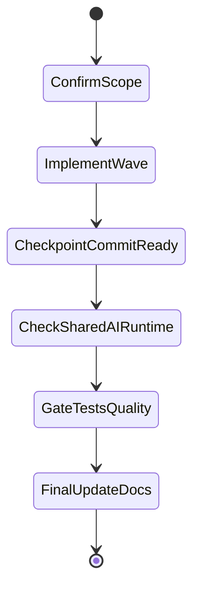

## task_139_allow_kit_update_when_unrelated_root_changes_are_uncommitted - Allow kit update when unrelated root changes are uncommitted
> From version: 1.26.1
> Schema version: 1.0
> Status: Ready
> Understanding: 95%
> Confidence: 90%
> Progress: 0%
> Complexity: Medium
> Theme: Workflow
> Reminder: Update status/understanding/confidence/progress and linked request/backlog references when you edit this doc.

# Context
- Derived from backlog item `item_327_allow_kit_update_when_unrelated_root_changes_are_uncommitted`.
- Source file: `logics/backlog/item_327_allow_kit_update_when_unrelated_root_changes_are_uncommitted.md`.
- Related request(s): `req_178_allow_kit_update_when_unrelated_root_changes_are_uncommitted`.
- The kit update action should not be blocked just because the repository root has unrelated uncommitted changes.
- The current safety check feels too broad if it treats the whole workspace as a single unit instead of focusing on the `logics/skills` install state that the update actually touches.
- Users should still be protected from updating when `logics/skills` itself is dirty or when the install type is incompatible with an automated update.

# Plan
- [ ] 1. Confirm scope, dependencies, and linked acceptance criteria.
- [ ] 2. Implement the next coherent delivery wave from the backlog item.
- [ ] 3. Checkpoint the wave in a commit-ready state, validate it, and update the linked Logics docs.
- [ ] CHECKPOINT: leave the current wave commit-ready and update the linked Logics docs before continuing.
- [ ] CHECKPOINT: if the shared AI runtime is active and healthy, run `python logics/skills/logics.py flow assist commit-all` for the current step, item, or wave commit checkpoint.
- [ ] GATE: do not close a wave or step until the relevant automated tests and quality checks have been run successfully.
- [ ] FINAL: Update related Logics docs

# Delivery checkpoints
- Each completed wave should leave the repository in a coherent, commit-ready state.
- Update the linked Logics docs during the wave that changes the behavior, not only at final closure.
- Prefer a reviewed commit checkpoint at the end of each meaningful wave instead of accumulating several undocumented partial states.
- If the shared AI runtime is active and healthy, use `python logics/skills/logics.py flow assist commit-all` to prepare the commit checkpoint for each meaningful step, item, or wave.
- Do not mark a wave or step complete until the relevant automated tests and quality checks have been run successfully.

# AC Traceability
- AC1 -> Scope: Kit update proceeds when the repository has uncommitted changes outside `logics/skills`.. Proof: capture validation evidence in this doc.
- AC2 -> Scope: Kit update still blocks when `logics/skills` itself has uncommitted changes.. Proof: capture validation evidence in this doc.
- AC3 -> Scope: The existing behavior for canonical submodule, standalone clone, and fallback installs remains intact.. Proof: capture validation evidence in this doc.
- AC4 -> Scope: The user-facing message clearly distinguishes between a dirty kit install and unrelated root changes.. Proof: capture validation evidence in this doc.
- AC5 -> Scope: The update path is covered by tests for both the allowed and blocked cases.. Proof: capture validation evidence in this doc.

# Decision framing
- Product framing: Not needed
- Product signals: (none detected)
- Product follow-up: No product brief follow-up is expected based on current signals.
- Architecture framing: Consider
- Architecture signals: data model and persistence
- Architecture follow-up: Review whether an architecture decision is needed before implementation becomes harder to reverse.

# Links
- Product brief(s): (none yet)
- Architecture decision(s): (none yet)
- Derived from `item_327_allow_kit_update_when_unrelated_root_changes_are_uncommitted`
- Request(s): `req_178_allow_kit_update_when_unrelated_root_changes_are_uncommitted`

# AI Context
- Summary: The kit update action should not be blocked just because the repository root has unrelated uncommitted changes.
- Keywords: allow, kit, update, unrelated, root, changes, are, uncommitted
- Use when: Use when implementing or reviewing the delivery slice for Allow kit update when unrelated root changes are uncommitted.
- Skip when: Skip when the change is unrelated to this delivery slice or its linked request.
# Validation
- Run the relevant automated tests for the changed surface before closing the current wave or step.
- Run the relevant lint or quality checks before closing the current wave or step.
- Confirm the completed wave leaves the repository in a commit-ready state.

# Definition of Done (DoD)
- [ ] Scope implemented and acceptance criteria covered.
- [ ] Validation commands executed and results captured.
- [ ] No wave or step was closed before the relevant automated tests and quality checks passed.
- [ ] Linked request/backlog/task docs updated during completed waves and at closure.
- [ ] Each completed wave left a commit-ready checkpoint or an explicit exception is documented.
- [ ] Status is `Done` and progress is `100%`.

# Report
