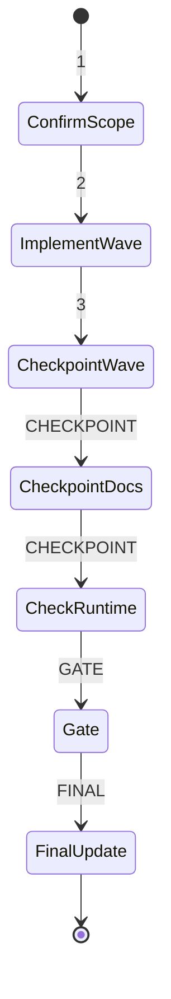

## task_141_add_request_color_badges_to_items_and_requests_to_visualize_request_task_linkage - Add request color badges to items and requests to visualize request-task linkage
> From version: 1.26.1
> Schema version: 1.0
> Status: Done
> Understanding: 95%
> Confidence: 90%
> Progress: 100%
> Complexity: Medium
> Theme: UI
> Reminder: Update status/understanding/confidence/progress and linked request/backlog references when you edit this doc.

# Context
- Derived from backlog item `item_329_add_request_color_badges_to_items_and_requests_to_visualize_request_task_linkage`.
- Source file: `logics/backlog/item_329_add_request_color_badges_to_items_and_requests_to_visualize_request_task_linkage.md`.
- Related request(s): `req_185_add_request_color_badges_to_items_and_requests_to_visualize_request_task_linkage`.
- The plugin already uses a compact color badge to show task coverage on task cards and covered item cards.
- The current task badge colors are not separated enough from one another, so distinct tasks can look too similar at a glance.
- The request badge layer should inherit the same stronger visual separation, with request colors amplified as well so request and task families stay easy to tell apart.

# Plan
- [ ] 1. Confirm scope, dependencies, and linked acceptance criteria.
- [ ] 2. Implement the next coherent delivery wave from the backlog item.
- [ ] 3. Checkpoint the wave in a commit-ready state, validate it, and update the linked Logics docs.
- [ ] CHECKPOINT: leave the current wave commit-ready and update the linked Logics docs before continuing.
- [ ] CHECKPOINT: if the shared AI runtime is active and healthy, run `python logics/skills/logics.py flow assist commit-all` for the current step, item, or wave commit checkpoint.
- [ ] GATE: do not close a wave or step until the relevant automated tests and quality checks have been run successfully.
- [ ] FINAL: Update related Logics docs

# Delivery checkpoints
- Each completed wave should leave the repository in a coherent, commit-ready state.
- Update the linked Logics docs during the wave that changes the behavior, not only at final closure.
- Prefer a reviewed commit checkpoint at the end of each meaningful wave instead of accumulating several undocumented partial states.
- If the shared AI runtime is active and healthy, use `python logics/skills/logics.py flow assist commit-all` to prepare the commit checkpoint for each meaningful step, item, or wave.
- Do not mark a wave or step complete until the relevant automated tests and quality checks have been run successfully.

# AC Traceability
- AC1 -> Scope: Request cards display a compact request badge using a color family that is visibly distinct from task badges and strong enough to keep separate requests readable at a glance.. Proof: capture validation evidence in this doc.
- AC2 -> Scope: Item cards that are linked to both a request and a task display both badges, with the request badge before the task badge.. Proof: capture validation evidence in this doc.
- AC3 -> Scope: The request badge is derived from a real resolved reference, not a guessed or duplicated lineage.. Proof: capture validation evidence in this doc.
- AC4 -> Scope: If the request reference cannot be resolved cleanly, the UI fails soft and omits the request badge rather than rendering incorrect linkage.. Proof: capture validation evidence in this doc.
- AC5 -> Scope: Existing task badge behavior remains intact, with a palette strong enough to keep different active tasks visually separable while staying subordinate only by ordering, not by loss of clarity.. Proof: capture validation evidence in this doc.
- AC6 -> Scope: Tests cover both the request-card rendering and the item-card dual-badge rendering, including the fallback path and the stronger palette differentiation.. Proof: capture validation evidence in this doc.

# Decision framing
- Product framing: Not needed
- Product signals: (none detected)
- Product follow-up: No product brief follow-up is expected based on current signals.
- Architecture framing: Consider
- Architecture signals: data model and persistence
- Architecture follow-up: Review whether an architecture decision is needed before implementation becomes harder to reverse.

# Links
- Product brief(s): (none yet)
- Architecture decision(s): (none yet)
- Derived from `item_329_add_request_color_badges_to_items_and_requests_to_visualize_request_task_linkage`
- Request(s): `req_185_add_request_color_badges_to_items_and_requests_to_visualize_request_task_linkage`

# AI Context
- Summary: Add request badges to request cards and item cards so the request lineage appears beside the existing task...
- Keywords: request badge, task badge, lineage, usedBy, request-task linkage, compact color badge, fallback, item card, request card
- Use when: Use when planning or implementing the request-to-item badge layer that sits alongside the existing task badge.
- Skip when: Skip when the change is only about task coverage, unrelated UI, or non-card-based reference surfaces.
# References
- `logics/skills/logics-ui-steering/SKILL.md`

# Validation
- Run the relevant automated tests for the changed surface before closing the current wave or step.
- Run the relevant lint or quality checks before closing the current wave or step.
- Confirm the completed wave leaves the repository in a commit-ready state.

# Definition of Done (DoD)
- [ ] Scope implemented and acceptance criteria covered.
- [ ] Validation commands executed and results captured.
- [ ] No wave or step was closed before the relevant automated tests and quality checks passed.
- [ ] Linked request/backlog/task docs updated during completed waves and at closure.
- [ ] Each completed wave left a commit-ready checkpoint or an explicit exception is documented.
- [ ] Status is `Done` and progress is `100%`.

# Report
- Implemented request badges on request cards and on items that resolve a real request linkage, with the request badge rendered before task dots when both are present.
- Kept the task badge surface intact while amplifying the task and request palettes so the two families stay visually distinct.
- Added board renderer coverage for the resolved-link case and the unresolved-link fallback path.
- Validation: `npm test -- tests/webview.board-renderer.test.ts`, `npm run lint:ts`.
