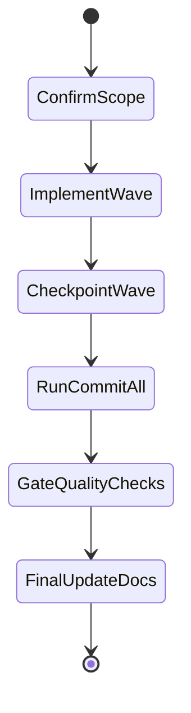

## task_143_implement_badge_row_layout_for_compact_card_display - Implement Badge Row Layout for Compact Card Display
> From version: 1.27.0
> Schema version: 1.0
> Status: Done
> Understanding: 94%
> Confidence: 88%
> Progress: 100%
> Complexity: Medium
> Theme: UI
> Reminder: Update status/understanding/confidence/progress and linked request/backlog references when you edit this doc.

# Context
- Derived from backlog item `item_333_implement_badge_row_layout_for_compact_card_display`.
- Source file: `logics/backlog/item_333_implement_badge_row_layout_for_compact_card_display.md`.
- Related request(s): `req_186_keep_card_badges_on_a_single_row`.
- The card surfaces currently show several compact badges at once, including `PROD`, `ADR`, `DELIVERY`, request/task lineage, and percentage or state chips.
- Those badges sometimes wrap onto a second line, which makes cards taller and harder to scan vertically.
- We want the badge area to stay on a single horizontal row whenever possible so the card height remains stable and the signal is easier to read at a glance.

# Plan
- [ ] 1. Confirm scope, dependencies, and linked acceptance criteria.
- [ ] 2. Implement the next coherent delivery wave from the backlog item.
- [ ] 3. Checkpoint the wave in a commit-ready state, validate it, and update the linked Logics docs.
- [ ] CHECKPOINT: leave the current wave commit-ready and update the linked Logics docs before continuing.
- [ ] CHECKPOINT: if the shared AI runtime is active and healthy, run `python logics/skills/logics.py flow assist commit-all` for the current step, item, or wave commit checkpoint.
- [ ] GATE: do not close a wave or step until the relevant automated tests and quality checks have been run successfully.
- [ ] FINAL: Update related Logics docs

# Delivery checkpoints
- Each completed wave should leave the repository in a coherent, commit-ready state.
- Update the linked Logics docs during the wave that changes the behavior, not only at final closure.
- Prefer a reviewed commit checkpoint at the end of each meaningful wave instead of accumulating several undocumented partial states.
- If the shared AI runtime is active and healthy, use `python logics/skills/logics.py flow assist commit-all` to prepare the commit checkpoint for each meaningful step, item, or wave.
- Do not mark a wave or step complete until the relevant automated tests and quality checks have been run successfully.

# AC Traceability
- AC1 -> Scope: Cards that already show multiple badges keep those badges on a single horizontal row by default.. Proof: capture validation evidence in this doc.
- AC2 -> Scope: The badge row does not wrap into a second line under normal card widths.. Proof: capture validation evidence in this doc.
- AC3 -> Scope: If the available space is too small, the layout uses a compact overflow or truncation strategy instead of breaking the row.. Proof: capture validation evidence in this doc.
- AC4 -> Scope: The existing badge order and meanings remain unchanged.. Proof: capture validation evidence in this doc.
- AC5 -> Scope: The layout change applies consistently to the affected card variants without altering their underlying data or badge logic.. Proof: capture validation evidence in this doc.

# Decision framing
- Product framing: Not needed
- Product signals: (none detected)
- Product follow-up: No product brief follow-up is expected based on current signals.
- Architecture framing: Consider
- Architecture signals: data model and persistence
- Architecture follow-up: Review whether an architecture decision is needed before implementation becomes harder to reverse.

# Links
- Product brief(s): (none yet)
- Architecture decision(s): (none yet)
- Derived from `item_333_implement_badge_row_layout_for_compact_card_display`
- Request(s): `req_186_keep_card_badges_on_a_single_row`

# AI Context
- Summary: Keep multiple card badges on one row so the cards stay compact and readable.
- Keywords: badge row, card density, nowrap, compact overflow, PROD, ADR, DELIVERY, request badge, task badge
- Use when: Use when planning or implementing the badge strip layout on cards that show several metadata chips at once.
- Skip when: Skip when the work is about badge color, badge meaning, or a different card surface.
# References
- `logics/skills/logics-ui-steering/SKILL.md`

# Validation
- Run the relevant automated tests for the changed surface before closing the current wave or step.
- Run the relevant lint or quality checks before closing the current wave or step.
- Confirm the completed wave leaves the repository in a commit-ready state.
- Finish workflow executed on 2026-04-12.
- Linked backlog/request close verification passed.

# Definition of Done (DoD)
- [x] Scope implemented and acceptance criteria covered.
- [x] Validation commands executed and results captured.
- [x] No wave or step was closed before the relevant automated tests and quality checks passed.
- [x] Linked request/backlog/task docs updated during completed waves and at closure.
- [x] Each completed wave left a commit-ready checkpoint or an explicit exception is documented.
- [x] Status is `Done` and progress is `100%`.

# Report
- Finished on 2026-04-12.
- Linked backlog item(s): `item_333_implement_badge_row_layout_for_compact_card_display`
- Related request(s): `req_186_keep_card_badges_on_a_single_row`
