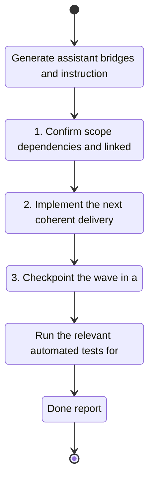

## task_150_generate_assistant_bridges_and_instructions_from_the_integrated_runtime - Generate assistant bridges and instructions from the integrated runtime
> From version: 1.28.0
> Schema version: 1.0
> Status: Done
> Understanding: 90%
> Confidence: 85%
> Progress: 100%
> Complexity: Medium
> Theme: General
> Reminder: Update status/understanding/confidence/progress and linked request/backlog references when you edit this doc.

# Context
- Execute the bounded delivery slice for Generate assistant bridges and instructions from the integrated runtime.

# Plan
- [x] 1. Confirm scope, dependencies, and linked acceptance criteria.
- [x] 2. Implement the next coherent delivery wave.
- [x] 3. Checkpoint the wave in a commit-ready state, validate it, and update the linked Logics docs.
- [x] CHECKPOINT: leave the current wave commit-ready and update the linked Logics docs before continuing.
- [x] CHECKPOINT: if the shared AI runtime is active and healthy, run `python logics/skills/logics.py flow assist commit-all` for the current step, item, or wave commit checkpoint.
- [x] GATE: do not close a wave or step until the relevant automated tests and quality checks have been run successfully.
- [x] FINAL: Update related Logics docs

# Delivery checkpoints
- Each completed wave should leave the repository in a coherent, commit-ready state.
- Update the linked Logics docs during the wave that changes the behavior, not only at final closure.
- Prefer a reviewed commit checkpoint at the end of each meaningful wave instead of accumulating several undocumented partial states.
- If the shared AI runtime is active and healthy, use `python logics/skills/logics.py flow assist commit-all` to prepare the commit checkpoint for each meaningful step, item, or wave.
- Do not mark a wave or step complete until the relevant automated tests and quality checks have been run successfully.

# AC Traceability
- AC4 -> Scope: Execute the bounded delivery slice for Generate assistant bridges and instructions from the integrated runtime. Proof: skills, bridges, and assistant instructions are toolchain-derived instead of hand-maintained.

# Decision framing
- Product framing: Not needed
- Product signals: (none detected)
- Product follow-up: No product brief follow-up is expected based on current signals.
- Architecture framing: Not needed
- Architecture signals: (none detected)
- Architecture follow-up: No architecture decision follow-up is expected based on current signals.

# Links
- Product brief(s): `logics/product/prod_009_logics_cli_as_the_primary_operator_surface_and_unified_runtime_api.md`
- Architecture decision(s): (none yet)
- Derived from `logics/backlog/item_341_generate_assistant_bridges_and_instructions_from_the_integrated_runtime.md`
- Request(s): `logics/request/req_188_unify_logics_into_a_bundled_cli_and_integrated_runtime.md`

# AI Context
- Summary: Generate assistant bridges and instructions from the integrated runtime
- Keywords: generate, assistant, bridges, and, instructions, the, integrated, runtime
- Use when: Use when executing the current implementation wave for Generate assistant bridges and instructions from the integrated runtime.
- Skip when: Skip when the work belongs to another backlog item or a different execution wave.
# Validation
- Run the relevant automated tests for the changed surface before closing the current wave or step.
- Run the relevant lint or quality checks before closing the current wave or step.
- Confirm the completed wave leaves the repository in a commit-ready state.

# Definition of Done (DoD)
- [x] Scope implemented and acceptance criteria covered.
- [x] Validation commands executed and results captured.
- [x] No wave or step was closed before the relevant automated tests and quality checks passed.
- [x] Linked request/backlog/task docs updated during completed waves and at closure.
- [x] Each completed wave left a commit-ready checkpoint or an explicit exception is documented.
- [x] Status is `Done` and progress is `100%`.

# Report
- Validation: `npm run lint:ts`, `python3 -m pytest python_tests/test_logics_manager_cli.py`, and `npm test` all passed.
