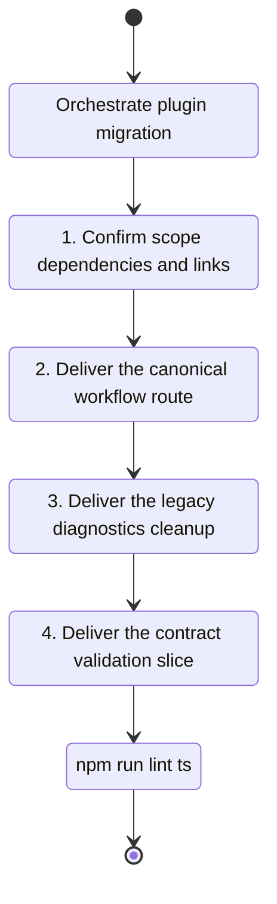

## task_151_orchestrate_plugin_migration_to_the_canonical_logics_manager_cli_surface - Orchestrate plugin migration to the canonical logics-manager CLI surface
> From version: 1.28.1
> Schema version: 1.0
> Status: Ready
> Understanding: 98%
> Confidence: 91%
> Progress: 20%
> Complexity: Medium
> Theme: Runtime integration
> Reminder: Update status/understanding/confidence/progress and linked request/backlog references when you edit this doc.

# Context
- Execute the orchestration lane for `req_189` by sequencing the linked backlog slices and keeping the plugin migration aligned with the canonical `logics-manager` runtime contract.
- Keep the 2026-04-23 assistant-surface audit findings synchronized with implementation:
  - canonical assistant instructions are already in place;
  - generated bridge labels, fallback prompts, request-authoring defaults, and some docs/tests still expose a hybrid `flow-manager` contract that must either converge or be explicitly downgraded to compatibility labeling.

# Plan
- [ ] 1. Confirm scope, dependencies, and linked acceptance criteria.
- [ ] 2. Deliver the canonical workflow-entrypoint migration slice.
- [ ] 3. Deliver the legacy diagnostics and gating cleanup slice.
- [ ] 4. Deliver the contract documentation and validation slice.
- [ ] 5. Checkpoint the migration in a commit-ready state, validate it, and update the linked Logics docs.
- [ ] CROSS-CHECK: after each wave, compare assistant-visible instructions versus bridge labels and plugin agent defaults so the migration does not leave a hybrid operator contract behind.
- [ ] CHECKPOINT: keep each completed wave commit-ready and update the linked Logics docs during the wave.
- [ ] GATE: do not close a wave or step until the relevant automated tests and quality checks have been run successfully.
- [ ] FINAL: report which `req_189` gaps were closed, which remain, and any residual justified exceptions.

# Backlog
- `logics/backlog/item_345_route_plugin_workflow_actions_through_canonical_logics_manager_entrypoints.md`
- `logics/backlog/item_346_orchestrate_plugin_migration_to_the_canonical_logics_manager_cli_surface.md`
- `logics/backlog/item_347_remove_legacy_runtime_compatibility_surfaces_from_plugin_diagnostics_and_gating.md`
- `logics/backlog/item_348_document_and_validate_the_canonical_plugin_to_cli_contract.md`

# Definition of Done (DoD)
- [ ] The linked backlog slices are delivered or explicitly deferred with rationale.
- [ ] Validation passes for the changed plugin/runtime surfaces.
- [ ] Linked docs are synchronized.
- [ ] The final report states the remaining residual risk or exception set, if any.

# Validation
- Run `npm run lint:ts`.
- Run `npm test`.
- Run `npm run test:npm-cli`.
- Run `python3 -m logics_manager lint --require-status`.

# Report
- Orchestration report pending implementation.

# AI Context
- Summary: Implement orchestrate plugin migration to the canonical logics-manager cli surface.
- Keywords: task, implementation, backlog, runtime, python
- Use when: You need a bounded implementation task for a backlog item.
- Skip when: The work is still at the request or backlog shaping stage.

# Links
- Request: `logics/request/req_189_finish_plugin_migration_to_canonical_logics_manager_cli_surface.md`
- Product brief(s): `logics/product/prod_009_logics_cli_as_the_primary_operator_surface_and_unified_runtime_api.md`
- Architecture decision(s): (none yet)
- Derived from `logics/backlog/item_346_orchestrate_plugin_migration_to_the_canonical_logics_manager_cli_surface.md`
