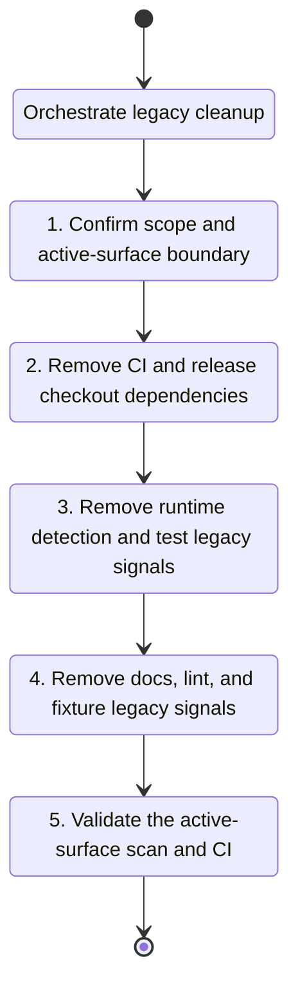

## task_152_orchestrate_removal_of_legacy_logics_skills_and_cdx_logics_kit_references - Orchestrate removal of legacy logics/skills and cdx-logics-kit references
> From version: 2.0.1
> Schema version: 1.0
> Status: Ready
> Understanding: 100% (refreshed)
> Confidence: 95% (refreshed)
> Progress: 0% (refreshed)
> Complexity: High
> Theme: Runtime migration
> Reminder: Update status/understanding/confidence/progress and linked request/backlog references when you edit this doc.

# Context
- Execute the orchestration lane for `req_190` by sequencing the three cleanup slices that remove the retired `logics/skills` and `cdx-logics-kit` references from active surfaces.
- Keep the work split along the active-surface boundary:
  - CI/release workflow cleanup;
  - runtime detection and tests cleanup;
  - docs, lint, and fixture cleanup.

# Plan
- [ ] 1. Confirm the request scope, dependencies, and active-surface boundary.
- [ ] 2. Deliver the CI and release workflow cleanup slice.
- [ ] 3. Deliver the runtime detection and test cleanup slice.
- [ ] 4. Deliver the docs, lint, and fixture cleanup slice.
- [ ] 5. Validate the active-surface scan and the supported CI path, then update the linked Logics docs.
- [ ] GATE: do not close the task until the active surfaces no longer contain the retired references and the workflow validation is green.

# Backlog
- `logics/backlog/item_349_remove_legacy_checkout_and_release_workflow_dependencies_from_ci_validation.md`
- `logics/backlog/item_350_remove_legacy_runtime_detection_and_bootstrap_signals_from_typescript_and_tests.md`
- `logics/backlog/item_351_remove_legacy_docs_lint_and_fixture_references_from_active_surfaces.md`

# Definition of Done (DoD)
- [ ] The linked backlog slices are delivered or explicitly deferred with rationale.
- [ ] Validation passes for the changed workflow, runtime, and documentation surfaces.
- [ ] The active-surface scan no longer finds `logics/skills` or `cdx-logics-kit`.
- [ ] Linked docs are synchronized.
- [ ] The final report states any residual archival-only mentions.

# Validation
- Run the targeted CI and runtime tests for the changed surfaces.
- Run a targeted search over active surfaces to confirm the retired references are gone.
- Run the supported GitHub Actions or equivalent local workflow validation for the checkout path.

## Request AC proof lines
- req_190 AC1 -> item_349. Proof: the orchestration lane removed the legacy checkout from the supported CI and release validation path.
- req_190 AC2 -> item_350. Proof: the orchestration lane removed legacy runtime detection and bootstrap signals from the supported TypeScript/runtime path.
- req_190 AC3 -> item_351. Proof: the orchestration lane removed the legacy docs and contributor guidance from the active support surface.
- req_190 AC4 -> item_351. Proof: the orchestration lane removed the legacy lint and fixture layout assumptions from the active surface.
- req_190 AC5 -> item_349/item_350. Proof: the orchestration lane removed the legacy references from the active workflow, runtime, and test surfaces.
- req_190 AC6 -> item_351. Proof: any remaining mentions were confined to archival surfaces, not active support paths.

# AI Context
- Summary: Orchestrate removal of legacy logics/skills and cdx-logics-kit references.
- Keywords: orchestration, legacy cleanup, ci, runtime, docs, tests
- Use when: Use when sequencing the cleanup of the last active references to the retired kit boundary.
- Skip when: Skip when the work only needs a single bounded code change.

# Links
- Request: `logics/request/req_190_remove_legacy_logics_skills_and_cdx_logics_kit_references_from_active_surfaces.md`
- Product brief(s): `logics/product/prod_009_logics_cli_as_the_primary_operator_surface_and_unified_runtime_api.md`
- Architecture decision(s): (none yet)
- Derived from `logics/backlog/item_349_remove_legacy_checkout_and_release_workflow_dependencies_from_ci_validation.md`
- Derived from `logics/backlog/item_350_remove_legacy_runtime_detection_and_bootstrap_signals_from_typescript_and_tests.md`
- Derived from `logics/backlog/item_351_remove_legacy_docs_lint_and_fixture_references_from_active_surfaces.md`
