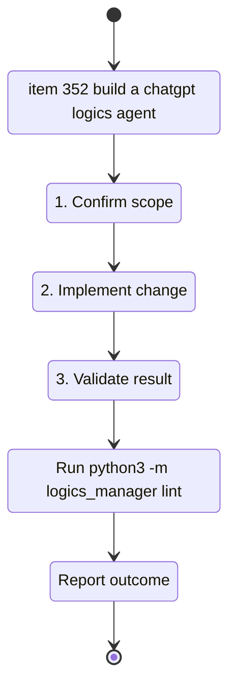

## task_153_build_a_chatgpt_logics_agent - Build a ChatGPT Logics Agent
> From version: 2.0.5
> Schema version: 1.0
> Status: In progress
> Understanding: 97%
> Confidence: 90%
> Progress: 88%
> Complexity: Medium
> Theme: Implementation delivery
> Reminder: Update status/understanding/confidence/progress and linked request/backlog references when you edit this doc.

# Definition of Done (DoD)
- [ ] The backlog scope is implemented.
- [ ] Acceptance criteria are covered.
- [ ] A Codex dogfooding run can exercise the MCP tools for request to backlog to task without direct CLI usage.
- [ ] Validation passes.

# Backlog
- `item_352_build_a_chatgpt_logics_agent`

# Acceptance criteria
- AC1: The agent can create a Logics request from a ChatGPT conversation through a bounded MCP action.
- AC2: The agent can promote existing workflow docs only through canonical `logics-manager` commands.
- AC3: The MCP surface rejects arbitrary shell execution and absolute path writes.
- AC4: Each write returns the changed artifact path, validation status, and a human-readable diff summary.
- AC5: Codex remains the execution agent and can later consume generated tasks without extra translation.

# AC Traceability
- AC1 -> Scope: Build the bounded MCP action for creating a Logics request from ChatGPT conversation. Proof: request creation is part of the task acceptance criteria.
- AC2 -> Scope: Build promotion actions that delegate to canonical `logics-manager` commands. Proof: request and backlog promotion are part of the task acceptance criteria.
- AC3 -> Scope: Add command and path restrictions around the MCP action surface. Proof: the task explicitly rejects arbitrary shell execution and absolute path writes.
- AC4 -> Scope: Return changed paths, validation status, and diff summaries after write actions. Proof: write result reporting is part of the task acceptance criteria.
- AC5 -> Scope: Preserve the Codex handoff boundary. Proof: the task keeps implementation work out of ChatGPT's direct action surface.

# Validation
- Run `python3 -m logics_manager lint --require-status`.
- Run an automated smoke test for create request, promote request, promote backlog, lint, audit, and diff reporting.
- Run a Codex dogfooding scenario against the MCP surface before treating the ChatGPT connector path as product-ready.
- Run `python3 -m logics_manager flow finish task task_153_build_a_chatgpt_logics_agent.md` after implementation.

# Report
- First implementation slice complete: added the local MCP handler module, JSON-RPC stdio surface, direct testing command, path guardrails, tool definitions, and Python smoke coverage for request to backlog to task flow.
- Second implementation slice complete: added stricter MCP argument validation, dirty tracked-source conflict detection, untracked-file diff summaries, and a JSON-RPC dogfooding script for the request to backlog to task flow.
- Local dogfood proof: `scripts/dogfood-mcp-flow.py --repo-root <temp repo>` creates request, backlog, and task through MCP JSON-RPC handlers, then runs lint, audit, and diff.
- Third implementation slice in progress: added local HTTP transport for tunnel testing and documented the ChatGPT connector constraint that local MCP needs a remote or tunnel path.
- HTTP smoke proof: a temporary local server returned `200` for `/health` and `200` for `POST /mcp` `tools/list`, exposing 9 tools.
- Remaining work: run a real Codex dogfooding session, verify an HTTPS tunnel against the HTTP transport, and refine packaging for ChatGPT integration.

# AI Context
- Summary: Implement build a chatgpt logics agent.
- Keywords: task, implementation, backlog, runtime, python
- Use when: You need a bounded implementation task for a backlog item.
- Skip when: The work is still at the request or backlog shaping stage.

# Links
- Request: `req_191_build_a_chatgpt_logics_agent`
- Product brief(s): `logics/product/prod_010_chatgpt_logics_agent.md`
- Architecture decision(s): `logics/architecture/adr_022_chatgpt_logics_agent_mcp_contract.md`
