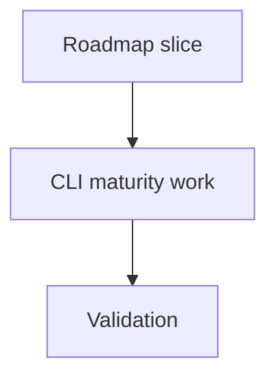

## task_162_mature_cli_product_contracts - Mature CLI product contracts
> From version: 2.1.2
> Schema version: 1.0
> Status: Done
> Understanding: 90%
> Confidence: 85%
> Progress: 100%
> Complexity: Medium
> Theme: Implementation delivery
> Reminder: Update status/understanding/confidence/progress and linked request/backlog references when you edit this doc.

# Definition of Done (DoD)
- [x] CLI contract documentation is updated.
- [x] Representative subprocess tests cover JSON output and npm wrapper execution.
- [x] Shared helper or documented helper direction exists for CLI output/path handling.
- [x] Product brief links are synchronized.
- [x] Validation passes.

# Backlog
- `item_361_mature_cli_product_contracts`

# Acceptance criteria
- AC1: JSON output rules and target path forms are documented for CLI operators.
- AC2: A shared renderer/path-policy direction is implemented or explicitly prepared for incremental adoption.
- AC3: Subprocess coverage exercises installed-style CLI execution, including the npm wrapper.
- AC4: Remaining multi-file mutation and ID allocation risks are either mitigated or documented with tests/limitations.
- AC5: Request, backlog, task, and product briefs reference each other consistently.

# AC Traceability
- request-AC1 -> Task implementation. Proof: document JSON contract and subprocess validation.
- request-AC2 -> Task implementation. Proof: document target forms and path boundary behavior.
- request-AC3 -> Task implementation. Proof: add or prepare shared helper direction.
- request-AC4 -> Task implementation. Proof: cover mutation and ID allocation risk decisions.
- request-AC5 -> Task implementation. Proof: keep product briefs and workflow docs linked.

# Validation
- Run `python3 -m logics_manager lint --require-status`.
- Run `python3 -m logics_manager flow finish task task_162_mature_cli_product_contracts.md` after implementation.
- Finish workflow executed on 2026-06-07.
- Linked backlog/request close verification passed.

# Report
- Track implementation notes and validation results for the CLI maturity roadmap.
- Finished on 2026-06-07.
- Linked backlog item(s): `item_361_mature_cli_product_contracts`
- Related request(s): `req_197_mature_cli_product_contracts`

# AI Context
- Summary: Implement mature cli product contracts.
- Keywords: task, implementation, backlog, runtime, python
- Use when: You need a bounded implementation task for a backlog item.
- Skip when: The work is still at the request or backlog shaping stage.

# Links
- Request: `req_197_mature_cli_product_contracts`
- Product brief(s): `prod_013_cli_primary_usage_audit_and_hardening`, `prod_014_cli_mutation_safety_and_automation_contract`, `prod_015_cli_product_maturity_roadmap`
- Architecture decision(s): (none yet)
