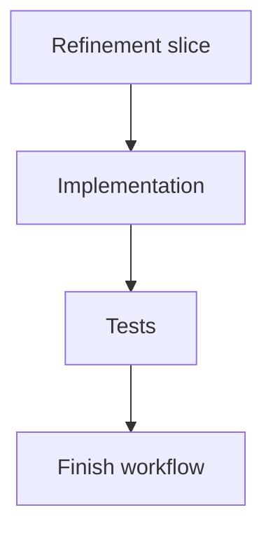

## task_163_refine_logics_operator_signal_commands - Refine Logics operator signal commands
> From version: 2.1.2
> Schema version: 1.0
> Status: Done
> Understanding: 90%
> Confidence: 85%
> Progress: 100%
> Complexity: Medium
> Theme: Implementation delivery
> Reminder: Update status/understanding/confidence/progress and linked request/backlog references when you edit this doc.

# Definition of Done (DoD)
- [x] Follow-up filtering and title cleanup are implemented.
- [x] Product consistency strict mode is implemented.
- [x] MCP exposes read-only operator signal tools.
- [x] Subprocess JSON coverage includes new operator commands and `--json`.
- [x] README triage guidance is documented.
- [x] Validation passes.

# Backlog
- `item_362_refine_logics_operator_signal_commands`

# Acceptance criteria
- AC1: `followups` defaults to open actionable work and supports source/closed-state filters.
- AC2: `product-consistency` supports strict release-check behavior and no longer reports valid proposed briefs as blocking.
- AC3: Read-only operator signal commands are available through MCP.
- AC4: Subprocess tests cover the new commands and the `--json` alias.
- AC5: README guidance documents the operator triage flow.
- AC6: Follow-up request title suggestions are concise and shell-safe.

# AC Traceability
- AC1 -> Implementation. Proof: `followups_payload` supports `source_kind`, `include_closed`, and `closed_only`, with open-only default tests.
- AC2 -> Implementation. Proof: `product-consistency --strict` returns non-zero only when active/validated product lineage checks fail.
- AC3 -> Implementation. Proof: MCP exposes `get_logics_status`, `get_logics_health`, `list_logics_followups`, and `check_product_consistency`.
- AC4 -> Tests. Proof: subprocess JSON test matrix includes `status`, `health`, `followups`, `search`, and `product-consistency` with `--json`.
- AC5 -> Documentation. Proof: README includes the operator triage flow.
- AC6 -> Implementation. Proof: follow-up title generation removes inline Markdown, bounds title length, and shell-quotes suggested commands.

# Validation
- Run `python3 -m logics_manager lint --require-status`.
- Run `python3 -m logics_manager flow finish task task_163_refine_logics_operator_signal_commands.md` after implementation.
- Implemented operator signal refinements with separate commits: follow-up filters, product consistency strict mode, MCP exposure, subprocess coverage, triage documentation, title cleanup, and product brief linkage.
- Finish workflow executed on 2026-06-07.
- Linked backlog/request close verification passed.

# Report
- Implementation complete.
- Finished on 2026-06-07.
- Linked backlog item(s): `item_362_refine_logics_operator_signal_commands`
- Related request(s): `req_198_refine_logics_operator_signal_commands`

# AI Context
- Summary: Implement refine logics operator signal commands.
- Keywords: task, implementation, backlog, runtime, python
- Use when: You need a bounded implementation task for a backlog item.
- Skip when: The work is still at the request or backlog shaping stage.

# Links
- Request: `req_198_refine_logics_operator_signal_commands`
- Product brief(s): `prod_016_logics_operator_signal_refinement`
- Architecture decision(s): (none yet)
