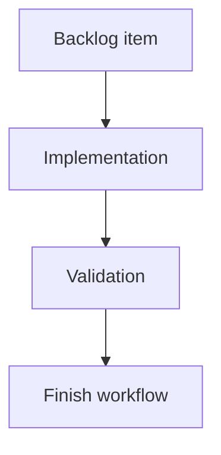

## task_164_implement_flow_deliver_from_product - Implement flow deliver from product
> From version: 2.1.2
> Schema version: 1.0
> Status: Done
> Understanding: 90%
> Confidence: 85%
> Progress: 100%
> Complexity: Medium
> Theme: Operator workflow
> Reminder: Update status/understanding/confidence/progress and linked request/backlog references when you edit this doc.

# Context
- Execute the bounded delivery slice for Implement flow deliver from product.

# Plan
- [x] 1. Confirm scope, dependencies, and linked acceptance criteria.
- [x] 2. Implement the next coherent delivery wave.
- [x] 3. Checkpoint the wave in a commit-ready state, validate it, and update the linked Logics docs.
- [x] GATE: do not close a wave or step until the relevant automated tests and quality checks have been run successfully.

# Backlog
- `item_363_implement_flow_deliver_from_product`

# Definition of Done (DoD)
- [x] Code is implemented and reviewed.
- [x] Validation passes.
- [x] Linked docs are synchronized.

# AC Traceability
- request-AC1 -> This task. Proof: implementation delivers the bounded request need.
- request-AC2 -> This task. Proof: implementation scope is limited to the linked delivery slice.
- request-AC3 -> This task. Proof: implementation is executable from the promoted backlog item.
- backlog-AC1 -> This task. Proof: task remains bounded to the linked backlog scope.
- backlog-AC2 -> This task. Proof: task provides the executable implementation surface.

# Validation
- Run `python3 -m logics_manager lint --require-status`.
- Run the task-specific automated tests.
- Focused CLI regression: PYTHONPATH=. pytest python_tests/test_logics_manager_cli.py -q passed with 148 tests.
- Finish workflow executed on 2026-06-07.
- Linked backlog/request close verification passed.
- Full Python regression: PYTHONPATH="/Users/alexandreagostini/Documents/logics-manager" pytest python_tests -q passed with 172 tests.

# Report
- Implementation complete.
- Implemented flow deliver --from-product as a native CLI orchestration command that creates and links request, backlog, and task docs from a product brief.
- Finished on 2026-06-07.
- Linked backlog item(s): `item_363_implement_flow_deliver_from_product`
- Related request(s): `req_199_implement_flow_deliver_from_product`

# AI Context
- Summary: Implement implement flow deliver from product.
- Keywords: task, implementation, backlog, runtime, python
- Use when: You need a bounded implementation task for a backlog item.
- Skip when: The work is still at the request or backlog shaping stage.

# Links
- Request: `req_199_implement_flow_deliver_from_product`
- Product brief(s): `prod_017_logics_delivery_loop_ergonomics`
- Architecture decision(s): (none yet)
