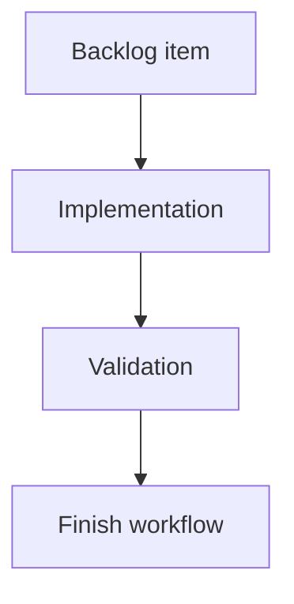

## task_166_add_a_local_web_viewer_for_cli_driven_logics_work - Add a local web viewer for CLI-driven Logics work
> From version: 2.2.0
> Schema version: 1.0
> Status: Ready
> Understanding: 90%
> Confidence: 85%
> Progress: 0%
> Complexity: Medium
> Theme: Implementation delivery
> Reminder: Update status/understanding/confidence/progress and linked request/backlog references when you edit this doc.

# Definition of Done (DoD)
- [ ] The backlog scope is implemented.
- [ ] Acceptance criteria are covered.
- [ ] Validation passes.

# Backlog
- `item_365_add_a_local_web_viewer_for_cli_driven_logics_work`

# Acceptance criteria
- AC1: The product direction explains why CLI output alone is insufficient for document-heavy Logics work.
- AC2: The first version is scoped as a local browser viewer, not a VS Code replacement or cloud service.
- AC3: The proposal preserves the CLI/runtime as the authority for data and future mutations.
- AC4: The brief identifies reuse points from the existing webview and the need for a host adapter boundary.
- AC5: Security and scope guardrails are explicit, especially localhost-only behavior by default.

# AC Traceability
- request-AC1 -> Task implementation. Proof: product brief documents the CLI visual feedback gap for document-heavy Logics work.
- request-AC2 -> Task implementation. Proof: product brief scopes the first version as a local browser viewer and excludes VS Code replacement or cloud service work.
- request-AC3 -> Task implementation. Proof: product brief keeps CLI/runtime authority for data and future mutations.
- request-AC4 -> Task implementation. Proof: product brief calls out webview asset reuse and a browser host adapter boundary.
- request-AC5 -> Task implementation. Proof: product brief requires localhost-only default behavior and explicit tunnel intent.

# Validation
- Run `python3 -m logics_manager lint --require-status`.
- Run `python3 -m logics_manager flow finish task task_166_add_a_local_web_viewer_for_cli_driven_logics_work.md` after implementation.

# Report
- Implementation complete.

# AI Context
- Summary: Implement add a local web viewer for cli-driven logics work.
- Keywords: task, implementation, backlog, runtime, python
- Use when: You need a bounded implementation task for a backlog item.
- Skip when: The work is still at the request or backlog shaping stage.

# Links
- Request: `req_201_add_a_local_web_viewer_for_cli_driven_logics_work`
- Product brief(s): `logics/product/prod_020_local_web_viewer_for_cli_driven_logics_work.md`
- Architecture decision(s): (none yet)
