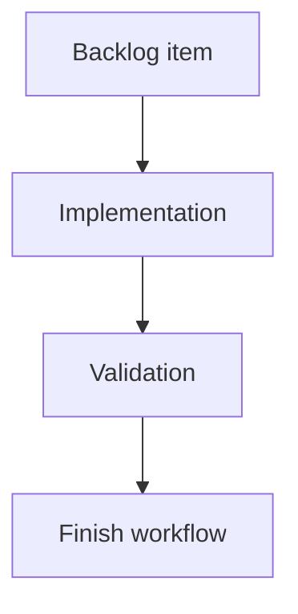

## task_167_harden_local_viewer_ux_after_first_operator_review - Harden local viewer UX after first operator review
> From version: 2.2.0
> Schema version: 1.0
> Status: Done
> Understanding: 90%
> Confidence: 85%
> Progress: 100%
> Complexity: Medium
> Theme: Implementation delivery
> Reminder: Update status/understanding/confidence/progress and linked request/backlog references when you edit this doc.

# Definition of Done (DoD)
- [x] The backlog scope is implemented.
- [x] Acceptance criteria are covered.
- [x] Validation passes.

# Backlog
- `item_366_harden_local_viewer_ux_after_first_operator_review`

# Acceptance criteria
- AC1: `logics-manager view` stops cleanly on `Ctrl-C` without hanging and without printing noisy `BrokenPipeError` tracebacks for interrupted browser/API requests.
- AC2: The local viewer does not present mutating actions as available browser commands in read-only mode; unavailable future actions are hidden, disabled with clear copy, or moved out of the primary action path.
- AC3: The primary document action is clear and read-only, using viewer-appropriate wording such as `Read document` or `Preview`; `Open` no longer implies editing in the local browser surface.
- AC4: Document view renders markdown through the shared markdown renderer or an equivalent browser-safe path, including headings, lists, links, tables, code blocks, and readable long-line behavior.
- AC5: The local viewer shell has dedicated styling for the topbar, status/meta line, document panel, and responsive layout so it feels intentional outside VS Code.
- AC6: Health view summarizes lint and audit results visually, highlights blocking issues and warnings, and provides a path to inspect affected documents instead of dumping raw JSON as the primary display.
- AC7: The read-only local viewer behavior is covered by focused tests or a harness check for action availability, document rendering, health rendering, and shutdown behavior where practical.

# Validation
- Run `python3 -m logics_manager lint --require-status`.
- Run `python3 -m logics_manager flow finish task task_167_harden_local_viewer_ux_after_first_operator_review.md` after implementation.
- npm test passed: 54 files, 477 tests. python3 -m pytest tests/python -q passed: 189 tests.
- Finish workflow executed on 2026-06-07.
- Linked backlog/request close verification passed.

# Report
- Implementation complete.
- Finished on 2026-06-07.
- Linked backlog item(s): `item_366_harden_local_viewer_ux_after_first_operator_review`
- Related request(s): `req_202_harden_local_viewer_ux_after_first_operator_review`

# AI Context
- Summary: Implement harden local viewer ux after first operator review.
- Keywords: task, implementation, backlog, runtime, python
- Use when: You need a bounded implementation task for a backlog item.
- Skip when: The work is still at the request or backlog shaping stage.

# Links
- Request: `req_202_harden_local_viewer_ux_after_first_operator_review`
- Product brief(s): (none yet)
- Architecture decision(s): (none yet)

# AC Traceability
- request-AC1 -> This task. Proof: `logics_manager/viewer.py` handles `KeyboardInterrupt` around `serve_forever()` and suppresses interrupted-client `BrokenPipeError`/`ConnectionResetError`; `tests/python/test_logics_manager_cli.py::test_viewer_main_stops_cleanly_on_keyboard_interrupt` covers the shutdown path.
- request-AC2 -> This task. Proof: `clients/viewer/browser-host.js` applies a local read-only chrome model that hides `promote`, `mark-done`, `mark-obsolete`, `change-status`, and `open` actions; `tests/viewer.browser-host.test.ts` verifies mutation actions stay hidden.
- request-AC3 -> This task. Proof: `clients/viewer/browser-host.js` relabels the remaining document action to `Read document` with read-only title copy; `tests/viewer.browser-host.test.ts` asserts the action label and title.
- request-AC4 -> This task. Proof: `clients/shared-web/media/renderMarkdown.js` exposes the shared markdown renderer to the browser host, and `clients/viewer/browser-host.js` renders document content as markdown HTML; `tests/viewer.browser-host.test.ts` verifies headings, strong text, and tables render.
- request-AC5 -> This task. Proof: `clients/viewer/viewer.css` adds dedicated topbar, document panel, markdown content, health, and responsive styles; `clients/viewer/index.html`, `logics_manager/viewer.py`, and `package.json` load, serve, and package the stylesheet.
- request-AC6 -> This task. Proof: `clients/viewer/browser-host.js` renders lint/audit payloads into summary cards and clickable finding rows instead of raw JSON; `tests/viewer.browser-host.test.ts` verifies health summary text and document-link navigation.
- request-AC7 -> This task. Proof: validation passed with `npm test` (54 files, 477 tests) and `python3 -m pytest tests/python -q` (189 tests), including the new browser host and shutdown coverage.
