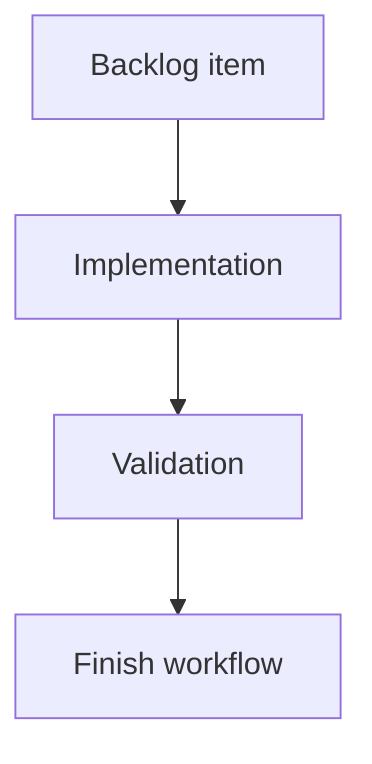

## task_168_improve_local_viewer_corpus_navigation - Improve local viewer corpus navigation
> From version: 2.2.0
> Schema version: 1.0
> Status: Done
> Understanding: 92
> Confidence: 86
> Progress: 100%
> Complexity: High
> Theme: UI
> Reminder: Update status/understanding/confidence/progress and linked request/backlog references when you edit this doc.

# Definition of Done (DoD)
- [x] The backlog scope is implemented.
- [x] Acceptance criteria are covered.
- [x] Validation passes.

# Backlog
- `item_367_improve_local_viewer_corpus_navigation`

# Acceptance criteria
- AC1: The local viewer exposes corpus insights from its top-level UI, including overview counts, flow health, relationship gaps, and recent activity.
- AC2: Corpus insights reuse existing indexed Logics item data where practical and avoid duplicating the full VS Code insights implementation.
- AC3: The filter and sort UI is reorganized around operator tasks, with visible search, quick stage/status filters, advanced filters, presets, active-filter count, and clear reset behavior.
- AC4: The revised controls make it easy to isolate active work, blocked work, unlinked docs, recently changed docs, companion docs, and items needing promotion.
- AC5: The local viewer remains lightweight, responsive, and read-mostly; existing read, health, refresh, and edit-document flows keep working.
- AC6: Browser-host tests and Python viewer tests cover the new insights payload/rendering and the filter/sort control behavior.

# AC Traceability
- request-AC1 -> This task. Proof: implement a local viewer insights entry point backed by corpus overview, flow health, relationship gaps, and recent activity data.
- request-AC2 -> This task. Proof: derive local insights from existing viewer item indexing or a small viewer-specific insights payload instead of porting the full VS Code insights panel.
- request-AC3 -> This task. Proof: replace the current filter panel with task-oriented controls for search, quick filters, advanced filters, presets, grouping, sorting, active count, and reset.
- request-AC4 -> This task. Proof: add explicit presets or equivalent controls for active work, blocked work, unlinked docs, recently changed docs, companion docs, and items needing promotion.
- request-AC5 -> This task. Proof: keep the local viewer lightweight and preserve existing read, health, refresh, and edit-document behavior during the UI refactor.
- request-AC6 -> This task. Proof: extend browser-host and Python viewer tests for insights payload/rendering plus filter and sort behavior.

# Validation
- Run `python3 -m logics_manager lint --require-status`.
- Run `python3 -m logics_manager flow finish task task_168_improve_local_viewer_corpus_navigation.md` after implementation.
- Finish workflow executed on 2026-06-07.
- Linked backlog/request close verification passed.

# Report
- Implementation complete.
- Finished on 2026-06-07.
- Linked backlog item(s): `item_367_improve_local_viewer_corpus_navigation`
- Related request(s): `req_203_improve_local_viewer_corpus_navigation`

# AI Context
- Summary: Implement improve local viewer corpus navigation.
- Keywords: task, implementation, backlog, runtime, python
- Use when: You need a bounded implementation task for a backlog item.
- Skip when: The work is still at the request or backlog shaping stage.

# Links
- Request: `req_203_improve_local_viewer_corpus_navigation`
- Product brief(s): (none yet)
- Architecture decision(s): (none yet)
