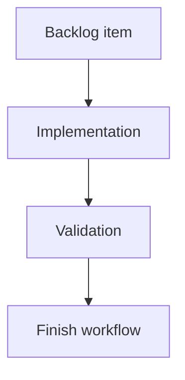

## task_169_notify_operators_when_logics_manager_updates_are_available - Notify operators when logics-manager updates are available
> From version: 2.2.0
> Schema version: 1.0
> Status: Done
> Understanding: 90
> Confidence: 82
> Progress: 100%
> Complexity: Medium
> Theme: Operator workflow
> Reminder: Update status/understanding/confidence/progress and linked request/backlog references when you edit this doc.

# Definition of Done (DoD)
- [x] The backlog scope is implemented.
- [x] Acceptance criteria are covered.
- [x] Validation passes.

# Backlog
- `item_368_notify_operators_when_logics_manager_updates_are_available`

# Acceptance criteria
- AC1: Human-oriented CLI commands can display a concise update-available notice with current version, latest version, and recommended update command.
- AC2: JSON output remains machine-safe; update metadata is either omitted from stdout text or exposed through structured fields where appropriate.
- AC3: The local viewer can display update availability without blocking item loading, refresh, health, read, or edit-document flows.
- AC4: Remote version checks are cached or throttled and fail closed without noisy stack traces when offline or when a registry is unreachable.
- AC5: The implementation handles Python and npm installation paths well enough to recommend the right update command or a safe generic fallback.
- AC6: Tests cover version comparison, cache/throttle behavior, CLI output behavior, JSON safety, and local viewer update notice rendering.

# AC Traceability
- request-AC1 -> This task. Proof: implement human CLI update notices with current version, latest version, and update command guidance.
- request-AC2 -> This task. Proof: preserve JSON stdout safety by omitting human notices or exposing update metadata only through structured fields.
- request-AC3 -> This task. Proof: add a local viewer update notice that loads independently from item, health, read, refresh, and edit flows.
- request-AC4 -> This task. Proof: add cache/throttle and offline failure handling around remote version lookup.
- request-AC5 -> This task. Proof: detect or infer Python versus npm install path enough to recommend `logics-manager self-update` or a safe fallback.
- request-AC6 -> This task. Proof: cover version comparison, cache/throttle, CLI rendering, JSON safety, and viewer notice behavior in tests.

# Validation
- Run `python3 -m logics_manager lint --require-status`.
- Run `python3 -m logics_manager flow finish task task_169_notify_operators_when_logics_manager_updates_are_available.md` after implementation.
- Finish workflow executed on 2026-06-07.
- Linked backlog/request close verification passed.

# Report
- Implementation complete.
- Finished on 2026-06-07.
- Linked backlog item(s): `item_368_notify_operators_when_logics_manager_updates_are_available`
- Related request(s): `req_204_notify_operators_when_logics_manager_updates_are_available`

# AI Context
- Summary: Implement notify operators when logics-manager updates are available.
- Keywords: task, implementation, backlog, runtime, python
- Use when: You need a bounded implementation task for a backlog item.
- Skip when: The work is still at the request or backlog shaping stage.

# Links
- Request: `req_204_notify_operators_when_logics_manager_updates_are_available`
- Product brief(s): (none yet)
- Architecture decision(s): (none yet)
