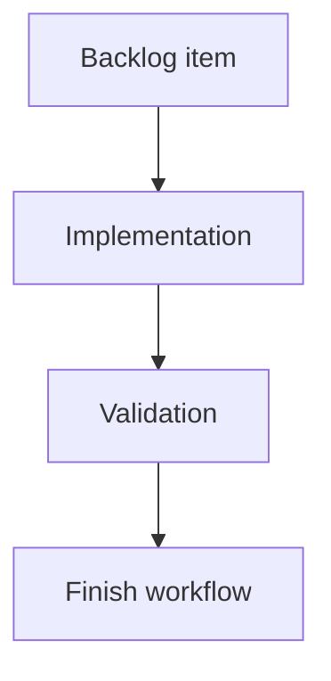

## task_170_redesign_local_viewer_corpus_filters_and_sorting - Redesign local viewer corpus filters and sorting
> From version: 2.2.0
> Schema version: 1.0
> Status: Ready
> Understanding: 94
> Confidence: 88
> Progress: 90
> Complexity: High
> Theme: UI
> Reminder: Update status/understanding/confidence/progress and linked request/backlog references when you edit this doc.

# Definition of Done (DoD)
- [ ] The backlog scope is implemented.
- [ ] Acceptance criteria are covered.
- [ ] Validation passes.

# Backlog
- `item_369_redesign_local_viewer_corpus_filters_and_sorting`

# Acceptance criteria
- AC1: The visible local viewer filter panel is organized around Focus, Type, Status, Relations, Activity, and Organize sections.
- AC2: Low-level compatibility toggles are no longer the primary visible model.
- AC3: Filter axes can combine so operators can isolate cases such as blocked tasks, unlinked docs, stale work, companion docs, and items needing promotion.
- AC4: Group and sort controls have clearer labels, and title sorting is supported.
- AC5: Existing viewer flows continue to work: search, refresh, health, corpus insights, read, and edit document.
- AC6: Tests cover the combined local filter axes and existing shared webview filter behavior remains green.

# AC Traceability
- request-AC1 -> Implemented in `clients/viewer/index.html` and `clients/viewer/viewer.css`. Proof: the panel is split into Focus, Type, Status, Relations, Activity, and Organize sections, with Focus/Narrow/Organize layout columns.
- request-AC2 -> Implemented in `clients/viewer/index.html`. Proof: the old shared-web checkbox IDs remain hidden in `.viewer-filter-native` for renderer compatibility instead of being visible corpus controls.
- request-AC3 -> Implemented in `clients/viewer/browser-host.js`. Proof: `matchesViewerFilter` combines focus, type, status, relation, and activity state for blocked tasks, unlinked docs, stale active work, companion docs, and promotion gaps.
- request-AC4 -> Implemented in `clients/viewer/index.html` and `clients/shared-web/media/webviewSelectors.js`. Proof: Group uses Type/Status/Theme labels, Sort adds Title, and the shared selector supports `title-asc`.
- request-AC5 -> Covered by existing local viewer handlers and tests in `tests/viewer.browser-host.test.ts`. Proof: refresh, health, insights, read, and edit document flows remain covered.
- request-AC6 -> Covered by `tests/viewer.browser-host.test.ts`, `tests/webview.harness-details-and-filters.test.ts`, and `tests/webview.board-renderer.test.ts`. Proof: tests exercise combined local axes and the shared webview filter behavior.

# Validation
- [x] `npm test -- tests/viewer.browser-host.test.ts`
- [x] `npm test -- tests/webview.harness-details-and-filters.test.ts tests/webview.board-renderer.test.ts`
- [x] `python3 -m logics_manager lint --require-status`
- [x] `python3 -m logics_manager audit --legacy-cutoff-version 1.1.0 --group-by-doc`
- [ ] Run `python3 -m logics_manager flow finish task task_170_redesign_local_viewer_corpus_filters_and_sorting.md` after implementation.

# Report
- Implementation complete.

# AI Context
- Summary: Implement redesign local viewer corpus filters and sorting.
- Keywords: task, implementation, backlog, runtime, python
- Use when: You need a bounded implementation task for a backlog item.
- Skip when: The work is still at the request or backlog shaping stage.

# Links
- Request: `req_205_redesign_local_viewer_corpus_filters_and_sorting`
- Product brief(s): (none yet)
- Architecture decision(s): (none yet)
