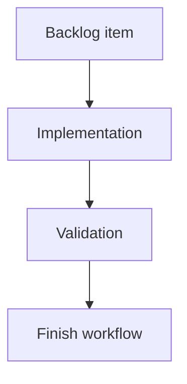

## task_171_add_progressive_group_rendering_for_large_item_lists - Add progressive group rendering for large item lists
> From version: 2.2.0
> Schema version: 1.0
> Status: Done
> Understanding: 92
> Confidence: 84
> Progress: 100%
> Complexity: Medium
> Theme: UI
> Reminder: Update status/understanding/confidence/progress and linked request/backlog references when you edit this doc.

# Plan
- Confirm the current board/list renderer grouping path in `clients/shared-web/media/renderBoardApp.js` and where group counts are computed.
- Add a small per-group reveal state, defaulting to roughly 10 rendered items per group.
- Render a stable in-flow `Show more` control for truncated groups, with remaining count copy.
- Reconcile reveal limits when search, filters, group mode, or sort mode changes.
- Decide search behavior explicitly so relevant matches are visible without repeated reveal clicks.
- Add focused tests in renderer/harness coverage before implementation is marked done.

# Definition of Done (DoD)
- [x] The backlog scope is implemented.
- [x] Acceptance criteria are covered.
- [x] Validation passes.

# Backlog
- `item_370_add_progressive_group_rendering_for_large_item_lists`

# Acceptance criteria
- AC1: Board/list groups render an initial bounded number of items per group when a group exceeds the configured threshold.
- AC2: Each truncated group exposes a visible in-flow control to reveal the next page of items, with copy that makes the hidden count clear.
- AC3: Group headers or summaries distinguish total matching items from currently rendered items when truncation is active.
- AC4: Filtering, search, grouping, and sorting produce predictable visible limits and do not leave stale expansion state that hides expected results.
- AC5: Search remains operator-friendly; relevant matches are not buried behind repeated `Show more` clicks.
- AC6: Tests cover initial truncation, reveal-more behavior, reset/reconciliation after filter or sort changes, and search behavior.

# AC Traceability
- request-AC1 -> This task. Proof: planned renderer work adds a bounded per-group visible item limit.
- request-AC2 -> This task. Proof: planned renderer work adds an in-flow show-more control with remaining-count copy.
- request-AC3 -> This task. Proof: planned renderer work updates group summaries to expose rendered versus total matching counts.
- request-AC4 -> This task. Proof: planned state reconciliation covers filter, search, grouping, and sorting transitions.
- request-AC5 -> This task. Proof: planned search behavior explicitly prevents relevant matches from being buried behind repeated reveal actions.
- request-AC6 -> This task. Proof: validation plan includes renderer and harness tests for truncation, reveal, search, and filter/sort transitions.

# Validation
- Run `npm test -- tests/webview.board-renderer.test.ts`.
- Run `npm test -- tests/webview.harness-core.test.ts`.
- Run `python3 -m logics_manager lint --require-status`.
- Run `python3 -m logics_manager audit --legacy-cutoff-version 1.1.0 --group-by-doc`.
- Run `python3 -m logics_manager flow finish task task_171_add_progressive_group_rendering_for_large_item_lists.md` after implementation.
- Finish workflow executed on 2026-06-07.
- Linked backlog/request close verification passed.

# Report
- Planned. No implementation has been applied yet.
- Finished on 2026-06-07.
- Linked backlog item(s): `item_370_add_progressive_group_rendering_for_large_item_lists`
- Related request(s): `req_206_add_progressive_group_rendering_for_large_item_lists`

# AI Context
- Summary: Implement progressive per-group rendering for large board/list item groups with explicit show-more controls and tests.
- Keywords: board-renderer, list-view, progressive-rendering, show-more, large-corpus, local-viewer
- Use when: Implementing the next UI slice for large-corpus board/list rendering.
- Skip when: The work targets server-side pagination, indexing, or unrelated local viewer filters.

# Links
- Request: `req_206_add_progressive_group_rendering_for_large_item_lists`
- Product brief(s): (none yet)
- Architecture decision(s): (none yet)
