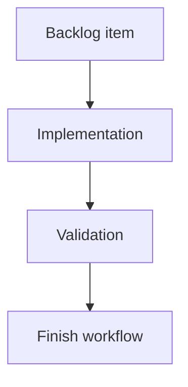

## task_172_add_local_viewer_favicon_from_existing_app_assets - Add local viewer favicon from existing app assets
> From version: 2.2.0
> Schema version: 1.0
> Status: Ready
> Understanding: 96
> Confidence: 94
> Progress: 0
> Complexity: Low
> Theme: UI
> Reminder: Update status/understanding/confidence/progress and linked request/backlog references when you edit this doc.

# Plan
- Confirm the preferred existing icon asset, starting with `clients/shared-web/media/icon.png`.
- Add favicon link tags to `clients/viewer/index.html`.
- Verify the existing `/media/` static route serves the favicon asset with a browser-usable content type.
- Add or update a focused test covering the referenced favicon path and package inclusion.

# Definition of Done (DoD)
- [ ] The backlog scope is implemented.
- [ ] Acceptance criteria are covered.
- [ ] Validation passes.

# Backlog
- `item_371_add_local_viewer_favicon_from_existing_app_assets`

# Acceptance criteria
- AC1: The local viewer HTML declares a favicon using existing app assets from `clients/shared-web/media/`.
- AC2: The favicon path is served by the local viewer without adding a new static route unless the existing media route proves insufficient.
- AC3: The selected primary icon works in common browsers from `http://127.0.0.1:<port>/` without requiring a page reload loop or external asset.
- AC4: Packaging or viewer tests cover that the referenced favicon asset is included and addressable.
- AC5: The implementation does not alter VS Code extension icon behavior or introduce a new icon source.

# AC Traceability
- request-AC1 -> This task. Proof: planned HTML change adds favicon declarations to `clients/viewer/index.html`.
- request-AC2 -> This task. Proof: planned verification uses the existing `/media/` route in `logics_manager/viewer.py`.
- request-AC3 -> This task. Proof: planned browser-host/viewer check uses the local viewer root and same-origin asset path.
- request-AC4 -> This task. Proof: planned tests cover asset reference and package inclusion.
- request-AC5 -> This task. Proof: scope excludes VS Code extension icon behavior and new icon sources.

# Validation
- Run `npm test -- tests/npmPackage.test.ts`.
- Run `npm test -- tests/viewer.browser-host.test.ts`.
- Run `python3 -m logics_manager lint --require-status`.
- Run `python3 -m logics_manager audit --legacy-cutoff-version 1.1.0 --group-by-doc`.
- Run `python3 -m logics_manager flow finish task task_172_add_local_viewer_favicon_from_existing_app_assets.md` after implementation.

# Report
- Planned. No implementation has been applied yet.

# AI Context
- Summary: Implement a local viewer favicon by reusing existing shared media app assets.
- Keywords: local-viewer, favicon, icon.png, browser-tab, packaging
- Use when: Implementing or reviewing the viewer favicon polish task.
- Skip when: The work targets new artwork or VS Code extension branding.

# Links
- Request: `req_207_add_local_viewer_favicon_from_existing_app_assets`
- Product brief(s): (none yet)
- Architecture decision(s): (none yet)
