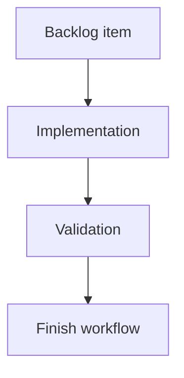

## task_173_auto_refresh_local_viewer_data_without_page_navigation - Auto refresh local viewer data without page navigation
> From version: 2.2.0
> Schema version: 1.0
> Status: Done
> Understanding: 94
> Confidence: 86
> Progress: 100%
> Complexity: Medium
> Theme: UI
> Reminder: Update status/understanding/confidence/progress and linked request/backlog references when you edit this doc.

# Plan
- Add a small auto-refresh scheduler in `clients/viewer/browser-host.js`.
- Reuse `loadItems("POST")` or an equivalent path to call `/api/refresh` without page reload.
- Add an in-flight guard so timer ticks cannot overlap.
- Preserve visible UI state, including selected item, open document preview, local filters, search, grouping, and sorting.
- Skip/defer refresh while the document is hidden and refresh when the tab becomes visible again.
- Keep automatic refresh meta updates quiet unless an error occurs.

# Definition of Done (DoD)
- [x] The backlog scope is implemented.
- [x] Acceptance criteria are covered.
- [x] Validation passes.

# Backlog
- `item_372_auto_refresh_local_viewer_data_without_page_navigation`

# Acceptance criteria
- AC1: The local viewer refreshes its item payload automatically about once per minute while visible.
- AC2: Automatic refresh uses existing viewer APIs and does not reload or navigate the browser page.
- AC3: Automatic refresh preserves the currently open document preview, selected item, filters, search, grouping, and sorting where practical.
- AC4: Refreshes do not overlap; a new automatic tick is skipped or deferred while a previous refresh is still in flight.
- AC5: Hidden-tab behavior is intentional: background ticks are skipped/deferred and the viewer refreshes when it becomes visible again.
- AC6: Tests cover timer-driven refresh, no page navigation, in-flight guarding, and state preservation for document/viewer UI.

# AC Traceability
- request-AC1 -> This task. Proof: planned browser-host scheduler refreshes at roughly a one-minute interval while visible.
- request-AC2 -> This task. Proof: planned implementation reuses `/api/refresh` and does not call page navigation APIs.
- request-AC3 -> This task. Proof: planned state-preservation checks cover document preview, selection, filters, search, grouping, and sorting.
- request-AC4 -> This task. Proof: planned in-flight guard skips or defers overlapping timer ticks.
- request-AC5 -> This task. Proof: planned visibility handling skips/defer hidden-tab ticks and refreshes on visible transition.
- request-AC6 -> This task. Proof: planned tests cover timer refresh, no navigation, in-flight guarding, and UI state preservation.

# Validation
- Run `npm test -- tests/viewer.browser-host.test.ts`.
- Run `python3 -m logics_manager lint --require-status`.
- Run `python3 -m logics_manager audit --legacy-cutoff-version 1.1.0 --group-by-doc`.
- Run `python3 -m logics_manager flow finish task task_173_auto_refresh_local_viewer_data_without_page_navigation.md` after implementation.
- Finish workflow executed on 2026-06-07.
- Linked backlog/request close verification passed.

# Report
- Planned. No implementation has been applied yet.
- Finished on 2026-06-07.
- Linked backlog item(s): `item_372_auto_refresh_local_viewer_data_without_page_navigation`
- Related request(s): `req_208_auto_refresh_local_viewer_data_without_page_navigation`

# AI Context
- Summary: Implement silent in-place auto-refresh for local viewer data without page navigation.
- Keywords: local-viewer, auto-refresh, polling, refresh-api, no-navigation, visibilitychange
- Use when: Implementing or reviewing local viewer data freshness behavior.
- Skip when: The work requires WebSockets, server push, or user-configurable intervals.

# Links
- Request: `req_208_auto_refresh_local_viewer_data_without_page_navigation`
- Product brief(s): (none yet)
- Architecture decision(s): (none yet)
