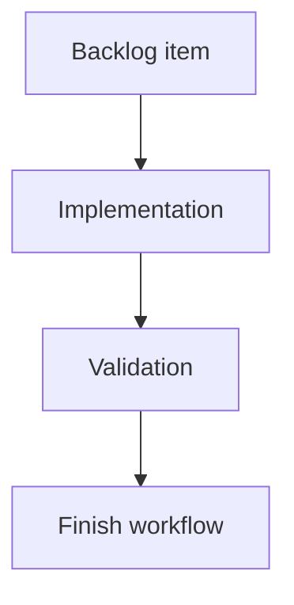

## task_174_open_focused_logics_items_in_the_local_viewer - Open focused Logics items in the local viewer
> From version: 2.3.0
> Schema version: 1.0
> Status: Ready
> Understanding: 90%
> Confidence: 85%
> Progress: 0%
> Complexity: Medium
> Theme: Implementation delivery
> Reminder: Update status/understanding/confidence/progress and linked request/backlog references when you edit this doc.

# Definition of Done (DoD)
- [ ] The viewer can open and focus a Logics item from a URL query target.
- [ ] The CLI can launch the viewer with `--focus <ref-or-path>` and `--open`.
- [ ] Focused loads select, reveal, and open details for the target item without workflow mutations.
- [ ] Assistant-facing docs explain both the viewer link and fallback command.
- [ ] Focus parsing and browser-host behavior are covered by focused tests.
- [ ] Validation passes.

# Backlog
- `item_373_open_focused_logics_items_in_the_local_viewer`

# Acceptance criteria
- AC1: The viewer accepts a focus target in the URL query and resolves both workflow refs and repo-relative Logics Markdown paths.
- AC2: `logics-manager view` supports a focus option that starts the local viewer and opens the focused URL when requested.
- AC3: A focused viewer load selects the item, scrolls it into view, and opens the details panel without mutating workflow files.
- AC4: Optional read-preview mode can open the rendered Markdown preview for the focused item, including Mermaid rendering fallback behavior.
- AC5: Missing, stale, or invalid focus targets produce clear viewer feedback while keeping the corpus usable.
- AC6: Assistant-facing guidance and README/CLI docs explain the link plus fallback-command pattern, including what to do when the server is not running.
- AC7: Focus target parsing is covered by tests for refs, repo-relative paths, URL encoding, missing items, and path traversal rejection.

# AC Traceability
- request-AC1 -> This task. Proof: planned viewer query parsing resolves focus targets from refs and repo-relative Logics Markdown paths.
- request-AC2 -> This task. Proof: planned CLI work adds `logics-manager view --focus <ref-or-path>` while preserving normal viewer launch behavior.
- request-AC3 -> This task. Proof: planned browser-host work selects, reveals, and opens details for the focused item without write actions.
- request-AC4 -> This task. Proof: planned read-mode query handling opens the existing rendered Markdown preview path for the focused item.
- request-AC5 -> This task. Proof: planned missing-target handling reports clear viewer feedback and keeps the corpus loaded.
- request-AC6 -> This task. Proof: planned README and assistant guidance document both the local viewer link and fallback launch command.
- request-AC7 -> This task. Proof: planned tests cover refs, repo-relative paths, URL encoding, missing items, and traversal rejection.

# Validation
- Run `npm test -- tests/viewer.browser-host.test.ts`.
- Run `python3 -m pytest tests/python/test_logics_manager_cli.py -q`.
- Run `python3 -m logics_manager lint --require-status`.
- Run `python3 -m logics_manager audit --legacy-cutoff-version 1.1.0 --group-by-doc`.
- Run `python3 -m logics_manager flow finish task task_174_open_focused_logics_items_in_the_local_viewer.md` after implementation.

# Implementation plan
1. Extend `logics_manager/viewer.py` with safe focus-target parsing and `logics-manager view --focus <ref-or-path>`.
2. Encode the focus target into the opened viewer URL, preserving `--host`, `--port`, `--open`, and `--no-open` behavior.
3. Update `clients/viewer/browser-host.js` so startup reads `focus` and optional `read` query params, resolves the loaded item, selects it, reveals it if needed, and opens details or preview.
4. Add clear feedback for missing or invalid targets while keeping the corpus loaded.
5. Document assistant usage in `README.md`, including the raw local link and fallback command.
6. Add focused tests for refs, repo-relative paths, URL encoding, missing items, and traversal rejection.

# Target files
- `logics_manager/viewer.py`
- `clients/viewer/browser-host.js`
- `clients/viewer/index.html`
- `tests/viewer.browser-host.test.ts`
- `tests/python/test_logics_manager_cli.py`
- `README.md`

# Report
- Implementation not started. This task prepares the delivery path for viewer focus links and assistant handoff guidance.

# AI Context
- Summary: Implement local viewer focus links and `logics-manager view --focus` so assistants can give users a direct focused item link plus a robust fallback command.
- Keywords: local-viewer, focus-link, deep-link, CLI focus, assistant handoff, viewer browser host, read-only
- Use when: Implementing or reviewing focused viewer launch, focus query parsing, or assistant-facing viewer link guidance.
- Skip when: The change targets unrelated viewer filtering, remote sharing, or workflow mutation.

# Links
- Request: `logics/request/req_209_viewer_focus_links.md`
- Backlog: `logics/backlog/item_373_open_focused_logics_items_in_the_local_viewer.md`
- Product brief(s): (none yet)
- Architecture decision(s): (none yet)
