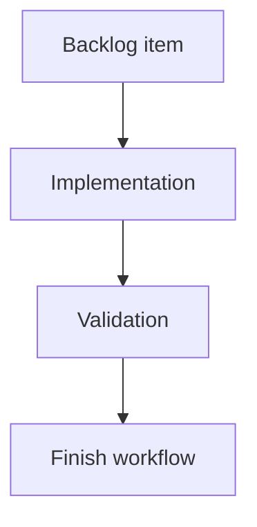

## task_175_improve_local_logics_viewer_controls_and_activity_signals - Improve local Logics viewer controls and activity signals
> From version: 2.3.3
> Schema version: 1.0
> Status: Done
> Understanding: 90%
> Confidence: 85%
> Progress: 100%
> Complexity: Medium
> Theme: Implementation delivery
> Reminder: Update status/understanding/confidence/progress and linked request/backlog references when you edit this doc.

# Definition of Done (DoD)
- [x] The backlog scope is implemented.
- [x] Acceptance criteria are covered.
- [x] Validation passes.

# Backlog
- `item_374_improve_local_logics_viewer_controls_and_activity_signals`

# Acceptance criteria
- AC1: In `logics-manager view`, the topbar shows `Auto`, `Refresh`, `Insights`, and `Health` in that order.
- AC2: The `Auto` checkbox enables and disables automatic refresh without disabling manual `Refresh`.
- AC3: The CLI supports configuring the automatic refresh interval, keeps a 60-second default, and accepts shorter positive intervals.
- AC4: The filter toolbar no longer includes the redundant corpus-insights icon, while the main `Insights` button still opens corpus insights.
- AC5: The local viewer tools menu is removed from the browser viewer UI.
- AC6: The viewer startup output includes the localhost URL and, when available/applicable, a network-facing address for the bound server.
- AC7: The refreshed metadata line includes a seconds countdown until the next automatic refresh when auto-refresh is active.
- AC8: Recent activity entries include a leading visual marker describing the document type.
- AC9: Existing viewer behavior for focus/read URLs, manual refresh, insights, health, and packaged PyPI/pipx assets remains covered by tests.

# Validation
- Run `python3 -m logics_manager lint --require-status`.
- Run `python3 -m logics_manager flow finish task task_175_improve_local_logics_viewer_controls_and_activity_signals.md` after implementation.
- Finish workflow executed on 2026-06-08.
- Linked backlog/request close verification passed.

# Report
- Implementation complete.
- Finished on 2026-06-08.
- Linked backlog item(s): `item_374_improve_local_logics_viewer_controls_and_activity_signals`
- Related request(s): `req_210_improve_local_logics_viewer_controls_and_activity_signals`

# AI Context
- Summary: Implement improve local logics viewer controls and activity signals.
- Keywords: task, implementation, backlog, runtime, python
- Use when: You need a bounded implementation task for a backlog item.
- Skip when: The work is still at the request or backlog shaping stage.

# Links
- Request: `req_210_improve_local_logics_viewer_controls_and_activity_signals`
- Product brief(s): (none yet)
- Architecture decision(s): (none yet)

# AC Traceability
- request-AC1 -> This task. Proof: In `logics-manager view`, the topbar shows `Auto`, `Refresh`, `Insights`, and `Health` in that order.
- request-AC2 -> This task. Proof: The `Auto` checkbox enables and disables automatic refresh without disabling manual `Refresh`.
- request-AC3 -> This task. Proof: The CLI supports configuring the automatic refresh interval, keeps a 60-second default, and accepts shorter positive intervals.
- request-AC4 -> This task. Proof: The filter toolbar no longer includes the redundant corpus-insights icon, while the main `Insights` button still opens corpus insights.
- request-AC5 -> This task. Proof: The local viewer tools menu is removed from the browser viewer UI.
- request-AC6 -> This task. Proof: The viewer startup output includes the localhost URL and, when available/applicable, a network-facing address for the bound server.
- request-AC7 -> This task. Proof: The refreshed metadata line includes a seconds countdown until the next automatic refresh when auto-refresh is active.
- request-AC8 -> This task. Proof: Recent activity entries include a leading visual marker describing the document type.
- request-AC9 -> This task. Proof: Existing viewer behavior for focus/read URLs, manual refresh, insights, health, and packaged PyPI/pipx assets remains covered by tests.
