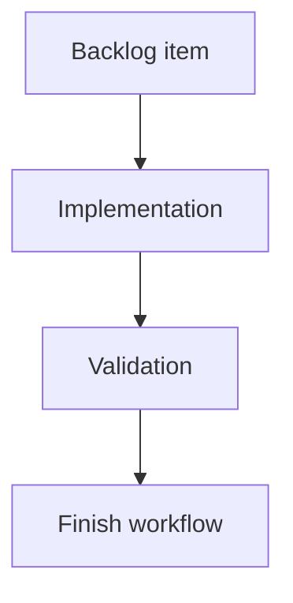

## task_176_improve_viewer_repository_identity_and_recent_activity_scanning - Improve viewer repository identity and recent activity scanning
> From version: 2.3.3
> Schema version: 1.0
> Status: Done
> Understanding: 90%
> Confidence: 85%
> Progress: 100%
> Complexity: Medium
> Theme: Implementation delivery
> Reminder: Update status/understanding/confidence/progress and linked request/backlog references when you edit this doc.

# Definition of Done (DoD)
- [x] The backlog scope is implemented.
- [x] Acceptance criteria are covered.
- [x] Validation passes.

# Backlog
- `item_375_improve_viewer_repository_identity_and_recent_activity_scanning`

# Acceptance criteria
- AC1: The viewer topbar displays a compact repository-name pill immediately to the right of `Logics Viewer`.
- AC2: The repository pill uses the short repo directory name and exposes the full repository path where practical.
- AC3: Recent activity entries show a leading activity-type icon or marker.
- AC4: A status-change marker is used only when the viewer can reliably detect that a document status changed since the previous known snapshot.
- AC5: A general update marker is used for entries that changed but do not have a reliable status-change signal.
- AC6: Recent activity initially renders at most 10 entries.
- AC7: A reveal control lets users show the next 10 Recent activity entries without changing the existing recency sort order.
- AC8: The reveal control is hidden or disabled when no additional activity entries remain.
- AC9: Existing activity entry selection, double-click read behavior, and timestamp rendering continue to work.

# Validation
- Run `python3 -m logics_manager lint --require-status`.
- Run `python3 -m logics_manager flow finish task task_176_improve_viewer_repository_identity_and_recent_activity_scanning.md` after implementation.
- Finish workflow executed on 2026-06-08.
- Linked backlog/request close verification passed.

# Report
- Implementation complete.
- Finished on 2026-06-08.
- Linked backlog item(s): `item_375_improve_viewer_repository_identity_and_recent_activity_scanning`
- Related request(s): `req_211_improve_viewer_repository_identity_and_recent_activity_scanning`

# AI Context
- Summary: Implement improve viewer repository identity and recent activity scanning.
- Keywords: task, implementation, backlog, runtime, python
- Use when: You need a bounded implementation task for a backlog item.
- Skip when: The work is still at the request or backlog shaping stage.

# Links
- Request: `req_211_improve_viewer_repository_identity_and_recent_activity_scanning`
- Product brief(s): (none yet)
- Architecture decision(s): (none yet)

# AC Traceability
- request-AC1 -> This task. Proof: The viewer topbar displays a compact repository-name pill immediately to the right of `Logics Viewer`.
- request-AC2 -> This task. Proof: The repository pill uses the short repo directory name and exposes the full repository path where practical.
- request-AC3 -> This task. Proof: Recent activity entries show a leading activity-type icon or marker.
- request-AC4 -> This task. Proof: A status-change marker is used only when the viewer can reliably detect that a document status changed since the previous known snapshot.
- request-AC5 -> This task. Proof: A general update marker is used for entries that changed but do not have a reliable status-change signal.
- request-AC6 -> This task. Proof: Recent activity initially renders at most 10 entries.
- request-AC7 -> This task. Proof: A reveal control lets users show the next 10 Recent activity entries without changing the existing recency sort order.
- request-AC8 -> This task. Proof: The reveal control is hidden or disabled when no additional activity entries remain.
- request-AC9 -> This task. Proof: Existing activity entry selection, double-click read behavior, and timestamp rendering continue to work.
