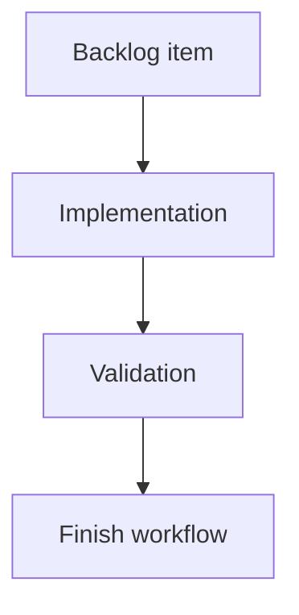

## task_177_expand_viewer_health_navigation_and_corpus_insights - Expand viewer health navigation and corpus insights
> From version: 2.3.3
> Schema version: 1.0
> Status: Ready
> Understanding: 90%
> Confidence: 85%
> Progress: 0%
> Complexity: Medium
> Theme: Implementation delivery
> Reminder: Update status/understanding/confidence/progress and linked request/backlog references when you edit this doc.

# Definition of Done (DoD)
- [ ] The backlog scope is implemented.
- [ ] Acceptance criteria are covered.
- [ ] Validation passes.

# Backlog
- `item_376_expand_viewer_health_navigation_and_corpus_insights`

# Acceptance criteria
- AC1: Validation health document-scoped findings expose a clickable path or control that opens the referenced document in the viewer read preview.
- AC2: Repository-level findings remain non-clickable and are visually distinguishable from document-scoped findings.
- AC3: Missing, invalid, or unsafe finding paths are rendered safely and do not break the Health screen.
- AC4: Corpus insights includes an `Overview` section with document counts by type, open/closed counts, blocked counts, missing or ambiguous status counts, and recently modified document counts.
- AC5: Corpus insights includes a `Flow health` section with incomplete workflow chain signals and orphan/linkage risk signals.
- AC6: Corpus insights includes an `Activity` section with latest changes, stale active docs, recently active docs, and a simple activity classification.
- AC7: Corpus insights includes a `Traceability` section with most referenced docs, unlinked docs, broken references, and relationship counts by document type.
- AC8: Corpus insights includes a `Quality signals` section summarizing lint/audit categories, finding counts by document type, and documents with concentrated issues.
- AC9: Corpus insights includes an `Operator actions` section with recommended next checks that are derived from available corpus, lint, and audit signals.
- AC10: The `Show blocked, orphaned, unprocessed, or inconsistent items` button toggles active/pressed state and filters the board/list to attention-required items in the local viewer.
- AC11: Turning the attention filter off restores the previous visible corpus according to the active search/filter settings.
- AC12: Existing `Insights` and `Health` buttons continue to work in the local viewer and in packaged PyPI/pipx assets.

# Validation
- Run `python3 -m logics_manager lint --require-status`.
- Run `python3 -m logics_manager flow finish task task_177_expand_viewer_health_navigation_and_corpus_insights.md` after implementation.

# Report
- Implementation complete.

# AI Context
- Summary: Implement expand viewer health navigation and corpus insights.
- Keywords: task, implementation, backlog, runtime, python
- Use when: You need a bounded implementation task for a backlog item.
- Skip when: The work is still at the request or backlog shaping stage.

# Links
- Request: `req_212_expand_viewer_health_navigation_and_corpus_insights`
- Product brief(s): (none yet)
- Architecture decision(s): (none yet)

# AC Traceability
- request-AC1 -> This task. Proof: Validation health document-scoped findings expose a clickable path or control that opens the referenced document in the viewer read preview.
- request-AC2 -> This task. Proof: Repository-level findings remain non-clickable and are visually distinguishable from document-scoped findings.
- request-AC3 -> This task. Proof: Missing, invalid, or unsafe finding paths are rendered safely and do not break the Health screen.
- request-AC4 -> This task. Proof: Corpus insights includes an `Overview` section with document counts by type, open/closed counts, blocked counts, missing or ambiguous status counts, and recently modified document counts.
- request-AC5 -> This task. Proof: Corpus insights includes a `Flow health` section with incomplete workflow chain signals and orphan/linkage risk signals.
- request-AC6 -> This task. Proof: Corpus insights includes an `Activity` section with latest changes, stale active docs, recently active docs, and a simple activity classification.
- request-AC7 -> This task. Proof: Corpus insights includes a `Traceability` section with most referenced docs, unlinked docs, broken references, and relationship counts by document type.
- request-AC8 -> This task. Proof: Corpus insights includes a `Quality signals` section summarizing lint/audit categories, finding counts by document type, and documents with concentrated issues.
- request-AC9 -> This task. Proof: Corpus insights includes an `Operator actions` section with recommended next checks that are derived from available corpus, lint, and audit signals.
- request-AC10 -> This task. Proof: The `Show blocked, orphaned, unprocessed, or inconsistent items` button toggles active/pressed state and filters the board/list to attention-required items in the local viewer.
- request-AC11 -> This task. Proof: Turning the attention filter off restores the previous visible corpus according to the active search/filter settings.
- request-AC12 -> This task. Proof: Existing `Insights` and `Health` buttons continue to work in the local viewer and in packaged PyPI/pipx assets.
