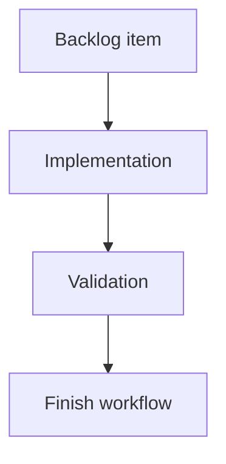

## task_178_dogfood_local_logics_viewer_on_real_corpora - Dogfood local Logics viewer on real corpora
> From version: 2.3.3
> Schema version: 1.0
> Status: Ready
> Understanding: 95
> Confidence: 85
> Progress: 0
> Complexity: Medium
> Theme: UX validation
> Reminder: Update status/understanding/confidence/progress and linked request/backlog references when you edit this doc.

# Definition of Done (DoD)
- [ ] The backlog scope is implemented.
- [ ] Acceptance criteria are covered.
- [ ] Validation passes.

# Backlog
- `item_377_dogfood_local_logics_viewer_on_real_corpora`

# Acceptance criteria
- AC1: The viewer is exercised from the local dev entrypoint against the current repo corpus.
- AC2: The review covers topbar controls, repository pill, Auto/Refresh, Insights, Health, attention filter, read preview, and recent activity.
- AC3: The review covers at least desktop, tablet-width, and mobile-width layouts.
- AC4: Findings are grouped into `must fix`, `should fix`, and `nice to have`.
- AC5: Any immediate fixes are small, validated, and documented; larger findings become new requests instead of being hidden in this work.
- AC6: The resulting backlog slice is actionable without needing the original chat context.

# Implementation plan
1. Start the dev viewer with `python3 -m logics_manager view --open --refresh-interval 10`.
2. Exercise the repository corpus through topbar controls, Auto/Refresh, Insights, Health, attention filtering, read preview, and recent activity.
3. Repeat the review at desktop, tablet-width, and mobile-width viewports.
4. Record findings under `must fix`, `should fix`, and `nice to have`.
5. Apply only small low-risk fixes discovered during the pass; create follow-up requests for larger work.

# Validation
- Run `python3 -m logics_manager lint --require-status`.
- Run `python3 -m logics_manager flow finish task task_178_dogfood_local_logics_viewer_on_real_corpora.md` after implementation.

# Report
- Not started.

# AI Context
- Summary: Implement dogfood local logics viewer on real corpora.
- Keywords: task, implementation, backlog, runtime, python
- Use when: You need a bounded implementation task for a backlog item.
- Skip when: The work is still at the request or backlog shaping stage.

# Links
- Request: `req_213_dogfood_local_logics_viewer_on_real_corpora`
- Product brief(s): (none yet)
- Architecture decision(s): (none yet)

# AC Traceability
- request-AC1 -> This task. Proof: The task requires exercising the viewer from the local dev entrypoint against the current repo corpus.
- request-AC2 -> This task. Proof: The task covers topbar controls, repository pill, Auto/Refresh, Insights, Health, attention filter, read preview, and recent activity.
- request-AC3 -> This task. Proof: The task covers desktop, tablet-width, and mobile-width layouts.
- request-AC4 -> This task. Proof: The task requires findings grouped into must fix, should fix, and nice to have.
- request-AC5 -> This task. Proof: The task limits immediate fixes to small validated changes and creates follow-up requests for larger findings.
- request-AC6 -> This task. Proof: The task keeps the backlog slice actionable without requiring chat context.
