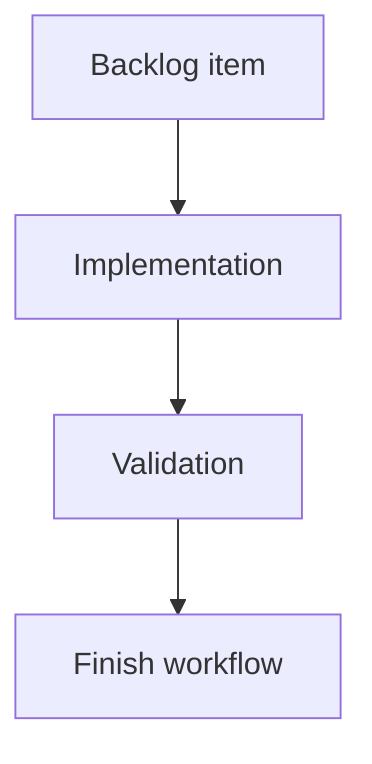

## task_179_make_local_viewer_corpus_insights_actionable - Make local viewer corpus insights actionable
> From version: 2.3.3
> Schema version: 1.0
> Status: Ready
> Understanding: 95
> Confidence: 85
> Progress: 0
> Complexity: Medium
> Theme: Viewer insights
> Reminder: Update status/understanding/confidence/progress and linked request/backlog references when you edit this doc.

# Definition of Done (DoD)
- [ ] The backlog scope is implemented.
- [ ] Acceptance criteria are covered.
- [ ] Validation passes.

# Backlog
- `item_378_make_local_viewer_corpus_insights_actionable`

# Acceptance criteria
- AC1: Flow health signals can apply the relevant local viewer filter where a matching filter already exists.
- AC2: Quality and traceability document lists render as compact rows with clickable read-preview controls for safe Logics document paths.
- AC3: Long lists initially render a bounded number of rows and expose a reveal control without changing sort order.
- AC4: Operator action rows either apply a filter, open Health, or open a relevant document preview.
- AC5: Turning an insight-derived filter off restores normal viewer filter behavior.
- AC6: Existing Insights and Health buttons continue to work in local dev and packaged assets.

# Implementation plan
1. Map existing Insights signals to available local viewer filters and read-preview actions.
2. Replace dense comma-separated document lists with compact bounded rows.
3. Add show-more behavior for long Insights sections without changing sort order.
4. Add click handlers for safe document paths and operator actions.
5. Update source and packaged viewer assets plus browser-host tests.

# Validation
- Run `python3 -m logics_manager lint --require-status`.
- Run `python3 -m logics_manager flow finish task task_179_make_local_viewer_corpus_insights_actionable.md` after implementation.

# Report
- Not started.

# AI Context
- Summary: Implement make local viewer corpus insights actionable.
- Keywords: task, implementation, backlog, runtime, python
- Use when: You need a bounded implementation task for a backlog item.
- Skip when: The work is still at the request or backlog shaping stage.

# Links
- Request: `req_214_make_local_viewer_corpus_insights_actionable`
- Product brief(s): (none yet)
- Architecture decision(s): (none yet)

# AC Traceability
- request-AC1 -> This task. Proof: The task requires Flow health signals to apply relevant local viewer filters where available.
- request-AC2 -> This task. Proof: The task requires compact Quality and Traceability document rows with safe read-preview controls.
- request-AC3 -> This task. Proof: The task requires bounded initial rendering and reveal behavior for long lists.
- request-AC4 -> This task. Proof: The task requires operator action rows to apply filters, open Health, or open a relevant document preview.
- request-AC5 -> This task. Proof: The task requires normal viewer filter behavior to be restored after insight-derived filters are turned off.
- request-AC6 -> This task. Proof: The task preserves existing Insights and Health buttons in local dev and packaged assets.
