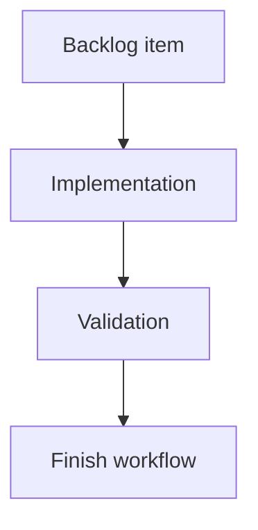

## task_180_add_reliable_local_activity_snapshots_to_the_viewer - Add reliable local activity snapshots to the viewer
> From version: 2.3.3+viewer-delivery
> Schema version: 1.0
> Status: Done
> Understanding: 100
> Confidence: 95
> Progress: 100%
> Complexity: Medium
> Theme: Viewer activity
> Reminder: Update status/understanding/confidence/progress and linked request/backlog references when you edit this doc.

# Definition of Done (DoD)
- [x] The backlog scope is implemented.
- [x] Acceptance criteria are covered.
- [x] Validation passes.

# Backlog
- `item_379_add_reliable_local_activity_snapshots_to_the_viewer`

# Acceptance criteria
- AC1: The viewer stores a minimal previous snapshot keyed by stable document path.
- AC2: `Status changed` appears only when the previous snapshot had a known status and the refreshed item has a different status.
- AC3: First load and newly discovered documents use general update markers, not status-change markers.
- AC4: The activity history is bounded and does not grow indefinitely in localStorage.
- AC5: A clear-history control removes local activity history without clearing unrelated viewer preferences.
- AC6: Existing recent activity selection, double-click read behavior, and timestamp rendering continue to work.

# Implementation plan
1. Define a minimal local snapshot shape keyed by repo-relative document path.
2. Persist the snapshot inside the existing local viewer state without overwriting unrelated preferences.
3. Compare previous and current statuses after refresh to emit reliable status-change markers.
4. Keep first-load and new-document activity classified as general updates.
5. Add a clear-history control and regression tests for activity selection/read behavior.

# Validation
- Run `python3 -m logics_manager lint --require-status`.
- Run `python3 -m logics_manager flow finish task task_180_add_reliable_local_activity_snapshots_to_the_viewer.md` after implementation.
- Finish workflow executed on 2026-06-08.
- Linked backlog/request close verification passed.

# Report
- Added localStorage-backed activity snapshots keyed by stable repo-relative document path.
- Status-change markers are emitted only when a previous known status differs from the refreshed status; first load and new docs remain general updates.
- Activity history is bounded to 80 entries and can be cleared with the new activity clear control without clearing viewer filter preferences.
- Existing activity selection, double-click read behavior, and timestamp rendering are covered by existing webview tests plus the new viewer smoke.
- Finished on 2026-06-08.
- Linked backlog item(s): `item_379_add_reliable_local_activity_snapshots_to_the_viewer`
- Related request(s): `req_215_add_reliable_local_activity_snapshots_to_the_viewer`

# AI Context
- Summary: Implement add reliable local activity snapshots to the viewer.
- Keywords: task, implementation, backlog, runtime, python
- Use when: You need a bounded implementation task for a backlog item.
- Skip when: The work is still at the request or backlog shaping stage.

# Links
- Request: `req_215_add_reliable_local_activity_snapshots_to_the_viewer`
- Product brief(s): (none yet)
- Architecture decision(s): (none yet)

# AC Traceability
- request-AC1 -> This task. Proof: The task requires a minimal previous snapshot keyed by stable document path.
- request-AC2 -> This task. Proof: The task requires Status changed markers only when previous and refreshed known statuses differ.
- request-AC3 -> This task. Proof: The task keeps first-load and newly discovered documents classified as general updates.
- request-AC4 -> This task. Proof: The task requires bounded localStorage activity history.
- request-AC5 -> This task. Proof: The task requires a clear-history control that does not clear unrelated viewer preferences.
- request-AC6 -> This task. Proof: The task preserves activity selection, double-click read behavior, and timestamp rendering.
