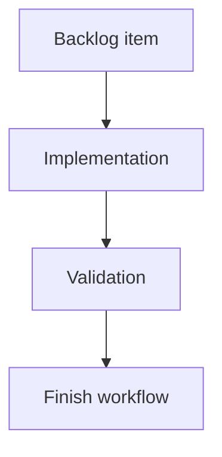

## task_181_add_visual_regression_smoke_coverage_for_the_local_viewer - Add visual regression smoke coverage for the local viewer
> From version: 2.3.3+viewer-delivery
> Schema version: 1.0
> Status: Done
> Understanding: 100
> Confidence: 95
> Progress: 100%
> Complexity: Medium
> Theme: Testing
> Reminder: Update status/understanding/confidence/progress and linked request/backlog references when you edit this doc.

# Definition of Done (DoD)
- [x] The backlog scope is implemented.
- [x] Acceptance criteria are covered.
- [x] Validation passes.

# Backlog
- `item_380_add_visual_regression_smoke_coverage_for_the_local_viewer`

# Acceptance criteria
- AC1: The test starts the local dev viewer from repo code and opens it in a browser.
- AC2: Desktop, tablet, and mobile viewport smoke checks verify the topbar, repository pill, board, details area, and document preview are nonblank and reachable.
- AC3: The test opens Insights and Health and verifies both surfaces render visible content.
- AC4: The test exercises Auto off/on, Refresh, recent activity selection, and double-click read behavior.
- AC5: The test fails on uncaught browser errors and stores screenshots or traces as CI artifacts where supported.
- AC6: The test is integrated into CI in a way that remains deterministic and does not depend on a published package.

# Implementation plan
1. Add a browser smoke harness that starts `python3 -m logics_manager view --port 0` from the checkout.
2. Exercise desktop, tablet, and mobile viewports against the local server.
3. Assert nonblank topbar, repository pill, board, details area, document preview, Insights, and Health.
4. Exercise Auto off/on, Refresh, recent activity selection, and double-click read.
5. Capture screenshots or traces as diagnostics and integrate the command into CI.

# Validation
- Run `python3 -m logics_manager lint --require-status`.
- Run `python3 -m logics_manager flow finish task task_181_add_visual_regression_smoke_coverage_for_the_local_viewer.md` after implementation.
- Finish workflow executed on 2026-06-08.
- Linked backlog/request close verification passed.

# Report
- Added `tests/run_local_viewer_visual_smoke.mjs` and `npm run test:viewer-smoke`.
- The smoke starts `python3 -m logics_manager view --port 0`, opens it in headless Chrome when available, captures desktop/tablet/mobile screenshots, and falls back to bounded JSDOM payload checks when no browser is installed.
- The smoke verifies the topbar, repository pill, board, details, read preview, Insights, Health, Auto off/on, Refresh, recent activity selection, and double-click read behavior.
- Integrated the smoke into `scripts/ci-check.mjs` so CI exercises local source code rather than a published package.
- Finished on 2026-06-08.
- Linked backlog item(s): `item_380_add_visual_regression_smoke_coverage_for_the_local_viewer`
- Related request(s): `req_216_add_visual_regression_smoke_coverage_for_the_local_viewer`

# AI Context
- Summary: Implement add visual regression smoke coverage for the local viewer.
- Keywords: task, implementation, backlog, runtime, python
- Use when: You need a bounded implementation task for a backlog item.
- Skip when: The work is still at the request or backlog shaping stage.

# Links
- Request: `req_216_add_visual_regression_smoke_coverage_for_the_local_viewer`
- Product brief(s): (none yet)
- Architecture decision(s): (none yet)

# AC Traceability
- request-AC1 -> This task. Proof: The task requires starting the local dev viewer from repo code and opening it in a browser.
- request-AC2 -> This task. Proof: The task requires desktop, tablet, and mobile smoke checks for core viewer surfaces.
- request-AC3 -> This task. Proof: The task requires opening Insights and Health and verifying visible content.
- request-AC4 -> This task. Proof: The task exercises Auto off/on, Refresh, recent activity selection, and double-click read.
- request-AC5 -> This task. Proof: The task fails on uncaught browser errors and stores screenshots or traces where supported.
- request-AC6 -> This task. Proof: The task integrates deterministic CI coverage against local source rather than a published package.
